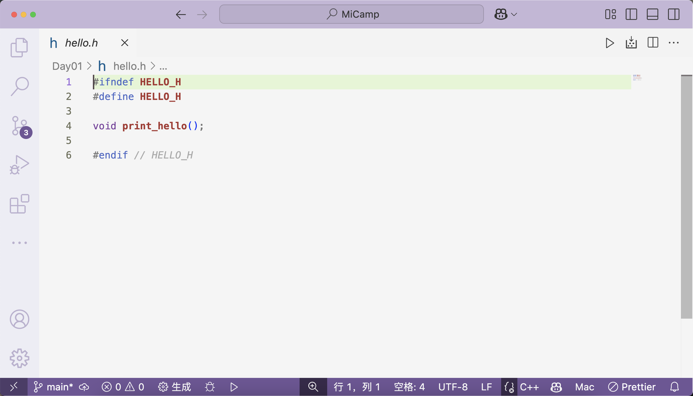
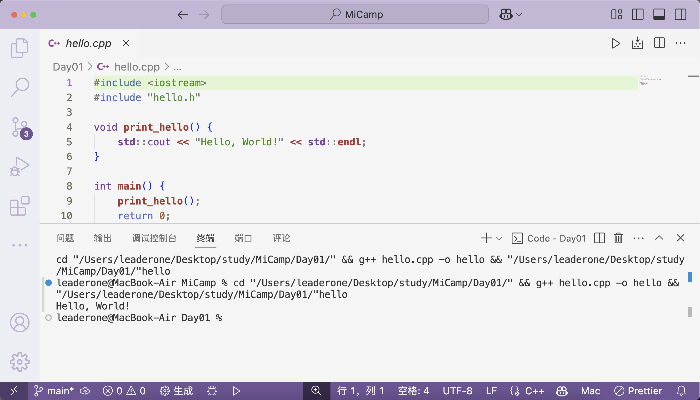
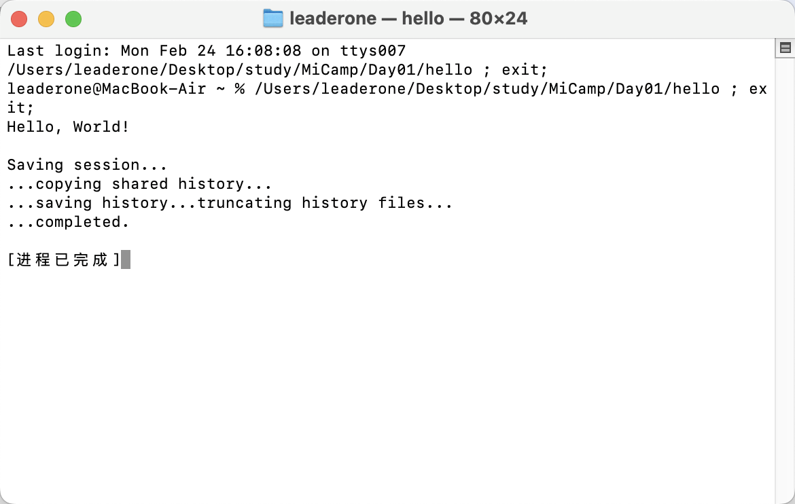
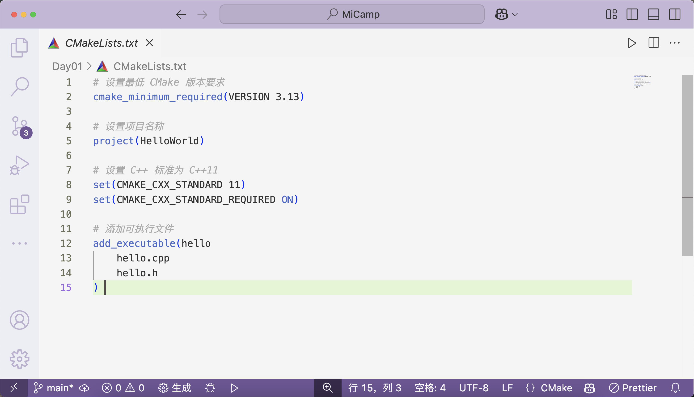
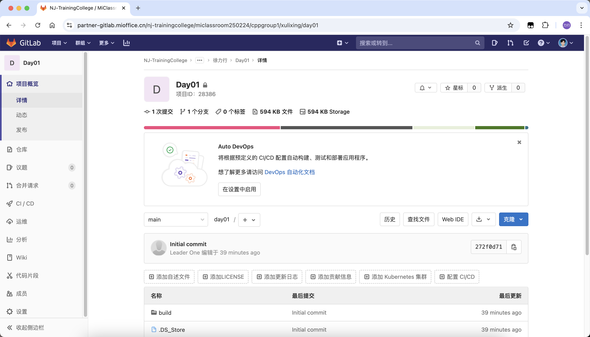

# Day 01 课程初识

今天的学习重点内容如下：

## 1. Linux 基础与操作系统

- 介绍了 Linux 内核和操作系统的基本概念，涵盖了操作系统源码、驱动和调度机制等内容。
- 学习了常用的 Linux 命令（如`cd`、`ls`），并深入理解了内存管理及缺页中断的相关概念。

## 2. C++编程基础

- 探讨了 C++中的指针、虚函数及虚函数表等概念。
- 研究了类的内存布局，特别是继承关系中成员变量重名的问题及解决方法。

## 3. Git 命令与版本管理

- 学习了 Git 的基本操作，如`git fetch`与`git pull`的区别，如何同步远程仓库以及处理版本冲突等。
- 练习了设置仓库级别的用户名和邮箱，并通过命令行配置了 Git 的基本信息。

## 课堂作业

创建了一个 `hello.cpp` 文件：


`hello.h` 文件内容如下：



编译和运行的命令如下：

```bash
g++ hello.cpp -o hello          # 编译 hello.cpp 文件并生成名为 hello 的可执行文件
mkdir -p build                  # 创建 build 目录，-p 参数保证即使目录已存在也不会报错
cd build                        # 进入 build 目录
cmake ..                        # 使用 CMake 配置项目，.. 表示 CMakeLists.txt 文件位于上级目录
```

编译后成功输出 Hello World!：





CMakeLists.txt 文件配置如下：



文件结构如下：

```
Day01/
├── build/
│   ├── .cmake/
│   ├── CMakeFiles/
│   ├── build.ninja
│   ├── cmake_install.cmake
│   ├── CMakeCache.txt
│   ├── compile_commands.json
│   ├── hello
│   ├── Makefile
│   ├── CMakeLists.txt
│   ├── hello.cpp
│   ├── hello.h
│   ├── README.md
```

包含 CMake 文件、源代码文件（如 hello.cpp 和 hello.h）以及其他构建相关文件。

完成文件夹上传至 GitLab，操作命令如下：

1. **初始化本地仓库**：

```bash
git init
```

2. **关联远程仓库**：

```bash
git remote add origin git@partner-gitlab.mioffice.cn:nj-trainingcollege/miclassroom250224/cppgroup1/xulixing/day01.git
```

3. **添加所有修改的文件**：

```bash
git add .
```

4. **提交修改**：

```bash
git commit -m "Initial commit"
```

5. **推送至远程仓库**：

```bash
git push -u origin main
```

上传成功如下所示：


