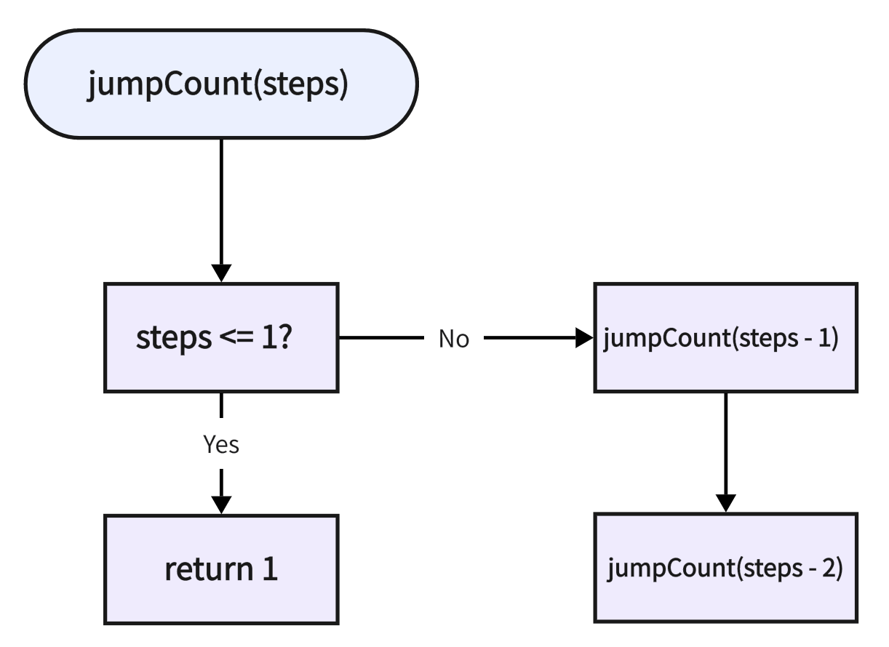
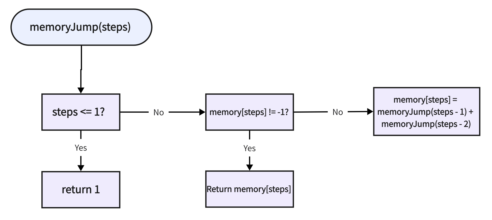
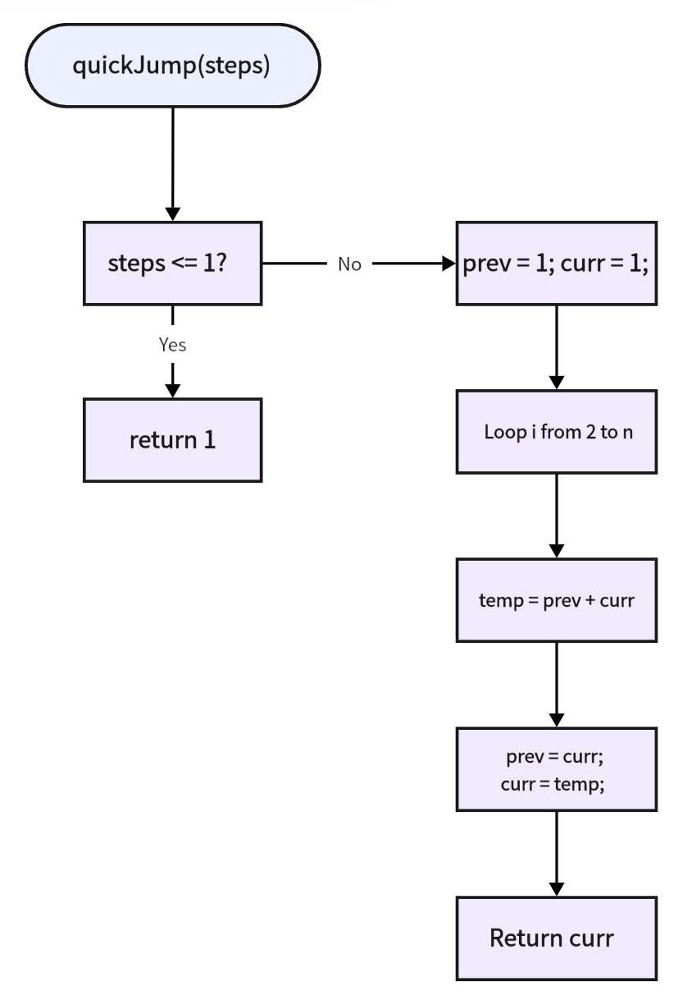
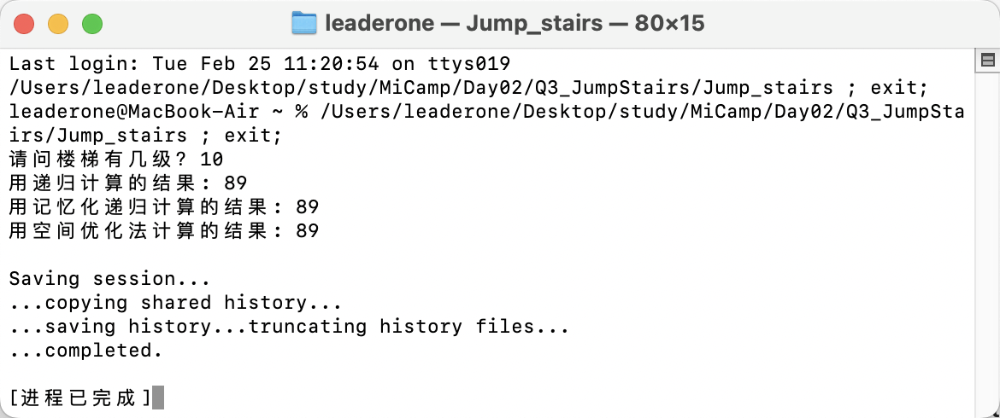

## Q3: 青蛙跳台阶算法问题与框图绘制

### 问题分析

青蛙一次可以跳跃一个台阶或者两个台阶，输入台阶数 `n`，计算青蛙一共有多少种跳跃方法，存入变量 `m`。

我通过递归的方式解决这个问题。递归的核心思想是：

- 如果最后一步爬了 1 个台阶，那么问题转化为爬到 `n-1` 级台阶的方法数。
- 如果最后一步爬了 2 个台阶，那么问题转化为爬到 `n-2` 级台阶的方法数。

因此，状态转移方程为：`dfs(i) = dfs(i - 1) + dfs(i - 2)`

### 递归边界条件和入口

- `dfs(0) = 1`：从第 0 级台阶爬到第 0 级台阶的方式只有一种，原地不动。
- `dfs(1) = 1`：从第 0 级台阶爬到第 1 级台阶的方式只有一种，即爬 1 个台阶。

递归的入口是 `dfs(n)`，即求从第 0 级台阶爬到第 `n` 级台阶的所有方法数。

### 算法框图

- **时间复杂度**：递归方法的时间复杂度为 `O(2^n)`。  
  搜索树的高度为 `O(n)`，每个节点的计算可能会展开两次子节点，导致搜索树的节点数为 `O(2^n)`，从而造成大量重复计算。

- **空间复杂度**：递归会占用 `O(n)` 的栈空间。  
  递归调用过程中，每次函数调用都会占用栈空间，最多会有 `n` 层递归，因此空间复杂度为 `O(n)`。

由于递归会重复计算很多子问题，我通过优化减少重复计算。

### 优化：记忆化递归

**核心思想**：由于递归会大量重复计算相同的子问题，我将已计算过的结果保存起来，避免重复计算。

**状态转移方程**：`memory[i] = memory[i - 1] + memory[i - 2]`

#### 算法框图

- **时间复杂度**：`O(n)`  
  每个子问题只会计算一次，避免了重复计算。

- **空间复杂度**：`O(n)`  
  需要一个 `memory` 数组来存储每个子问题的结果。

### 进一步优化：空间优化（滚动数组）

**核心思想**：观察状态转移方程发现，在计算 `dfs(i)` 时，只需要知道 `dfs(i-1)` 和 `dfs(i-2)` 的结果，而不需要存储所有的中间结果。因此，可以通过滚动数组的方式，将 `memory` 数组优化为两个变量，仅存储 `dfs(i-1)` 和 `dfs(i-2)` 的结果，从而进一步降低空间复杂度。

**空间优化方法**：

1. 使用两个变量 `prev` 和 `curr` 来存储 `dfs(i-2)` 和 `dfs(i-1)` 的值。
2. 每次迭代时，通过 `prev` 和 `curr` 计算新的 `curr` 值，并更新 `prev` 和 `curr`。

**状态转移方程**：  
`newF = prev + curr`  
`prev = curr`  
`curr = newF`

#### 算法框图

- **时间复杂度**：`O(n)`  
  每次迭代只进行常数时间的计算。

- **空间复杂度**：`O(1)`  
  仅使用常数空间来存储两个变量。

### 运行结果

