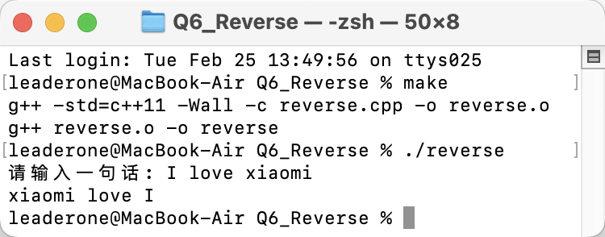
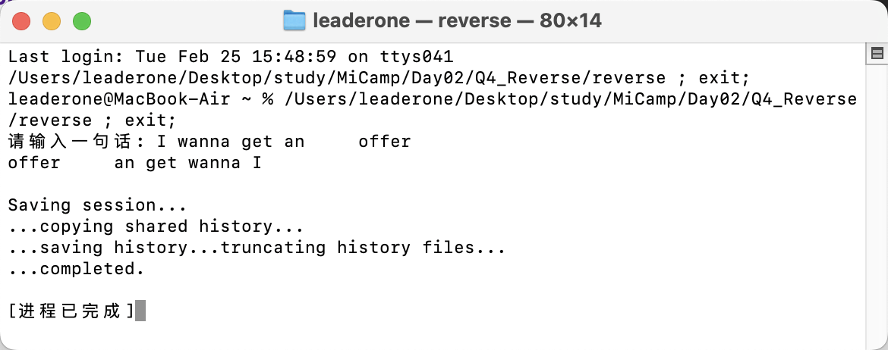
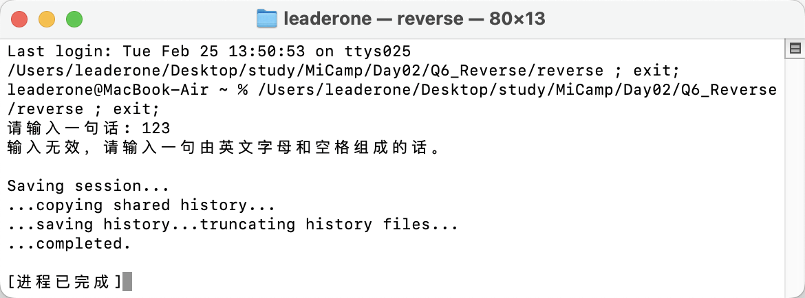

## Q4：反转字符串中的单词

本程序的目的是接收用户输入的一句话，反转句子中的单词顺序并输出。

本程序的亮点在于，利用 `istringstream` 和 `ostringstream` 流来高效地拆分和重组单词，代码简洁且易于理解。

### 程序运行逻辑

1. 用户输入一句话后，程序会验证输入的有效性。  
   如果输入无效，程序将提示错误信息并退出。
2. 如果输入有效，程序会反转单词顺序后输出。

### 编译与测试

我按照要求，在 Mac 上使用`Makefile`进行程序的编译和测试，以下是编译和测试的截图：

#### 编译过程和运行结果

通过`Makefile`构建可执行文件，命令行执行如下：

执行以下命令进行编译并执行：

```bash
make
./reverse
```



特别地，在本程序中我针对空格问题进行了特别处理。具体而言，如果两个单词在反转前间隔不止一个空格，反转后会保留这种状态，如图：


### 错误检测

程序在运行时，除了反转单词顺序，还具备输入检查功能。如果输入无效，程序会显示提示，如图：

