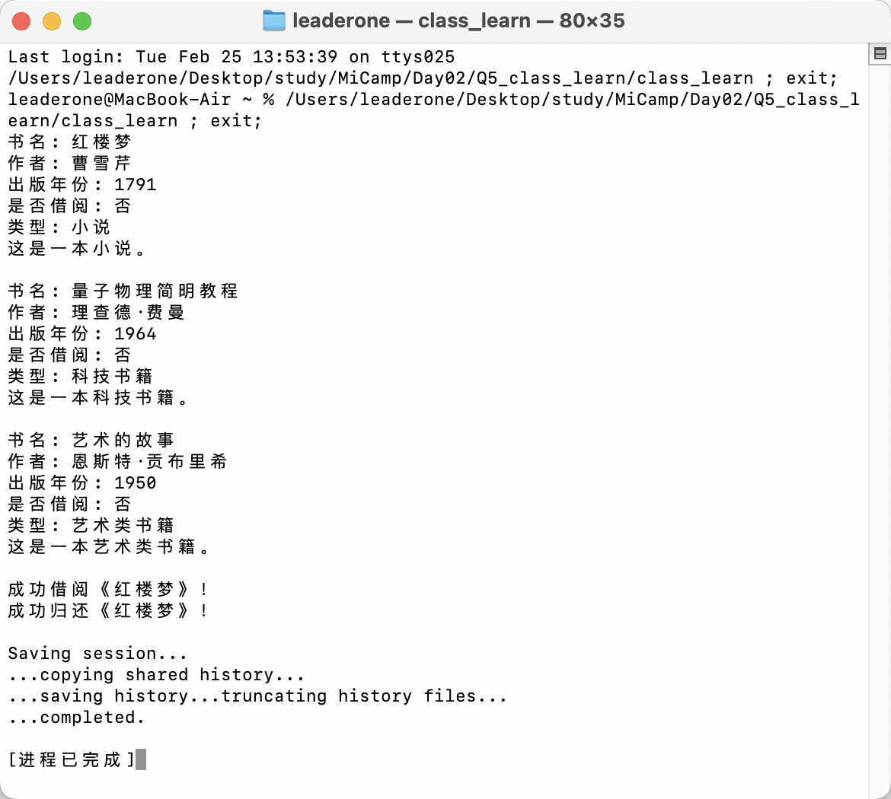

## Q5:类设计中的封装与多态实践

我编写的这个程序模拟了一个图书馆系统，涵盖了三种类型的书籍：小说、科技书籍和艺术类书籍。每本书都包含标题、作者、出版年份和借阅状态等信息。通过继承和多态的机制，程序能够根据不同类型的书籍展示相应的信息，并且提供借阅和归还书籍的功能。

在实现过程中，我使用了虚函数来处理不同类型书籍的展示方式，同时通过 `vector` 容器来管理所有书籍对象。

### 封装和多态的实现：

我通过封装将书籍的属性隐藏在类内部，只能通过方法访问，防止直接修改数据。多态则通过虚函数实现，让不同类型的书籍可以有不同的展示方式，而外部代码不需要关心具体类型，只通过基类指针调用方法。

### 程序操作流程：

1. 创建了三本不同类型的书籍。
2. 显示每本书的详细信息和类型。
3. 模拟了借书和还书的操作。
4. 最后释放了创建的内存，确保程序正确结束。

### 运行结果：

程序按我的预期成功运行，并正确模拟了借书、还书的操作。

