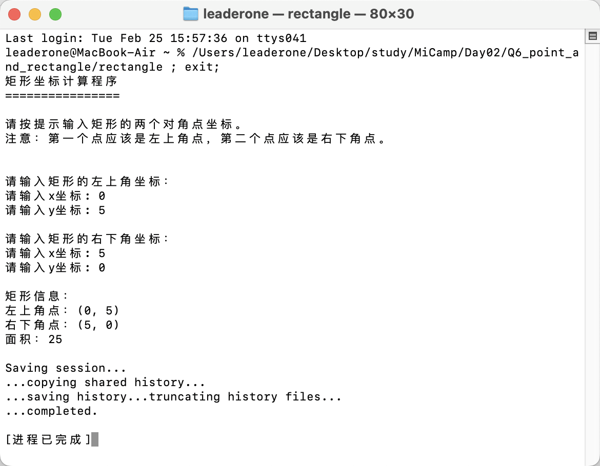
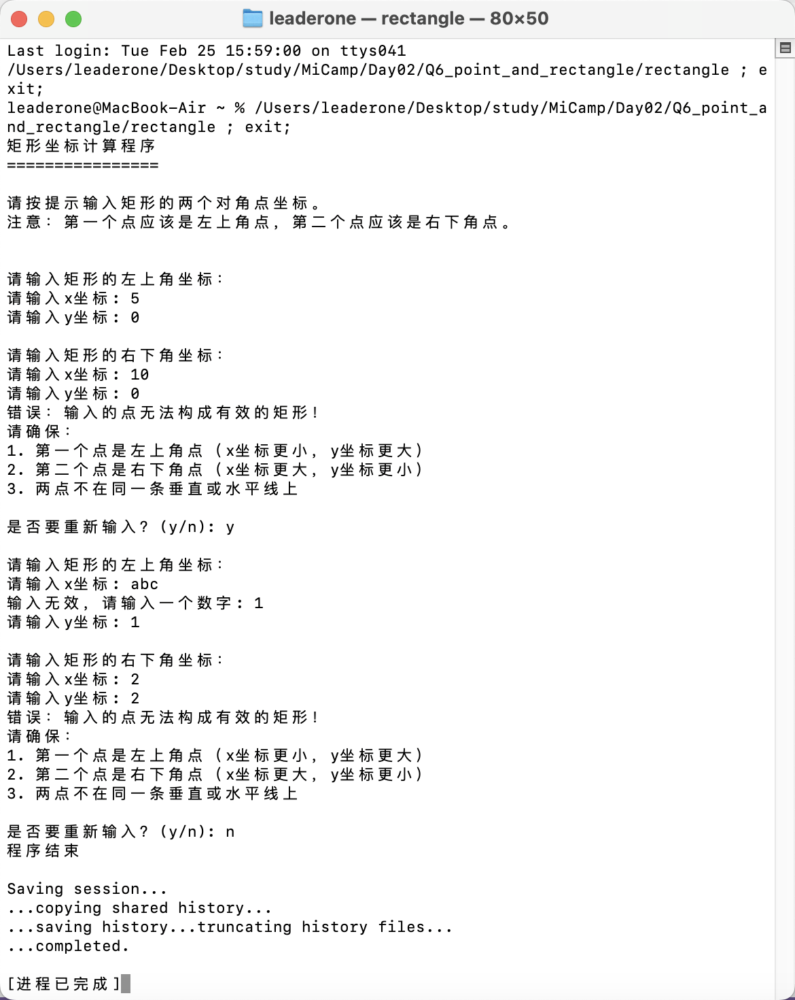

## Q6: 点和矩阵

### 设计思路

#### 基本结构

- **Point 类**：表示平面上的点，包含 `x` 和 `y` 坐标。
- **Rectangle 类**：使用两个 `Point` 对象表示矩形的左上角和右下角。

#### 主要功能

1. **用户输入矩形的两个对角点坐标**：用户通过输入两个点的坐标来定义矩形。
2. **验证输入是否能构成有效的矩形**：
   - 输入的点需满足：第一个点为左上角，第二个点为右下角。
   - 确保两个点不共线（在 x 轴或 y 轴上）。
3. **计算并显示矩形的面积**：
   - 根据两点的坐标计算矩形的宽度和高度，并得出面积。

#### 安全性

- 对用户输入进行严格验证。
- 提供友好的错误提示。
- 允许用户在输入错误时重新输入。

---

### 测试和实践

#### 正确输入测试

- 用户正确输入矩形的对角点坐标，程序能够正确计算出矩形的面积。
- 示例截图：

#### 错误输入测试

- **共线问题**：当两个输入的点在 x 轴或 y 轴上共线时，程序会提示错误并要求重新输入。
- **左上角与右下角位置错误**：当第一个点不是矩形的左上角时，程序会提示错误。
- **非法格式输入**：当用户输入的坐标格式不合法时，程序也会提供提示并要求重新输入。

- 示例截图：

---
