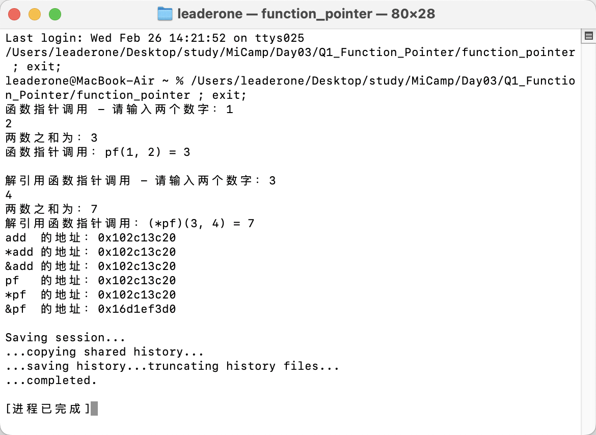

## Q1：函数指针练习

### 题目描述：

- 请编写一个函数 `add`，该函数接收两个 `int` 型参数，计算两数之和并打印，函数返回值为两数之和，再定义一个函数指针 `pf`，并将 `add` 赋予指针 `pf`。
- 通过函数指针的两种调用方式实现目标函数的调用。
- 请使用 `printf` 函数按照 `%p` 的格式，打印 `add`，`*add`，`&add`，`pf`，`*pf`，`&pf` 的值并比较打印出来的值。

### 设计思路：

我的程序按照题目要求，定义了一个加法函数`add`，然后通过函数指针`pf`调用这个函数。主要展示了两种调用方式：一种是直接通过`pf`调用，另一种是通过解引用指针`(\*pf)`来调用。

此外，我还通过打印地址来比较不同的函数和指针地址，理解了函数指针和地址之间的关系。

1. `add`：函数名本身，代表函数的首地址
2. `*add`：对函数名解引用，结果仍然是函数的首地址
3. `&add`：取函数的地址，结果还是函数的首地址
4. `pf`：函数指针变量，存储的是指向函数的地址
5. `*pf`：解引用函数指针，得到函数的地址
6. `&pf`：取函数指针变量自己的内存地址（指针变量本身的地址）

### 运行结果：

从运行结果可以看到，除了`&pf`之外，其他所有表达式的值都是相同的，因为它们都指向同一个函数的地址，而只有`&pf`是指针变量本身在内存中的地址，所以会不同。
