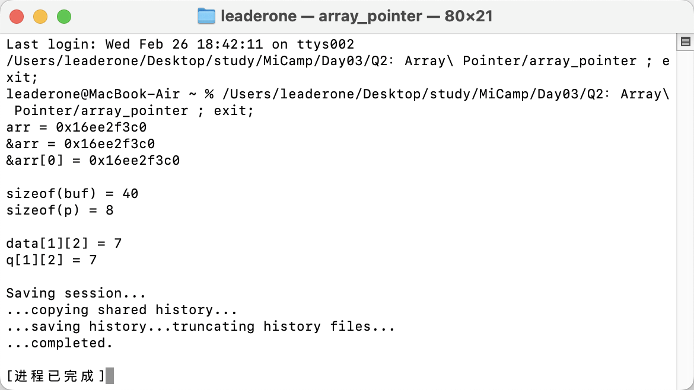

## Q2：指针和数组练习

### 题目描述：

- 请定义一个`int`型的大小为`10`的一维数组`arr`，使用`printf`函数按照`%p` 格式打印`arr`、`&arr`和`&arr[0]`的值并比较。
- 请定义一个`int`型的大小为 10 的一维数组`buf`，再定义一个对应类型的指针变量`P`,比较`sizeof（buf）`和`sizeof（p）`的区别。
- 请定义一个`int`型的二维数组`data[3][4]`并初始化，再定义一个相应类型的指针变量`p`，并把`data`赋值给指针变量`p`。

### 输出结果：



### 分析总结：

#### 第一问：

```c++
arr = 0x16b4bb090
&arr = 0x16b4bb090
&arr[0] = 0x16b4bb090
```

- 这三个地址完全相同，原因在于：
  1. `arr`（数组名）本身就是数组的首地址
  2. `&arr`（整个数组的地址）和数组首地址相同
  3. `&arr[0]`（第一个元素的地址）也是数组的开始位置
- 这证明了 C++ 中数组名本质是指向数组第一个元素的指针

#### 第二问：

```c++
sizeof(buf) = 40
sizeof(p) = 8
```

- `sizeof(buf) = 40`：因为是 10 个整型数组元素，每个 int 是 4 字节，所以总大小是 40 字节
- `sizeof(p) = 8`：在`AArch64（64位架构)`上，指针变量的大小固定是 8 字节
- 这个差异说明：
  1. 数组名虽然可以当指针用，但它保留了完整的数组信息
  2. 指针变量只存储了地址信息，不包含它所指向内容的大小信息

#### 第三问：

```c++
data[1][2] = 7
q[1][2] = 7
```

- 两种访问方式得到相同的值（7），这个值 7 正是 `data[1][2]` 的位置，证明：
  1. 指针 `q` 正确地指向了二维数组
  2. 通过数组名和指针都能正确访问二维数组的元素
