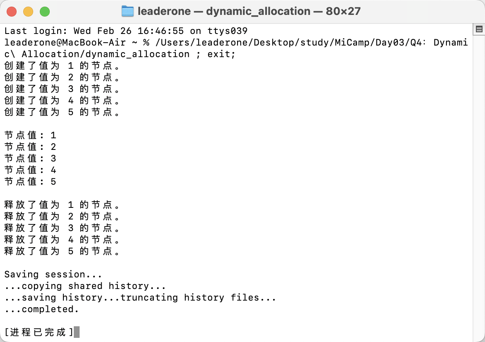

## Q4：指针和动态分配内存练习

### 题目描述：

- 尝试定义一个单向链表节点结构体`ListNode`，结构体包含两个字段，一个是`int`型的节点值`val`，一个是指向下个节点的指针`ListNode*`。
- 尝试利用上述节点实现一个包含`5`个节点的单链表，并遍历整个链表打印每个节点的值。

### 程序设计：

- 首先，我按照题目要求定义了 ListNode 结构体。
- 在 main 函数中：
  - 我使用 new 关键字创建了一个包含 5 个节点的链表。

```c++
    ListNode *head = new ListNode(1);
    head->next = new ListNode(2);
    head->next->next = new ListNode(3);
    head->next->next->next = new ListNode(4);
    head->next->next->next->next = new ListNode(5);
```

- 接下来我使用 while 循环遍历链表并打印每个节点的值。
- 最后我使用 delete 释放了所有分配的内存，避免内存泄漏。

```c++
    current = head;
    while (current != nullptr)
    {
        ListNode *temp = current;
        current = current->next;
        delete temp;
    }
```

### 输出结果：


