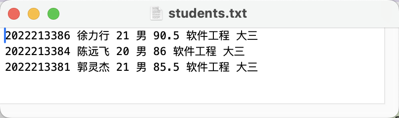
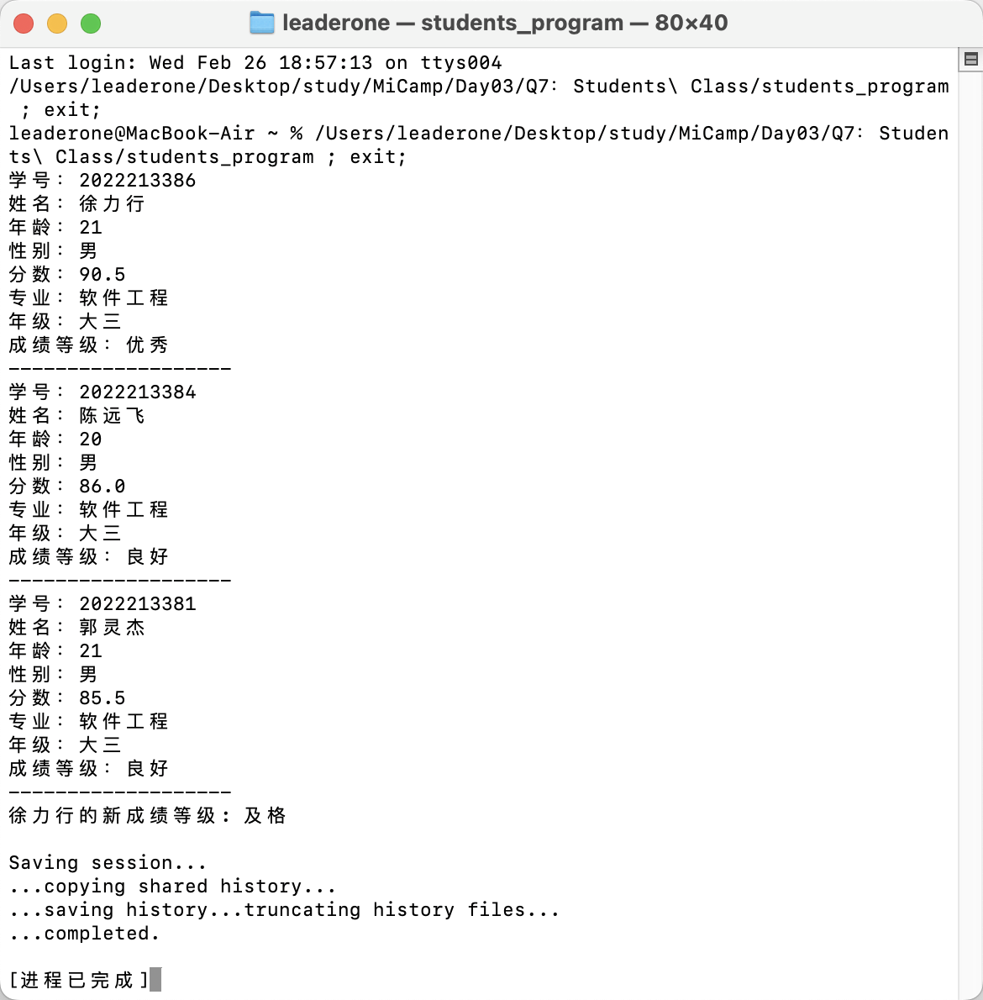

## Q6：使用指针动态分配内存并返回数组最大值

### 题目描述：

- 定义一个学生类（包括姓名、分数、专业等）并且把学生信息存储到文件当中。

### 程序设计：

#### 类的设计：

我在 Student.h 中定义了一个完整的 Student 类，包含了学生的基本信息：学号、姓名、年龄、性别、分数、专业和年级，并且我提供了完整的 getter 和 setter 方法来访问这些属性。

#### 核心功能：

- 可以计算学生的成绩等级（优秀/良好/中等/及格/不及格）
- 支持更新学生分数，并进行有效性检查（0-100 分）
- 能够将学生信息保存到文件中
- 可以从文件中读取学生信息
- 提供了信息展示功能

#### 主程序演示：

- 创建了 3 个学生：

```c++
vector<Student> students = {
        Student("2022213386", "徐力行", 21, "男", 90.5, "软件工程", "大三"),
        Student("2022213384", "陈远飞", 20, "男", 86.0, "软件工程", "大三"),
        Student("2022213381", "郭灵杰", 21, "男", 85.5, "软件工程", "大三")};
```

- 演示了文件的写入和读取操作

```c++
    // 写入文件
    ofstream outFile("students.txt");
    if (!outFile)
    {
        cout << "无法打开文件" << endl;
        return 1;
    }

    for (const auto &student : students)
    {
        student.save(outFile);
    }
    outFile.close();

    // 读取文件
    ifstream inFile("students.txt");
    if (!inFile)
    {
        cout << "无法打开文件" << endl;
        return 1;
    }

    vector<Student> stds;
    Student temp;
    while (inFile.good())
    {
        temp.load(inFile);
        if (inFile.good())
        {
            stds.push_back(temp);
        }
    }
    inFile.close();
```

- 展示了成绩更新功能

```c++
    stds[0].update(60.0);
    cout << stds[0].getName() << "的新成绩等级: "
         << stds[0].level() << endl;
```

### 输出结果：

#### 编译命令：

```c
g++ main.cpp Student.cpp -o students_program
```




