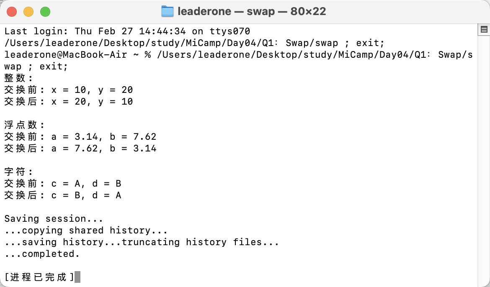

## Q1：交换值

### 题目描述：

- 实现一个模板函数，接受两个参数。交换他们的值，并运行调试打印交换前后的值。

### 实现过程：

- 我通过使用模板函数 Swap，实现了交换两个变量 a 和 b 的值，利用一个临时变量 temp 来存储其中一个变量的值。
- 特别地，由于 swap 是标准库中的函数，不能直接使用。于是我命名为 Swap，避免命名冲突。

```c++
template <typename T>
void Swap(T &a, T &b)
{
T temp = a;
a = b;
b = temp;
}
```

### 运行结果：


