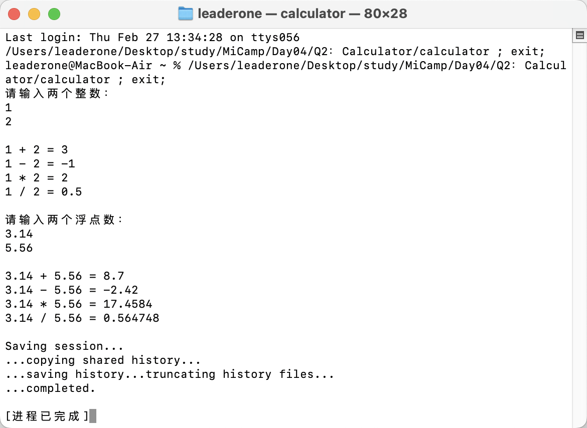

## Q2：通用计算器

### 题目描述：

- 创建一个通用的 Calculator 类模板，支持加、减、乘、除运算，并测试整型数据、浮点型数据的计算。

### 实现思路：

- 我定义了一个模板类 Calculator，用于执行两个相同类型数值的加、减、乘、除运算。通过构造函数初始化两个数值 a 和 b，并提供相应的成员函数来进行运算。
- 在整数除法时，运算结果可能为浮点数，因此对除法我做了特殊处理，将返回值改为 double。
- 特别地，如果除数为零，div 函数会抛出 runtime_error 异常。

```c++
template <typename T>
class Calculator
{
private:
    T a, b;

public:
    Calculator(T x, T y) : a(x), b(y) {}

    T add() const { return a + b; }
    T sub() const { return a - b; }
    T mul() const { return a * b; }

    // 处理商可能是浮点数的问题
    double div() const
    {
        if (b == 0)
        {
            throw runtime_error("除数不能为零");
        }
        else
        {
            return static_cast<double>(a) / static_cast<double>(b);
        }
    }
};
```

### 运行结果：

在下面的运行结果中，在整数运算时测试了正常情况，在浮点数运算时测试了除数为 0 的情况。

