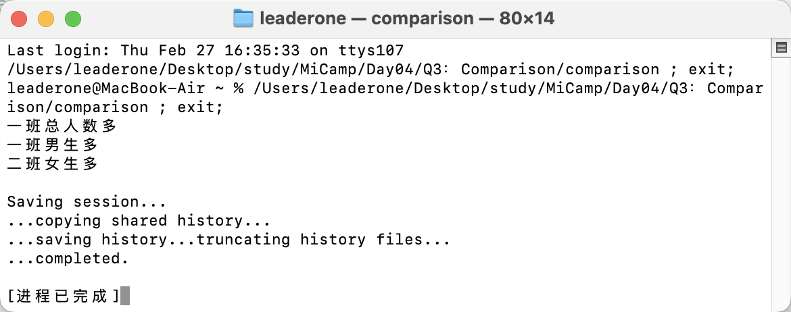

## Q3：班级人数比较

### 题目描述：

- 编写一个模板函数，实现比较两个班级的人数，包括总人数，男女生人数。
  - （1）求两个输入的最大值
  - （2）支持自定义比较函数

### 实现思路：

- 首先定义 Class 结构体，用于表示一个班级的总人数、男生人数和女生人数。

```c++
struct Class
{
    int total;
    int boy;
    int girl;
};
```

- 我使用 compareClass 函数比较两个班级的总人数、男生人数和女生人数。通过传入比较函数判断每一项数据是哪个班级的数值更大。

```c++
template <typename T>
void compareClass(const Class &c1, const Class &c2, bool (*compare)(T, T))
{
    cout << (compare(c1.total, c2.total) ? "一班总人数多" : "二班总人数多") << endl;
    cout << (compare(c1.boy, c2.boy) ? "一班男生多" : "二班男生多") << endl;
    cout << (compare(c1.girl, c2.girl) ? "一班女生多" : "二班女生多") << endl;
}
```

- compare 函数是我自定义的比较函数，如果第一个值大于第二个值，它返回 true。

```c++
bool compare(int a, int b)
{
    return a > b; // 自定义比较函数
}ß
```

- 判断给定的数据是否合法,要求总人数 = 男生人数 + 女生人数，且所有数据必须大于 0：

```c++
bool isValid(int total, int boy, int girl)
{
    return total > 0 && boy > 0 && girl > 0 && total == boy + girl;
}
```

### 运行结果：

给定的数据如下：

```c++
Class c1 = {30, 15, 15};
Class c2 = {25, 10, 15};
```


