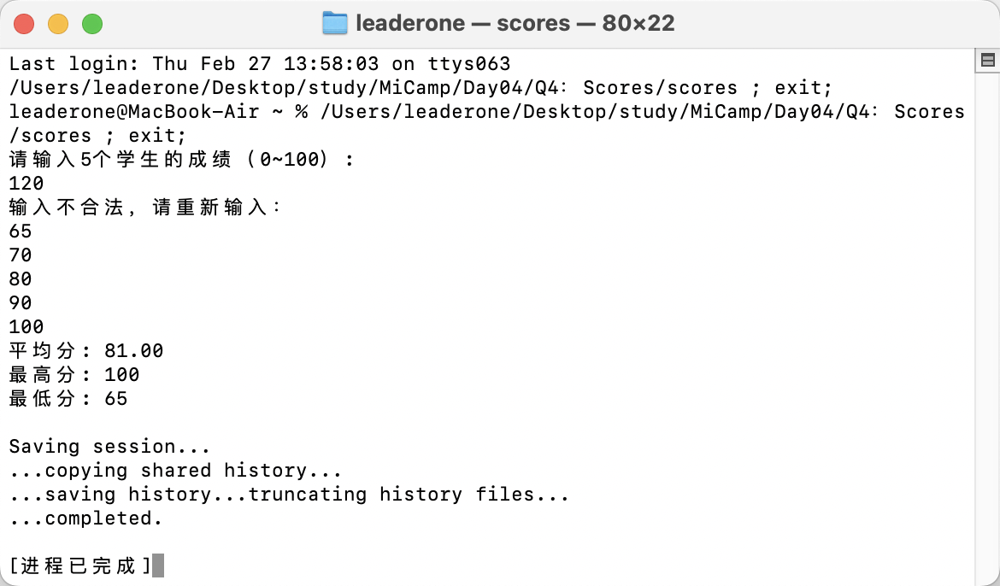

## Q4：成绩分析

### 题目描述：

- 输入 5 个学生的成绩（整数，范围 0~100），存储到 vector<int> 中，输出所有成绩的平均值（保留 2 位小数），找出并输出最高分和最低分。

### 实现思路：

- 创建一个包含 5 个整数的 vector 用以存储学生的成绩。

```c++
  vector<int> scores(5);
```

- 检查输入是否合法。

```c++
if (cin.fail() || scores[i] < 0 || scores[i] > 100)
{
    cin.clear();
    cin.ignore(INT_MAX, '\n');
    cout << "输入不合法，请重新输入：" << endl;
}
```

- 输出所有成绩的平均值，找出并输出最高分和最低分。

```c++
double sum = 0;
int max = scores[0], min = scores[0];
for (int a : scores)
{
    sum += a;
    if (a > max)
        max = a;
    if (a < min)
        min = a;
}
double average = sum / scores.size();
```

- 设置输出格式，保留两位小数。

```c++
cout << fixed << setprecision(2);
```

### 运行结果：


