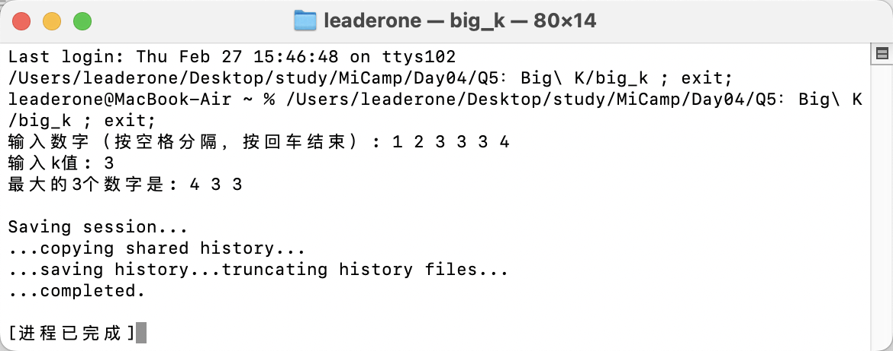
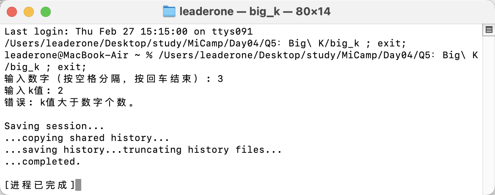

## Q5：打印最大 k 个数

### 题目描述：

- 编写一个子函数，输入为一组随机数字，打印最大的 k 个数。

### 实现思路：

- 根据老师的提示，我使用 unordered_multiset 来处理重复数字，并且利用 vector 和 sort 来按降序排列输出最大的 k 个数字。

```c++
unordered_multiset<int> num_set(nums.begin(), nums.end());
vector<int> sorted(num_set.begin(), num_set.end());
```

- 同时，按照老师的讲解，我使用反向迭代器 rbegin() 和 rend()，sort() 会从容器的末尾开始排序，从而实现降序排列。

```c++
sort(sorted.rbegin(), sorted.rend());
```

### 运行结果：

#### 正确运行：



#### 错误处理：

```c++
if (k > nums.size())
{
    cout << "错误: k值大于数字个数。" << endl;
    return;
}
```


