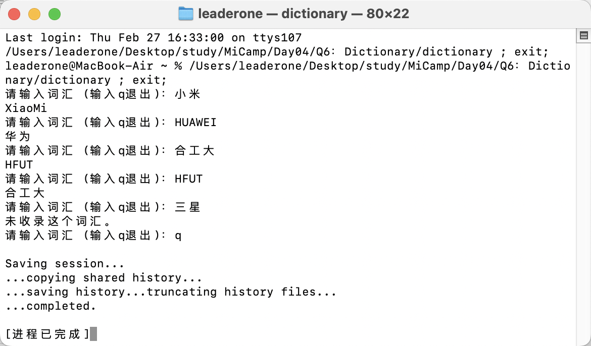

## Q6：英汉词典程序

### 题目描述：

- 利用 map.实现一个简单的英汉词典，要求输入中文或者英文，给出对应的翻译词汇，如果没有输出默认提示。

### 实现思路：

- 在头文件中，我声明了 Dictionary 类，用 add 添加词条，用 translate 执行翻译，用 map 存储词典数据。

```c++
class Dictionary
{
public:
   void add(const string &english, const string &chinese);
   string translate(const string &word);
private:
   map<string, string> dict;
};
```

- 函数的具体实现写在 Dictionary.cpp 文件中。为了实现双向互译功能（通过调用一次 add 函数即可同时存储英->汉和汉->英的映射关系），我做了这段代码：

```c++
void Dictionary::add(const string &english, const string &chinese)
{
    dict[english] = chinese;
    dict[chinese] = english;
}
```

- 随后我在 main 函数中进行了测试。

## 运行结果

1. 使用 g++编译程序：

```bash
 g++ main.cpp Dictionary.cpp -o dictionary
```

2. 运行程序：

```bash
./dictionary
```

3. 运行结果：


