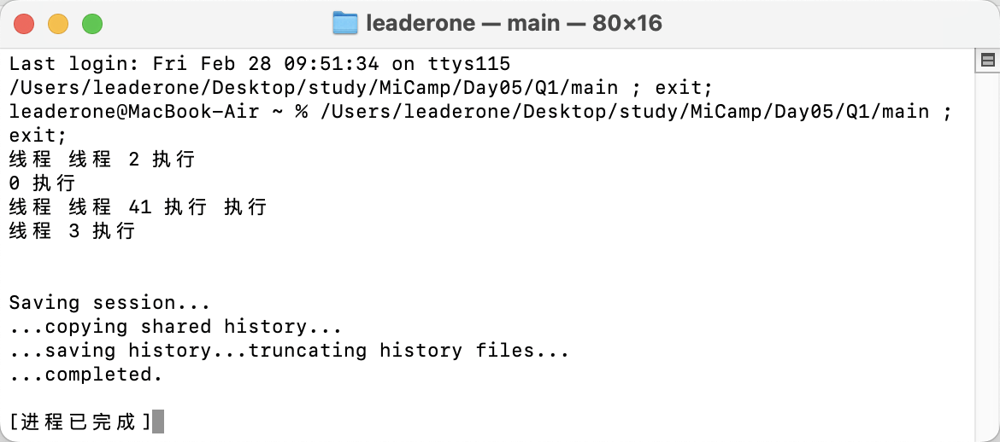
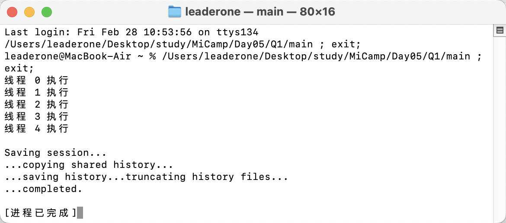

## Q1：编写一个多线程程序

### 实现一个基本的多线程程序

- 在我初学时编写的程序中，多个线程并行执行，但没有由于同步机制，因此导致了输出顺序混乱。

```c++
void task(int id)
{
cout << "线程 " << id << " 执行" << endl;
}
```

#### 运行结果



### 第一次优化：采用互斥锁同步

- 在课上学习多线程编程后，我引入了 mutex 互斥锁，确保每次只有一个线程能够输出，从而避免了输出混乱，但仍然存在线程执行顺序不正确的问题。

```c++
mutex mtx;
void task(int id)
{
mtx.lock();
cout << "线程 " << id << " 执行" << endl;
mtx.unlock();
}
```

#### 运行结果


### 第二次优化：采用条件变量顺序控制

- 在进一步学习多线程编程后，我引入了 condition_variable 条件变量，通过控制线程执行顺序，确保线程按预期顺序执行。

```c++
mutex mtx;
condition_variable cv;
int counter = 0;
void task(int id)
{
    unique_lock<mutex> lock(mtx);
    cv.wait(lock, [id]
            { return id == counter; });
    cout << "线程 " << id << " 执行" << endl;
    ++counter;
    cv.notify_all();
}
```

#### 运行结果


