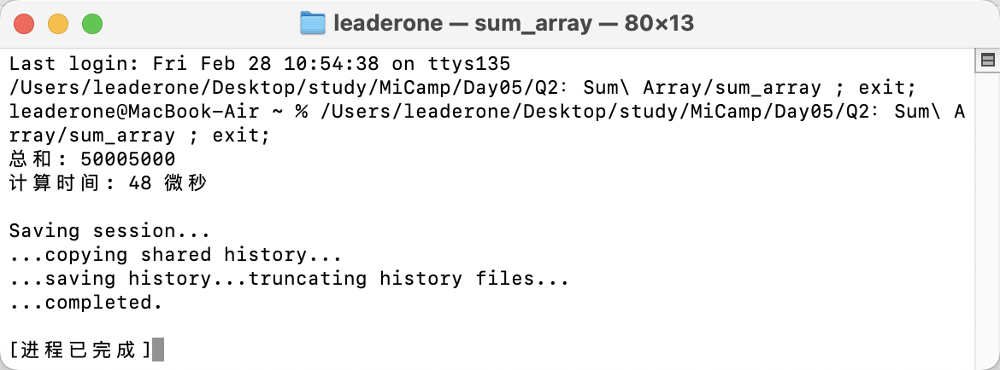

## Q2：计算数组整数和并输出计算时间

### 题目描述：

- 计算一个有大量整数数据数组的和，并且输出计算时间。（可以设定一个有 10000 个整数的数组来模拟大量数据）

### 实现思路：

- 我首先定义一个函数 psum，用于计算数组 arr 中从索引 start 到 end 范围内元素的和，并将结果累加到 result 中。这个函数用于计算数组的部分和。

```c++
void psum(const vector<int> &arr, long long &result, int start, int end)
{
    for (int i = start; i < end; ++i)
    {
        result += arr[i];
    }
}
```

- 我将数组分成 k 个部分，每个部分由一个线程计算。通过 vector<long long> sums(k, 0) 存储每个线程计算的部分和，然后使用 thread 来启动每个线程，并将结果存入对应的 sums 元素中。最后，通过 t.join() 等待所有线程完成，并将所有部分和累加得到最终的结果。

```c++
vector<long long> sums(k, 0);
    vector<thread> t;
    int part = n / k;

    for (int i = 0; i < k; ++i)
    {
        int begin = i * part;
        int end = (i == k - 1) ? n : (i + 1) * part;
        t.push_back(thread(psum, cref(arr), ref(sums[i]), begin, end));
    }

    for (auto &t : t)
    {
        t.join();
    }

    long long result = 0;
    for (const auto &sum : sums)
    {
        result += sum;
    }
```

- 计算过程的时间使用 high_resolution_clock::now() 来测量。

```c++
    auto start = high_resolution_clock::now();
    // 中间内容省略
    auto end = high_resolution_clock::now();
    auto time = duration_cast<microseconds>(end - start);
```

### 运行结果：


