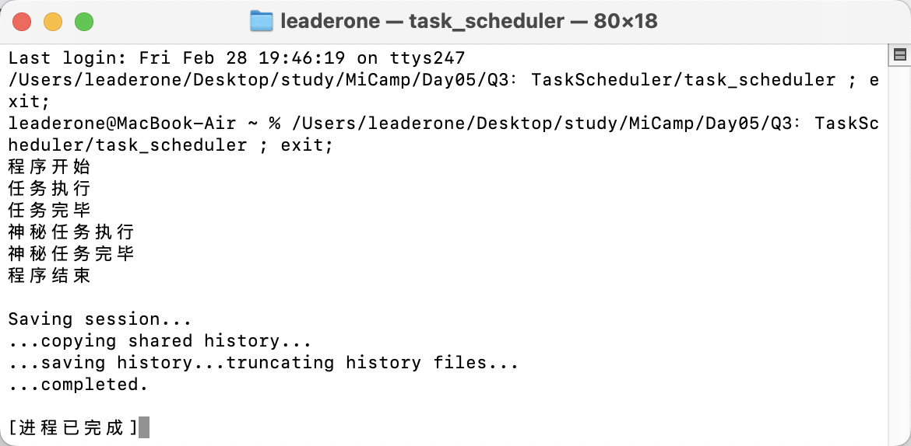

## Q3：多线程任务调度器

### 题目描述：

- 实现一个多线程任务调度器，使用线程池和任务队列来管理并发任务。用户可以向任务队列中添加任务，线程池中的线程会从任务队列中取出任务并执行。要求支持任务的动态添加和线程池的关闭。

### 实现思路：

- 首先我定义了一个 Pool 类来管理线程池，使用 vector<thread> 管理工作线程，queue<function<void()>> 存储待执行的任务，mutex 和 condition_variable 用于任务同步与调度，atomic<int> Count 用来记录当前正在执行的任务数量。

```c++
class Pool
{
public:
    Pool(size_t threads);
    ~Pool();
    template <typename F>
    void add(F &&f);
    void stop();
    int getCount() const { return Count.load(); }

private:
    void work();
    vector<thread> t;
    queue<function<void()>> tasks;
    mutex mtx;
    condition_variable cv;
    atomic<bool> flag;
    mutex printMutex;
    atomic<int> Count;
};
```

- add 函数用于向任务队列中添加任务，并通过 cv.notify_one() 通知空闲线程开始工作。
- stop 函数用于关闭线程池，设置 flag 为 true，并通知所有线程退出。

```c++
template <typename F>
void Pool::add(F &&f)
{
    {
        lock_guard<mutex> lock(mtx);
        tasks.push(std::forward<F>(f));
    }
    cv.notify_one();
}
void Pool::stop()
{
    flag = true;
    cv.notify_all();
}
```

- work 是每个线程的执行函数。线程通过 cv.wait 等待任务队列中有任务时才会唤醒。如果线程池已关闭且任务队列为空，线程退出。任务执行时，通过 Count 记录正在执行的任务数量。

```c++
void Pool::work()
{
    while (true)
    {
        function<void()> task;
        {
            unique_lock<mutex> lock(mtx);
            cv.wait(lock, [this] { return !tasks.empty() || flag; });
            if (flag && tasks.empty())
            {
                return;
            }
            task = std::move(tasks.front());
            tasks.pop();
        }
        {
            lock_guard<mutex> printLock(printMutex);
            Count++;
            task();
            Count--;
        }
    }
}
```

- 在 main 函数中，创建线程池并添加多个任务。通过 pool.getCount() 检查正在执行的任务数量，确保所有任务完成后再关闭线程池并结束程序。

```c++
int main()
{
    cout << "程序开始" << endl;
    Pool pool(4);
    pool.add(task);
    pool.add([]()
             {
        cout << "神秘任务执行" << endl;
        this_thread::sleep_for(chrono::seconds(1));
        cout << "神秘任务完毕" << endl; });
    while (pool.getCount() > 0)
    {
        this_thread::sleep_for(chrono::milliseconds(100));
    }
    pool.stop();
    cout << "程序结束" << endl;
    return 0;
}
```

### 运行结果：


