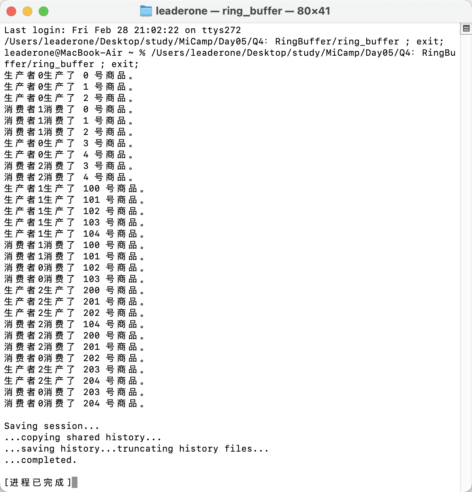

## Q4：多线程环形缓冲区

### 题目描述：

- 实现一个多线程环形缓冲区，支持多生产者线程向缓冲区中写入数据，多个消费者线程从缓冲区中读取数。使用互斥锁和条件变量来实现线程同步，确保数据的一致性和并发安全性。

### 实现思路：

- 在解决本题的过程中，我遭遇了一些困难：一开始我编写的程序存在问题，某些项在被生产之前就被消费了。（有点搞笑对吧）
- 经过我反复分析，我的代码核心逻辑是正确的。我已经在 Ring 类使用了互斥锁 mtx 和条件变量 full、empty 来确保缓冲区的访问是线程安全的，理论上不会出现消费未生产数据的情况。
- 然而，经过我反复排查发现，输出的异常顺序是由于打印语句的同步问题造成的。在我最初的代码中：生产者调用 buffer.produce(item)，然后在缓冲区操作锁保护下打印结果。消费者调用 buffer.consume()，然后在单独的输出锁保护下打印结果。由于二者是分开的，生产和消费操作的实际完成顺序就与打印顺序不一致。在这种情况下，尽管生产操作在消费之前完成，但由于打印的延迟，输出顺序颠倒，导致看起来像是先消费后生产。
- 为了让输出准确反映生产和消费的实际顺序，我需要确保打印语句与缓冲区操作同步。于是我将打印语句移动到 produce 和 consume 函数内部，在 mtx 锁的保护下执行。这样，打印顺序将严格遵循操作顺序，避免因线程调度导致的输出混乱。

```c++
    void produce(int id, const T &item)
    {
        unique_lock<mutex> lock(mtx);
        full.wait(lock, [this]()
                  { return count < capacity; });
        buffer[end] = item;
        end = (end + 1) % capacity;
        ++count;
        cout << "生产者" << id << "生产了 " << item << " 号商品。" << endl;
        empty.notify_all();
    }
    T consume(int id)
    {
        unique_lock<mutex> lock(mtx);
        empty.wait(lock, [this]()
                   { return count > 0; });
        T item = buffer[head];
        head = (head + 1) % capacity;
        --count;
        cout << "消费者" << id << "消费了 " << item << " 号商品。" << endl;
        full.notify_all();
        return item;
    }
```

### 运行结果：


