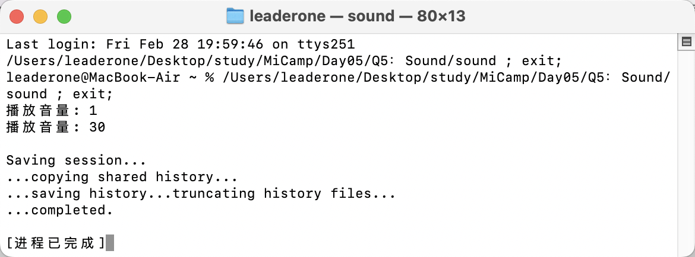

## Q5：声音播放

### 题目描述：

- 条件变量的代码例子
  - 我们有两个线程，一个线程模拟音量条拖动，一个线程模拟发出声音一秒。
  - 音量条拖动一次，发送一个消息给到声音播放线程，音量播放一秒钟。
  - 要求音量条可以随意播放，音量从 1 到 30，人耳要体验到音量是跟手的。

### 实现思路：

- set 函数模拟音量设置的过程，for 循环将数字 1 到 30 依次推入 setSound 队列，并每次插入后通过 cv.notify_one() 唤醒一个正在等待的线程（如果有的话）。

```c++
void set()
{
    for (int i = 1; i <= 30; ++i)
    {
        this_thread::sleep_for(chrono::milliseconds(100)); // 模拟拖动
        {
            lock_guard<mutex> lock(mtx);
            setSound.push(i);
        }
        cv.notify_one();
    }
}
```

- sound 函数实现了播放音量的逻辑。它运行在 while(true) 循环中，确保持续监听和处理音量设置。当队列为空且没有新的音量要设置时，它会等待，否则进入播放逻辑：从队列中取出一个音量值并播放，使用 this_thread::sleep_for(chrono::seconds(1)) 模拟播放音量的过程。如果 done 为 true 且队列为空，表示音量设置结束，线程退出。
- 为了满足题目要求，我实现了防抖机制：在音量播放时，我确保只播放最后一个设置的音量值，避免了多个连续音量值重复播放。

```c++
void sound()
{
    while (true)
    {
        unique_lock<mutex> lock(mtx);
        cv.wait(lock, []
                { return !setSound.empty() || done; });
        if (done && setSound.empty())
            break;
        if (!setSound.empty())
        {
            int volume = setSound.front();
            setSound.pop();
            lock.unlock();

            cout << "播放音量: " << volume << endl;
            this_thread::sleep_for(chrono::seconds(1));

            // 清空队列，只保留最后一个音量
            lock.lock();
            while (setSound.size() > 1)
            {
                setSound.pop();
            }
        }
        lock.unlock();
    }
}
```

#### 总结

- 这个程序本质上仍然是一个生产者-消费者模型，通过两个线程之间的协作来完成任务。生产者线程负责将音量值按顺序推入共享队列，而消费者线程则从队列中取出音量值进行播放。生产者在每次插入新音量值后，利用条件变量 cv.notify_one() 唤醒等待中的消费者线程，确保消费者及时处理新数据。消费者线程在没有数据时通过 cv.wait() 进入等待状态。

### 运行结果：

- test 函数模拟了快速拖动音量的操作，待设置的音量值为 1, 15, 20, 30。
- 在 main 函数中，创建了两个线程：t1 运行 test 函数，模拟快速拖动音量的操作，t2 运行 sound 函数，负责播放音量。



- 由于四个待设置的音量值均在一秒内传入，因此 15 和 20 两个值无效，程序输出的结果符合预期。
