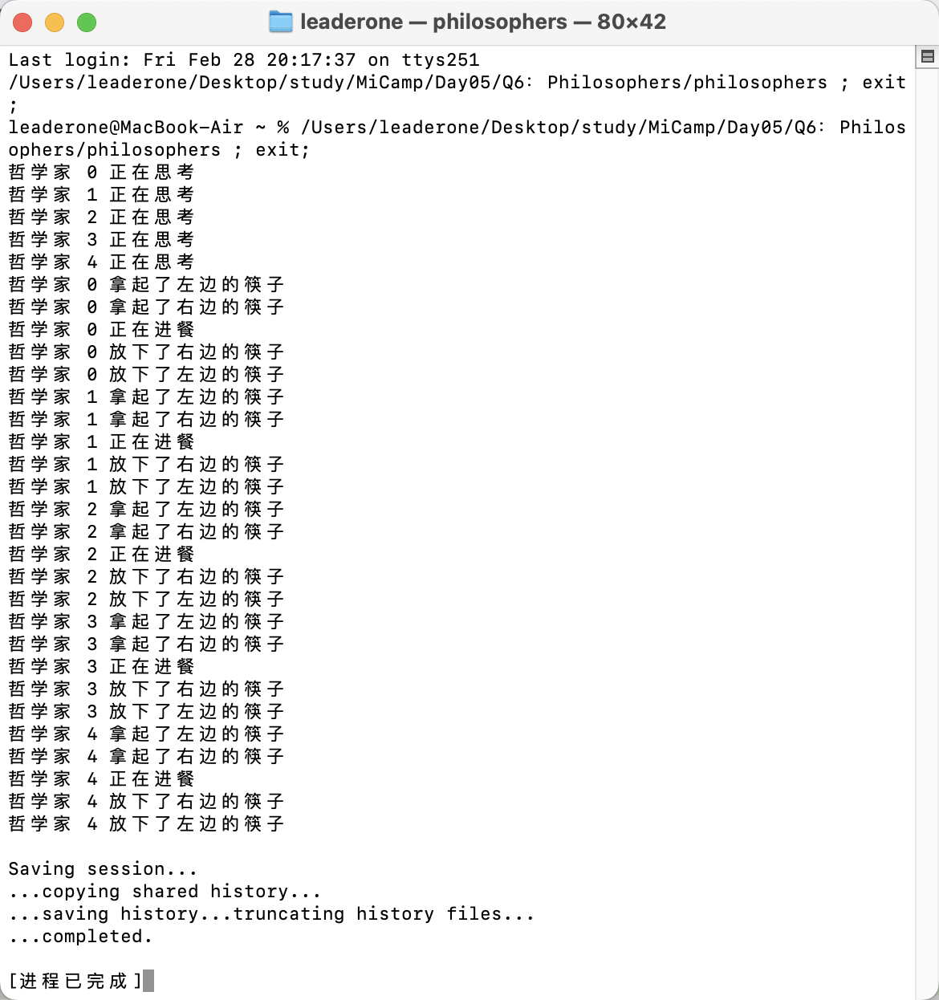

## Q2：哲学家进餐问题

### 题目描述：

- 5 个哲学家去吃中餐，坐在一张圆桌旁，他们有 5 根筷子（而不是 5 双），并且每两个人中间放一根筷子，哲学家们要么在思考，要么在进餐，每个人都需要一双筷子才能吃到东西，并在吃完后将筷子放回原处继续思考。
- 在保证所有人都能够进餐的前提下，实现 0，1，2，3，4 依次进餐。

### 实现思路：

- 哲学家在开始时先“思考”，并打印相应的消息。通过 lock_guard 来保护共享资源（cout），确保在输出时不会发生竞争。
- 每个哲学家会使用 cv.wait(lk, [id] { return num == id; }) 等待，直到 num 等于当前哲学家的编号 id，这确保哲学家按顺序进餐。cv.wait() 会使当前线程阻塞，直到条件满足，避免无意义的 CPU 资源消耗。num == id 表示只有当前哲学家的编号 id 匹配时，哲学家才能继续操作。
- 哲学家需要拿起左右两根筷子才能进餐。通过 lock() 获取互斥锁，确保两根筷子在同一时间只能被一个哲学家拿起。拿筷子后，会打印相关信息。哲学家在拿起筷子后，this_thread::sleep_for(chrono::milliseconds(100)); 用来模拟进餐的时间。
- 进餐结束后，哲学家会放下左右两根筷子，调用 unlock() 解锁。每次放下筷子时，都会打印相应的消息。
- num++ 表示下一个哲学家开始进餐，更新 num 的值。
- cv.notify_all() 会唤醒所有等待的线程（哲学家），使得每个哲学家能够继续按顺序进餐。

```c++
void philosopher(int id)
{
    {
        lock_guard<mutex> lock(mtx);
        cout << "哲学家 " << id << " 正在思考" << endl;
    }
    this_thread::sleep_for(chrono::milliseconds(100));

    {
        unique_lock<mutex> lk(mtx);
        cv.wait(lk, [id]
                { return num == id; });
    }

    // 确保哲学家按顺序进餐
    this_thread::sleep_for(chrono::milliseconds(100 * id));

    int left = id;
    int right = (id + 1) % 5;

    chopsticks[left].lock();
    {
        lock_guard<mutex> lock(mtx);
        cout << "哲学家 " << id << " 拿起了左边的筷子" << endl;
    }
    chopsticks[right].lock();
    {
        lock_guard<mutex> lock(mtx);
        cout << "哲学家 " << id << " 拿起了右边的筷子" << endl;
    }
    {
        lock_guard<mutex> lock(mtx);
        cout << "哲学家 " << id << " 正在进餐" << endl;
    }
    this_thread::sleep_for(chrono::milliseconds(100));
    chopsticks[right].unlock();
    {
        lock_guard<mutex> lock(mtx);
        cout << "哲学家 " << id << " 放下了右边的筷子" << endl;
    }
    chopsticks[left].unlock();
    {
        lock_guard<mutex> lock(mtx);
        cout << "哲学家 " << id << " 放下了左边的筷子" << endl;
    }

    // 通知下一个哲学家
    {
        lock_guard<mutex> lock(mtx);
        num++;
        cv.notify_all();
    }
}
```

### 运行结果：


