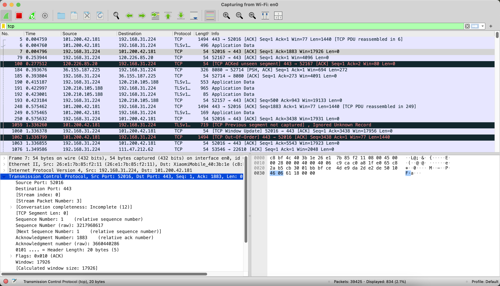
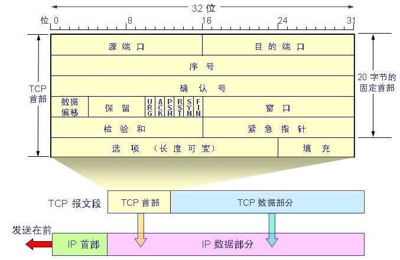

# Q1：使用 wireshark 查看 TCP 并截图，写一下你对 TCP 每一个字段的理解。

### WireShark 截图：

- 下面这张图就是我在 Mac 上使用 Wireshark 捕获网络数据包的界面，显示了 TCP 相关的数据包。

### 字段理解：

- 如图所示，首先是源端口和目标端口，这两个字段就像是信封上的寄件人和收件人地址，标明了这封信的来龙去脉。它们的作用是让操作系统知道这个 TCP 报文属于哪个应用程序，比如一个网页请求的 TCP 报文，源端口可能是随机分配的高位端口，而目标端口一般是 80 或者 443。

- 接下来是序列号，TCP 是基于字节流的，所有的数据都会被分成一个个的字节块，每个字节都有自己的编号，而序列号就是告诉接收方“我这次发的数据是从第几个字节开始的”。如果一个数据包丢失了，接收方可以根据序列号发现这个问题，并要求发送方重传。

- 然后是确认号，它其实是“你发给我数据的序列号 + 1”。比如你发来的数据序列号是 1000，长度是 100 字节，那么我给你的确认号就是 1100，意思是“我已经收到了 1000-1099 这部分数据，下次请从 1100 号字节开始发”。这个机制保证了 TCP 的可靠性，让发送方知道哪些数据已经被正确接收，哪些需要重传。

- 数据偏移告诉我们 TCP 头部的长度是多少，因为 TCP 头部可以有可选字段，所以这个长度并不是固定的。比如常见的 TCP 头部是 20 字节，但如果有选项字段，那就可能变长，接收方通过这个字段知道数据从哪里开始。

- 标志位是一组比特，用来控制 TCP 连接的状态。比如 SYN 表示建立连接，ACK 表示确认数据，FIN 表示关闭连接，RST 表示重置连接，PSH 强制数据立即发送，URG 表示有紧急数据。这些标志位的组合决定了 TCP 如何建立、维护和关闭连接，比如三次握手和四次挥手就是靠这些标志位完成的。

- 然后是窗口大小，它决定了 TCP 流量控制的核心规则。这个字段表示接收方还能接收多少数据，告诉发送方“你别发太快，我的缓存快满了”，防止发送方猛地发一堆数据把接收方的缓冲区撑爆。这个窗口大小是动态变化的，在高带宽、低丢包率的网络下，可以通过 TCP 窗口缩放选项来扩展它，从而提高传输效率。

- 校验和是保证数据完整性的关键，它是对 TCP 头部和数据部分进行计算得出的一个值，接收方收到数据后也会计算一遍，看看结果是不是一致。如果不一致，就说明数据在传输过程中可能出错了，需要丢弃并要求重传。

- 紧急指针这个字段基本上没什么用，除非在写一些特殊的应用，比如早期的 Telnet 需要用它来发送紧急数据。

- 最后是可选字段和填充，这里可以加一些额外的 TCP 选项，比如窗口缩放、时间戳选项（用来计算 RTT）、选择性确认 SACK（用于快速恢复丢失的包）等等。填充是为了让 TCP 头部的长度对齐到 4 字节的整数倍。
