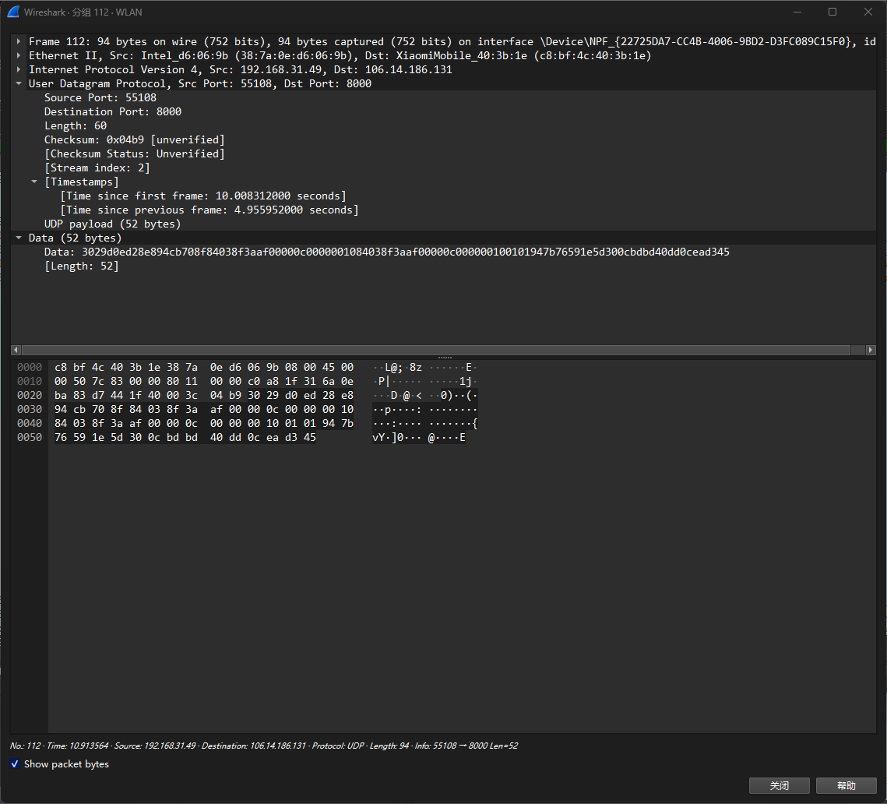
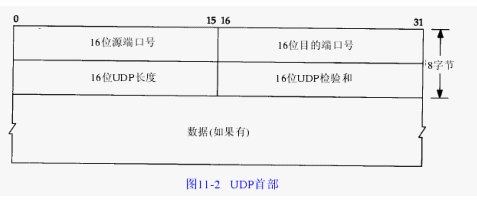

# Q2：自行查询 UDP 包头组成，并使用 wireshark 查看 UDP 包头，wireshark 截图，写下 UDP 包头字段的理解。

### WireShark 截图：

- 下面这张图是我在 Windows 上使用 Wireshark 抓包工具的界面，显示的是 UDP 数据包的详细信息。

### 字段理解：

- 如图所示，UDP 的包头结构比 TCP 简单得多，因为 UDP 不追求可靠性，而是主打快速和轻量。整个 UDP 头部只有 4 个字段，总共 8 字节，比 TCP 头部要精简得多。

- 首先是源端口，它的作用和 TCP 里的源端口一样，就是标明这个数据报是从哪个端口来的，方便接收方知道要把数据交给哪个应用程序。UDP 允许源端口字段为 0，这种情况通常意味着“我不需要回复，只是单纯发个消息”。

- 然后是目标端口，这个字段标明数据要发往哪个端口，比如 DNS 服务器默认监听 53 端口，DHCP 服务器监听 67 端口。UDP 没有连接的概念，所以这个目标端口字段就是唯一的投递地址。

- 再来看长度，它表示整个 UDP 数据报的总长度。这个长度最小是 8，最大是 65535，常见的 MTU 在 1500 字节左右。

- 最后是校验和，这个字段是为了检测数据在传输过程中有没有出错。它是对 UDP 头部、数据部分以及伪首部计算出的一个校验值。接收方收到数据后，也会计算一遍，如果发现结果不匹配，就丢弃数据报。
