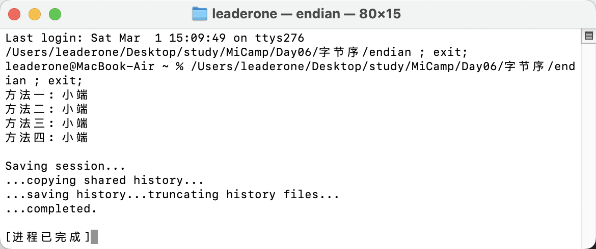

# 编程练习：如何确定本机是什么字节序？

## 实现思路：

针对这道练习题，在查阅资料学习后，我通过多种方法实现了题目要求。

### 方法 1：使用整数和指针

- 把整数 1 存到内存里，然后用指针去检查最低地址的那个字节。如果这个字节是 1，说明低位存在了内存开头（小端模式）；如果是 0，则说明高位存在开头（大端模式）。

```c++
void check1()
{
    int num = 1;
    char *byte = reinterpret_cast<char *>(&num);
    cout << "方法一: " << ((*byte == 1) ? "小端" : "大端") << endl;
}
```

### 方法 2：使用联合体 union

- 联合体的特点是所有成员共享同一块内存。比如定义一个联合体，里面放一个整数 0x01020304 和一个字符数组。通过看字符数组的第一个元素是 0x01 还是 0x04，就能判断是大端还是小端。

```c++
void check2()
{
    union
    {
        uint32_t i;
        uint8_t c[4];
    } test = {0x01020304};

    cout << "方法二: " << ((test.c[0] == 1) ? "大端" : "小端") << endl;
}
```

### 方法 3：使用 htonl() 函数

- 网络传输默认用大端字节序，所以可以用 htonl() 函数把本地数据转成网络格式。如果转换后的值和原值一样，说明本机是大端；如果不一样，说明本机是小端。

```c++
void check3()
{
    int num = 0x12345678;
    cout << "方法三: " << ((htonl(num) == num) ? "大端" : "小端") << endl;
}
```

### 方法 4：使用 std::endian

- 这种方法利用了 C++20 的新特性：通过 <bit> 头文件里的 std::endian::native 直接查询系统字节序。如果它等于 std::endian::little 就是小端，等于 std::endian::big 就是大端。优点是代码干净利落，不用写指针或联合体，完全避免手误和安全隐患，而且读起来一目了然，像是直接问系统：“你是大端还是小端？”。

```c++
void check4()
{
#if __cplusplus >= 202002L
    if constexpr (std::endian::native == std::endian::little)
    {
        cout << "方法四: 小端" << endl;
    }
    if constexpr (std::endian::native == std::endian::big)
    {
        cout << "方法四: 大端" << endl;
    }
#else
    cout << "请检查是否使用C++20进行编译。" << endl;
#endif
}
```

## 运行结果：

- MacBook（基于 Apple Silicon）的字节序默认是 小端（Little-endian）。
- 由于方法四利用了 C++20 的新特性，因此编译的命令是：

```bash
g++ -std=c++20 endian.cpp -o endian
```

- 运行结果如图（完全符合预期）：


