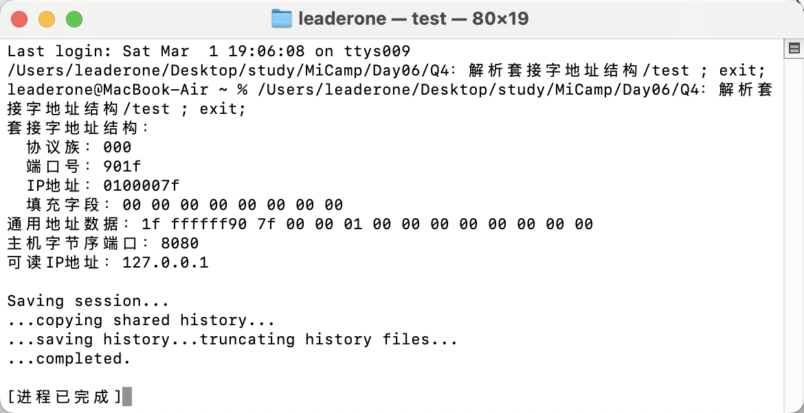

# 解析套接字地址

## 题目描述：

- 给 struct sockaddr_in 结构体赋初值，并强制转换为 struct sockaddr \*；打印输出 struct sockaddr_in 的数据成员，采用十六进制格式；打印输出 struct sockaddr 中的数据成员 sa_data 每个字节，采用十六进制格式；注意 ip 地址和 port 字节顺序，理解字节序概念。

## 实现思路：

- 首先初始化 sockaddr_in 结构体，包括协议族、端口号和 IP 地址，并清零 sin_zero 填充字段。然后将 sockaddr_in 指针强制转换为 sockaddr \*，。

```c++
struct sockaddr_in addr;
addr.sin_family = AF_INET;
addr.sin_port = htons(8080);
addr.sin_addr.s_addr = inet_addr("127.0.0.1");
memset(addr.sin_zero, 0, 8);
```

- 以十六进制方式输出 sin_family、sin_port 和 sin_addr.s_addr。

```c++
cout << "  协议族：" << hex << setw(4) << setfill('0') << addr.sin_family << endl;
cout << "  端口号：" << hex << setw(4) << setfill('0') << addr.sin_port << endl;
cout << "  IP地址：" << hex << setw(8) << setfill('0') << addr.sin_addr.s_addr << endl;
```

- 打印 struct sockaddr 的 sa_data 每个字节，采用十六进制格式.

```c++
cout << "通用地址数据：";
for (int i = 0; i < 14; i++)
{
    cout << hex << setw(2) << setfill('0') << static_cast<int>(addr_ptr->sa_data[i]) << " ";
}
cout << endl;
```

## 运行结果：


