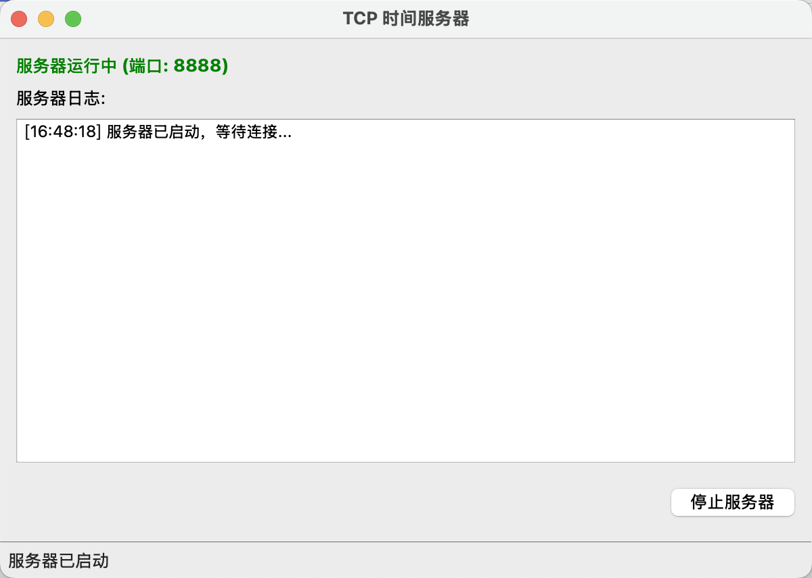
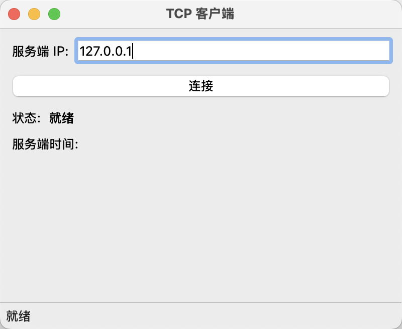
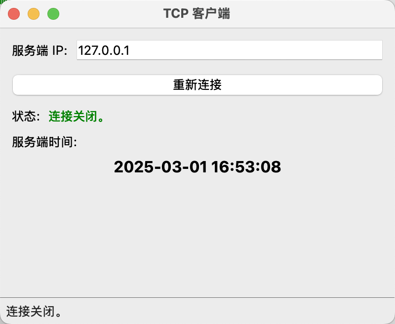
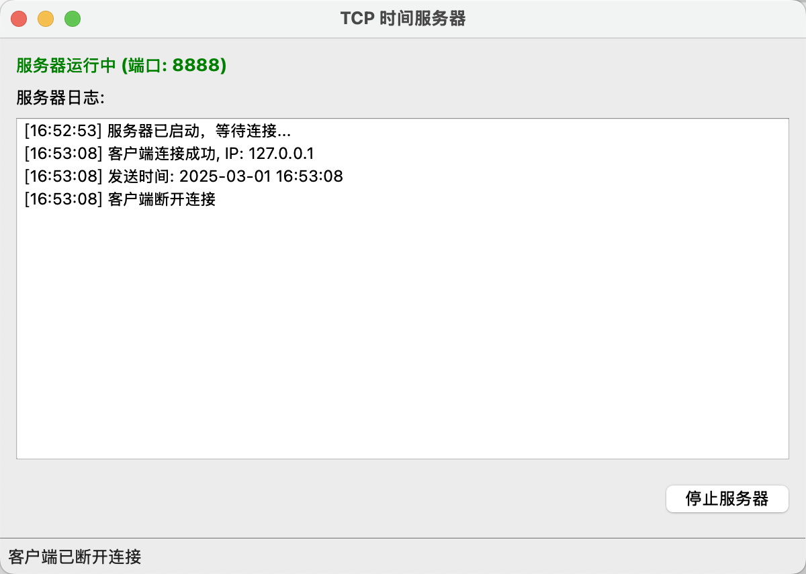

# TCP 连接并收发当前时间

## 题目描述：

- 写一个使用 TCP Socket 的客户端和服务端，当服务端收到客户端的连接时，服务端发送当前系统时间给到客户端，客户端收到时间并打印，接着退出。

## 实现思路：

- 在开发过程中，我采用了以下几种设计思路：

  - 我把整个系统分成了`Socket通信层`、`业务逻辑层`和`用户界面层`。这样做的好处是，每个部分的功能清晰，代码更容易维护和扩展。
  - 我让`网络通信`在单独的线程里运行，而`用户界面`运行在主线程。这样可以避免网络数据传输阻塞界面，让用户体验更流畅。
  - 我使用了`Qt的信号槽机制`，解决了`多线程之间的数据传输`问题。这样做的优势是，不需要手动加锁，线程间通信更加安全稳定。
  - 在客户端和服务器端，我设计了清晰的`状态转换逻辑`。比如，客户端会有`未连接`、`连接中`、`同步中`、`已同步 等状态，服务器也会根据请求变化状态。

## 编译与运行：

- 第一步：确保构建脚本可执行

```bash
chmod +x build.sh
```

- 第二步：运行构建脚本

```bash
./build.sh
```

- 第三步：启动服务器

```bash
open ./build/server.app
```

- 第四步：启动客户端

```bash
open ./build/client.app
```

### 运行过程和结果

- 点击"启动服务器"按钮开始接受连接，服务端会自动监听 8888 端口，界面显示连接和操作日志。



- 启动后在输入框中输入服务器 IP 地址（默认为 127.0.0.1）



- 点击"连接到服务器"按钮连接到服务器，连接成功后会显示从服务器接收到的时间，连接完成后可以点击"重新连接"按钮重新连接。



- 服务端会打印相关日志。



## 核心代码：

### 项目结构

```
TCP/
├── CMakeLists.txt          # CMake构建配置
├── build.sh                # 构建脚本
├── include/                # 头文件目录
│   └── socket.h            # Socket通用函数声明
├── src/                    # 源代码目录
│   ├── socket.cpp          # Socket通用函数实现
│   ├── server.cpp          # 服务端主程序
│   ├── client.cpp          # 客户端主程序
│   ├── server_window.h     # 服务端窗口类声明
│   ├── server_window.cpp   # 服务端窗口类实现
│   ├── client_window.h     # 客户端窗口类声明
│   └── client_window.cpp   # 客户端窗口类实现
└── README.md               # 项目说明
```

### 服务器线程核心逻辑，创建、绑定和监听套接字

```c++
void SrvThread::run()
{
    m_sock = createSock();
    if (m_sock == -1)
    {
        emit error("Socket 创建失败");
        return;
    }

    if (!bindSock(m_sock, PORT))
    {
        closeSock(m_sock);
        emit error("绑定失败");
        return;
    }

    if (!listenSock(m_sock))
    {
        closeSock(m_sock);
        emit error("监听失败");
        return;
    }

    m_run = true;
    emit started();
    emit log("服务器已启动，等待连接...");
    // ...
}
```

### 非阻塞型服务器循环，使用 select 实现多客户端处理

```c++
// 服务器工作循环
while (m_run)
{
    FD_ZERO(&readfds);
    FD_SET(m_sock, &readfds);

    tv.tv_sec = 0;
    tv.tv_usec = 100000;

    int activity = select(m_sock + 1, &readfds, NULL, NULL, &tv);

    if (activity < 0)
    {
        emit log("选择错误", true);
        break;
    }

    if (activity == 0)
    {
        continue;
    }

    if (FD_ISSET(m_sock, &readfds))
    {
        string clientIP;
        int clientSock = acceptConn(m_sock, clientIP);
        // 处理连接...
    }
}
```

### 客户端线程主要实现，负责连接服务器并接收时间

```c++
void CliThread::run()
{
    emit stateChange(CONNECTING, "正在连接服务端。");

    int sock = createSock();
    if (sock == -1)
    {
        emit error("Socket 创建失败。");
        emit stateChange(ERROR, "Socket 创建失败。");
        return;
    }

    // 连接服务器...
    string timeStr = recvData(sock);
    // 处理接收到的数据...
}
```
