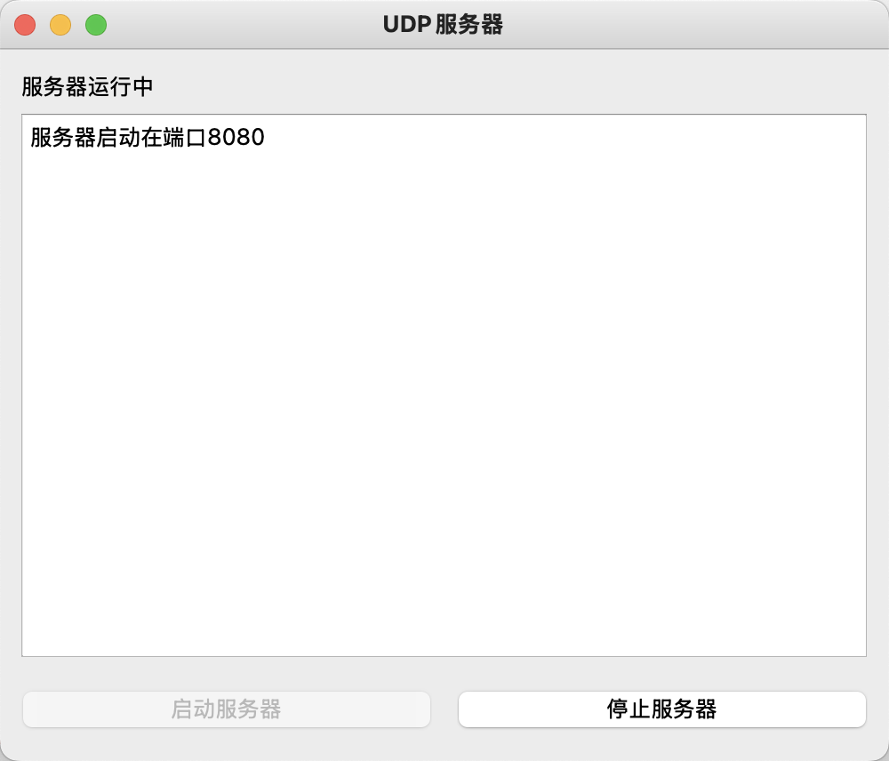
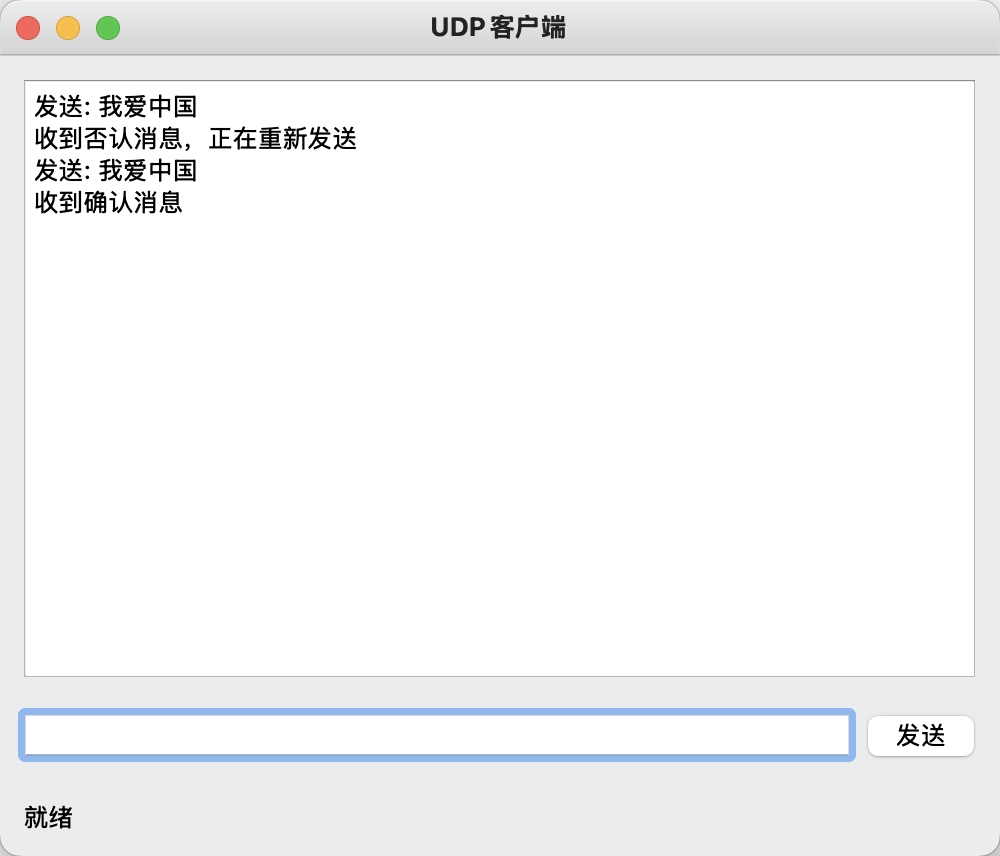
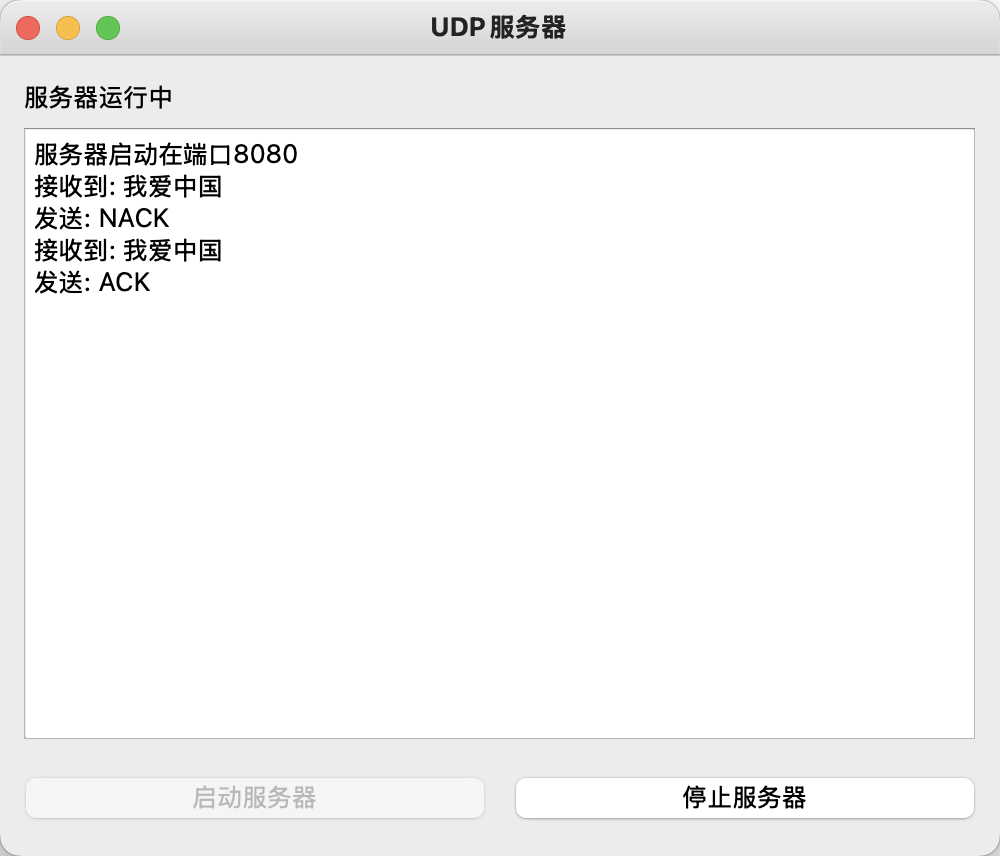
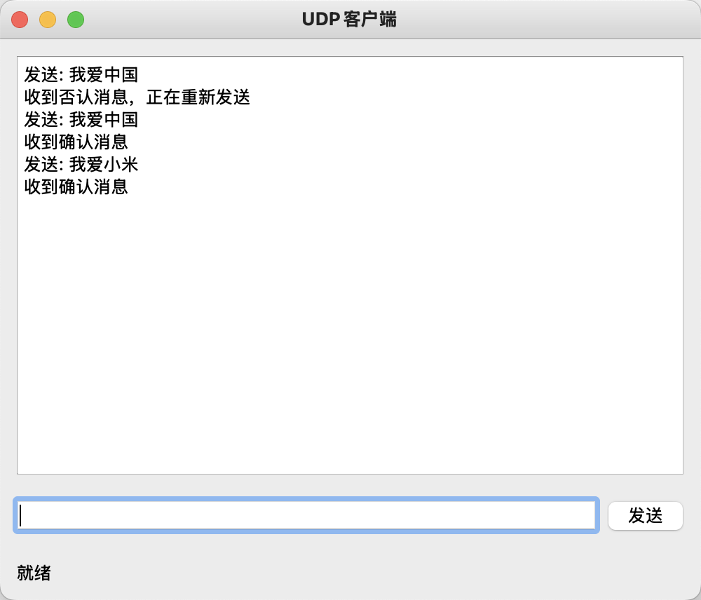
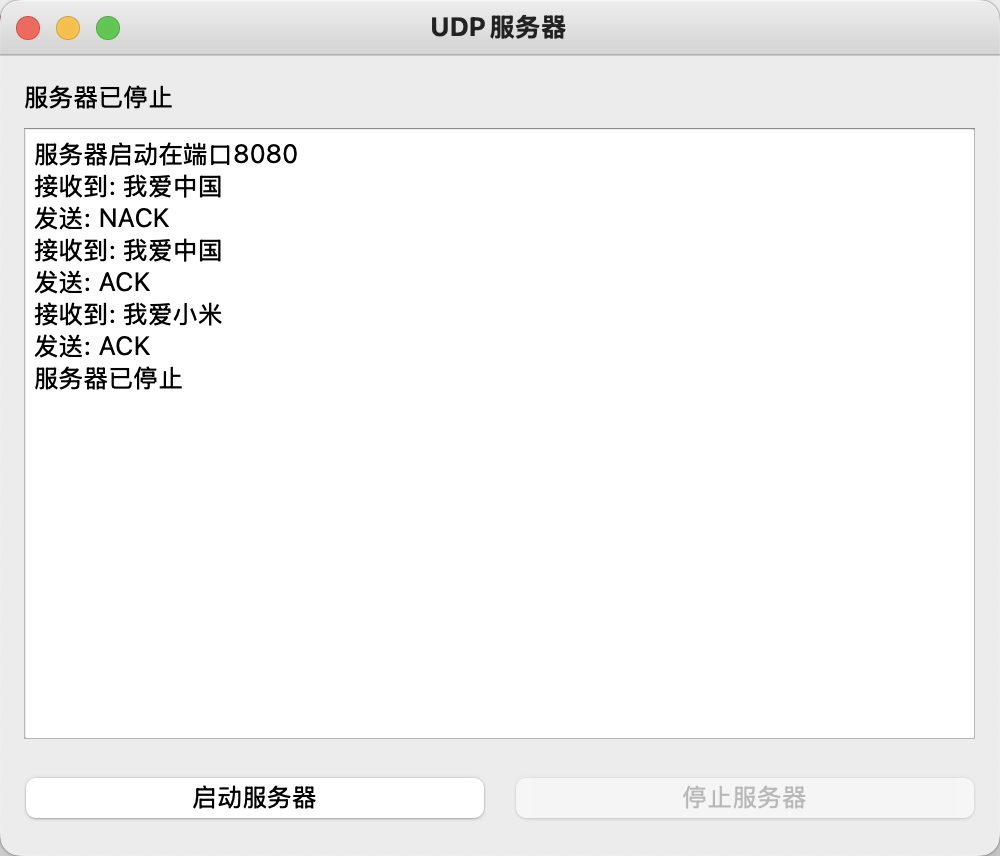

# UDP 实现停等协议

## 题目描述：

- 基于 UDP，自定义协议实现停止等待协议
  要求：
  - 自定义数据格式，包含：长度＋数据+checksum；
  - 客户端发送一次数据，必须停下来等待服务端回复 ACK；
  - 如果回复 ACK，客户端发送下一包数据；
  - 如果回复 NACK（否定应答），客户端重发数据；

## 实现思路

- 在开发这个基于 UDP 的停等协议过程中，除了延续上一题的设计思路，我还采用了以下的创新：
  - 我设计了自定义的数据包结构，包含数据长度、数据内容和校验和三个部分，确保数据传输的完整性和可靠性。
  - 在服务器端，我模拟了一个简单的错误模型，有一定概率会返回 ACK ,也有一定概率返回 NACK，用于测试客户端的重传机制。

## 编译与运行

- 第一步：使用 CMake 构建项目

```bash
mkdir build && cd build
cmake ..
make
```

- 第二步：启动服务器

```bash
./server_qt
```

- 第三步：启动客户端

```bash
./client_qt
```

### 运行过程和结果

- 点击服务器窗口中的"启动服务器"按钮，服务器会开始在 8080 端口监听 UDP 数据包。



- 在客户端输入框中输入要发送的消息，然后点击"发送"按钮发送消息。客户端会将消息打包（添加长度和校验和）后发送给服务器，并进入等待状态，直到收到服务器的回复。服务器收到数据包后会计算校验和进行验证，然后随机返回 ACK（确认）或 NACK（否认）。如果客户端收到 ACK，则可以发送新的消息；如果收到 NACK，则会重新发送当前消息。如果客户端在 3 秒内没有收到服务器的回复，会自动重传当前消息。




- 再测试一组数据并关闭服务器：




## 核心代码

### 项目结构

```

UDP/
├── CMakeLists.txt          # CMake构建配置
├── include/                # 头文件目录
│   └── common.h            # 通用定义和函数声明
├── src/                    # 源代码目录
│   ├── client/             # 客户端代码
│   │   ├── client.cpp      # 客户端实现
│   │   └── CMakeLists.txt  # 客户端构建配置
│   └── server/             # 服务器端代码
│       ├── server.cpp      # 服务器端实现
│       └── CMakeLists.txt  # 服务器端构建配置
└── README.md               # 项目说明

```

### 自定义数据包结构

```c++
struct Packet
{
    quint16 len;            // 数据长度
    char data[MAX_DATA_SIZE]; // 数据内容
    quint16 checksum;       // 校验和
};

quint16 calcChecksum(const char *data, size_t len)
{
    quint16 checksum = 0;
    for (size_t i = 0; i < len; ++i)
    {
        checksum ^= data[i];
    }
    return checksum;
}
```

### 服务器处理数据包核心逻辑

```c++
void processPacket() {
    QByteArray buffer;
    buffer.resize(sock->pendingDatagramSize());
    QHostAddress sender;
    quint16 senderPort;

    sock->readDatagram(buffer.data(), buffer.size(), &sender, &senderPort);

    if (buffer.size() >= static_cast<int>(sizeof(Packet))) {
        Packet pkt = *reinterpret_cast<Packet*>(buffer.data());
        logView->append("接收到: " + QString(pkt.data));

        quint16 recv_checksum = pkt.checksum;
        pkt.checksum = 0;
        quint16 calc_checksum = calcChecksum(pkt.data, pkt.len);

        QByteArray resp;
        if (recv_checksum == calc_checksum) {
            // 20%概率ACK，80%概率NACK
            int rand_val = QRandomGenerator::global()->bounded(100);
            if (rand_val < 20) {
                resp = "ACK";
            } else {
                resp = "NACK";
            }
        } else {
            resp = "NACK";
        }

        sock->writeDatagram(resp, sender, senderPort);
        logView->append("发送: " + QString(resp));
    }
}
```

### 客户端发送消息和处理应答的实现

```c++
void sendMessage() {
    if (waiting_for_response) {
        msgHistory->append("等待服务器响应，请稍后...");
        return;
    }

    QString msg = msgInput->text().trimmed();
    if (msg.isEmpty()) return;

    msgInput->clear();

    strncpy(current_pkt.data, msg.toUtf8().constData(), MAX_DATA_SIZE);
    current_pkt.len = strlen(current_pkt.data);
    current_pkt.checksum = calcChecksum(current_pkt.data, current_pkt.len);

    sock->writeDatagram(reinterpret_cast<char*>(&current_pkt), sizeof(current_pkt), serverAddr, serverPort);
    msgHistory->append("发送: " + QString(current_pkt.data));

    timer->start(3000); // 3秒超时
    waiting_for_response = true;
    statusLabel->setText("等待响应...");
}
}
```

### 客户端超时重传机制

```c++
void retransmit() {
    if (waiting_for_response) {
        msgHistory->append("响应超时，重新发送");
        sock->writeDatagram(reinterpret_cast<char*>(&current_pkt), sizeof(current_pkt), serverAddr, serverPort);
        msgHistory->append("发送: " + QString(current_pkt.data));
        timer->start(3000); // 3秒超时
    }
}
```
