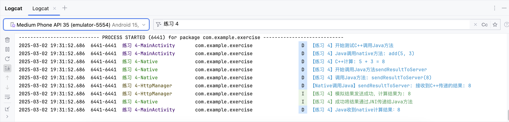

# Day07：Android 基础知识

- 由于今日题目较少，我不再为每题分别撰写详细的 README 文档，而是汇总到本篇。

## 练习 - C++调用 Java 方法

### 题目介绍

- 在这道练习题中，我在 Android Studio 实现了 C++代码调用 Java 方法，具体包括定义 Java 中的 native 方法（add），在 C++中实现该 native 方法，并在 C++代码中调用 Java 的静态方法（sendResultToServer）。

### 实现思路

#### Java 端

- 首先创建`JNITest`类，包含：
  - native 方法声明：`public native int add(int a, int b)`
  - 静态内部类`HttpManager`，包含`sendResultToServer`方法
  - 加载 native 库的静态代码块

#### C++端

- 在 native-lib.cpp 中实现：
  - 添加`Java_com_example_exercise_JNITest_add`方法，实现两个整数相加
  - 使用 JNI 接口获取 Java 类和方法
  - 调用 Java 的静态方法`sendResultToServer`，将计算结果传递给 Java

#### JNI 调用流程

1. Java 代码调用 native 方法 add
2. native 方法执行计算
3. native 方法通过 JNI 接口调用 Java 的静态方法
4. 日志中可以看到 sendResultToServer 方法被调用的记录

### 运行效果

- 运行程序后，可以在 Logcat 中筛选"练习 4"关键字，能看到完整的调用流程日志：



- 这表明 C++成功计算了结果，并通过 JNI 调用了 Java 的方法传递了结果。

## 作业 - JNI 实现反转字符串

### 题目描述：

- 实现一个 jni 函数：
  - reverse 函数：在 C++层反转单词，并 return 结果。
- 要求：
  - 在 MainActivity 中触发这个 reverse 函数，并通过 Log 打印，上传 Log 截图。

### 功能简介

- 我的应用实现了这些功能：
  - 提供一个简单界面。
  - 用户输入英文句子后，点击按钮可以反转句子中各单词的顺序。
  - 使用 JNI 调用 C++实现的反转算法。
  - 反转结果在界面上显示，同时通过 Log 打印。

### 实现思路

#### JNI 部分

核心算法是在 C++层实现的，这是我个人感觉最有挑战的部分。要点如下：

1. 创建一个 native 方法声明

```java
public native String reverseStringJNI(String inputString);
```

2. 在 C++层实现算法

```cpp
extern "C" JNIEXPORT jstring JNICALL
Java_com_example_assignment_MainActivity_reverseStringJNI(
        JNIEnv* env,
        jobject /* this */,
        jstring input_string) {
    // 实现单词反转...
}
```

- 算法实现部分基本复用了 Day02 作业中的 C++代码，不再赘述。

#### 界面部分

由于没有系统学习过 Android Studio，我只是稍微速成了一下，设计的界面比较简单，仅仅满足测试所需。

### 运行结果

- 使用很简单：在输入框中输入英文句子（I love xiaomi）后点击"反转单词顺序"按钮，就可以查看结果区域显示的反转结果。


- 也可以通过 Logcat 查看输出（过滤"反转字符串"关键词）


