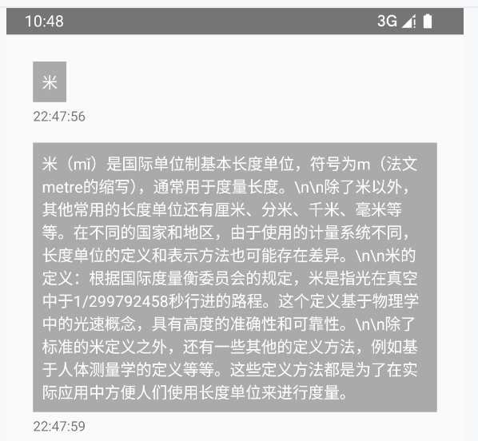
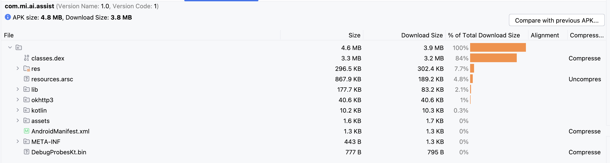

# AI-Assist

## 题目描述：

- 完成 cJSON 交叉编译，并把生成的解析库放入 android 工程当中，对网络请求的回来的数据解析，可以完成大模型对话功能。
- 要求：
  - 1．把 cJSON 编译成 android 可用的 so 库。
  - 2．把 cJSON 的使用接口封装成 jni 可以供 java 层调用。
  - 3、实现和 AI 对话功能。

### 运行结果

- 测试：



- 打包成为 apk 后 analyze：



- 下面的这些日志证明 cJSON 已成功编译为 so 库并被加载，JNI 接口封装正常工作，JSON 数据的编码和解码功能正常：

```log
Load /data/app/.../libaiassist.so using ns clns-7 from class loader: ok
```

- 这表明包含 cJSON 的动态库已成功编译并加载。

```log
AiAssist: Generated JSON: {
    "question": "米",
    "time": 1741009528208
}
```

- 这表明 JNI 方法成功调用, AiAssist 组件成功创建了一个 JSON 请求，并准备向 AI 处理模块发送查询。

```log
AiAssist: Parsing JSON response: {
    "time": 1741013084.4319146,
    "answer": "米（mǐ）是国际单位制基本长度单位..."
}
```

- 这表明 AiAssist 成功解析了 AI 生成的 JSON 响应，并提取了 answer 字段的内容。

2. decodeJsonStrToObj 调用证据：

```log
MainActivity: Response JSON: {
    "time": 1741009533.0047185,
    "answer": "..."
}
```

- 这表明 decodeJsonStrToObj 成功调用。

## 编译 cJSON 库

### ### cJSON 编译为 Android so 库

- 编译后的 .so 文件位置

```：
app/build/intermediates/merged_native_libs/debug/out/lib/
├── arm64-v8a/
│ ├── libcjson.so
│ └── libaiassist.so
```

## JNI 接口实现

### Java 层定义

在 `MainActivity.java` 中定义 native 方法：

```java
public class MainActivity extends AppCompatActivity {
private static boolean mCjsonLibExisted = false;
static {
try {
System.loadLibrary("aiassist");
mCjsonLibExisted = true;
} catch (UnsatisfiedLinkError e) {
Log.e(TAG, "cjson so 不存在!");
}
}
// JNI 方法声明
private native String encodeObjToJsonStr(QuestionData data);
private native AnswerData decodeJsonStrToObj(String jsonStr);
}
```

### C++ 实现

```cpp
// 对象转 JSON 字符串
JNIEXPORT jstring JNICALL
Java_com_mi_ai_assist_MainActivity_encodeObjToJsonStr(
JNIEnv env, jobject thiz, jobject data) {
// 获取 Java 对象字段
jclass questionClass = env->GetObjectClass(data);
jfieldID questionField = env->GetFieldID(questionClass,
"question", "Ljava/lang/String;");
jfieldID timeField = env->GetFieldID(questionClass, "time", "J");
// 创建 JSON
cJSON root = cJSON_CreateObject();
cJSON_AddStringToObject(root, "question", question);
cJSON_AddNumberToObject(root, "time", (double)timestamp);
// 转换为字符串
char jsonString = cJSON_Print(root);
jstring result = env->NewStringUTF(jsonString);
// 清理资源
free(jsonString);
cJSON_Delete(root);
return result;
}
// JSON 字符串转对象
JNIEXPORT jobject JNICALL
Java_com_mi_ai_assist_MainActivity_decodeJsonStrToObj(
JNIEnv env, jobject thiz, jstring jsonStr) {
// 解析 JSON
const char json = env->GetStringUTFChars(jsonStr, 0);
cJSON root = cJSON_Parse(json);
// 获取字段
cJSON answer = cJSON_GetObjectItem(root, "answer");
cJSON time = cJSON_GetObjectItem(root, "time");
// 创建 Java 对象
jclass answerClass = env->FindClass("com/mi/ai/assist/AnswerData");
jobject answerData = env->NewObject(answerClass, constructor);
// 设置字段值
env->SetObjectField(answerData, answerField,
env->NewStringUTF(answer->valuestring));
env->SetFloatField(answerData, timeField,
(jfloat)time->valuedouble);
return answerData;
}
```

## 项目结构

```
app/
├── src/
│ └── main/
│ ├── cpp/
│ │ ├── cJSON/ # cJSON 源码
│ │ │ ├── cJSON.c
│ │ │ ├── cJSON.h
│ │ │ ├── cJSON_Utils.c
│ │ │ └── cJSON_Utils.h
│ │ ├── chat_jni.cpp # JNI 实现
│ │ └── CMakeLists.txt # CMake 构建脚本
│ └── java/
│ └── com/mi/ai/assist/
│ ├── MainActivity.java
│ ├── DialogData.java
│ └── DialogAdapter.java
```

## 编译说明

1. 在 Android Studio 中打开项目
2. 确保已安装 NDK 和 CMake
3. 执行 Build -> Make Project
4. 编译完成后会在上述目录生成 .so 文件
