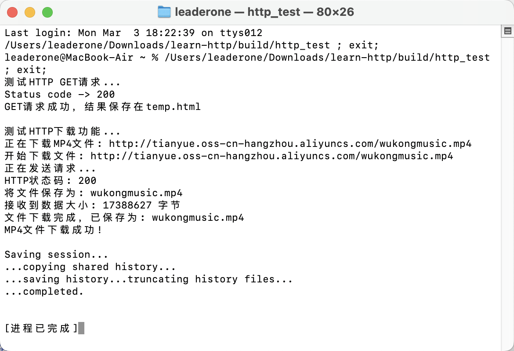

# HTTP 下载 MP4 文件

## 题目描述：

- 1：libghttp 为子工程，实现了 http 功能，需要编译生成动态库。
- 2：主工程为 http 请求测试工程，编译生成可执行文件，依赖子工程的 http 库，完成 http 的 get 和 download 请求测试。

## 运行结果

- 编译程序：

```bash
cmake .. && make
```

- 运行程序测试 MP4 下载功能：

```bash
./http_test
```

- 输出结果：



- 检查下载的文件：

```bash
ls -lh wukongmusic.mp4
-rw-r--r--@ 1 leaderone  staff    17M  3  3 15:22 wukongmusic.mp4
```

- 成功下载了 17MB 大小的 MP4 文件！视频成功播放：


## 设计思路

### libghttp 子项目的 CMakeLists.txt

```c
cmake_minimum_required(VERSION 3.10)
project(libghttp VERSION 1.0.0 LANGUAGES C)

set(CMAKE_C_STANDARD 99)
set(CMAKE_C_STANDARD_REQUIRED ON)

file(GLOB SOURCES "*.c")
file(GLOB HEADERS "*.h")

add_library(ghttp SHARED ${SOURCES} ${HEADERS})

set_target_properties(ghttp PROPERTIES
    VERSION ${PROJECT_VERSION}
    SOVERSION 1
)

target_include_directories(ghttp
    PUBLIC
        $<BUILD_INTERFACE:${CMAKE_CURRENT_SOURCE_DIR}>
)

install(TARGETS ghttp
    LIBRARY DESTINATION lib
    PUBLIC_HEADER DESTINATION include/libghttp
)

set_target_properties(ghttp PROPERTIES PUBLIC_HEADER "${HEADERS}")
```

#### 主项目的 CMakeLists.txt

```c
cmake_minimum_required(VERSION 3.10)
project(http_test VERSION 1.0.0 LANGUAGES CXX)

set(CMAKE_CXX_STANDARD 14)
set(CMAKE_CXX_STANDARD_REQUIRED ON)

add_subdirectory(libghttp)

set(SOURCES
    main.cpp
    src/get.cpp
    src/download.cpp
)

include_directories(
    ${CMAKE_CURRENT_SOURCE_DIR}/include
    ${CMAKE_CURRENT_SOURCE_DIR}
)

add_executable(http_test ${SOURCES})

target_link_libraries(http_test PRIVATE ghttp)

install(TARGETS http_test
    RUNTIME DESTINATION bin
)
```

### 原来的 download.h 文件包含实现代码，修改为只包含声明：

```cpp
#pragma once

#include <string>

int download(std::string downloadURL);
```

### 添加必要的头文件引用：

```cpp
#include "download.h"
#include <stdio.h>
#include "libghttp/ghttp.h"
```

### 改进 download.cpp 实现

```cpp
#include "download.h"
#include <stdio.h>
#include <string.h>
#include <iostream>
#include <sstream>
#include <fstream>
#include "libghttp/ghttp.h"

int download(std::string downloadURL) {
    const char *url = downloadURL.c_str();
    ghttp_request *request = ghttp_request_new();
    ghttp_status status;

    std::cout << "开始下载文件: " << url << std::endl;

    ghttp_set_header(request, http_hdr_Accept, "*/*");
    ghttp_set_header(request, http_hdr_Connection, "close");

    std::string filename = "download.mp4";
    size_t last_slash = downloadURL.find_last_of("/");
    if (last_slash != std::string::npos && last_slash < downloadURL.length() - 1) {
        filename = downloadURL.substr(last_slash + 1);
    }

    std::cout << "将文件保存为: " << filename << std::endl;

    // ... 其他代码 ...
}
```

### 修改 main.cpp 添加 MP4 下载测试

```cpp
int main(int argc, char *argv[])
{
    std::string url = "http://www.example.com";
    std::string mp4_url = "http://tianyue.oss-cn-hangzhou.aliyuncs.com/wukongmusic.mp4";

    std::cout << "测试HTTP GET请求..." << std::endl;
    int get_result = get(url);

    std::cout << "\n测试HTTP下载功能..." << std::endl;
    std::cout << "正在下载MP4文件: " << mp4_url << std::endl;
    int download_result = download(mp4_url);
    if (download_result == 0) {
        std::cout << "MP4文件下载成功!" << std::endl;
    } else {
        std::cout << "MP4文件下载失败" << std::endl;
    }

    return 0;
}
```

## 项目结构一览

- 项目结构大致如下：

```
.
├── CMakeLists.txt          # 主项目配置
├── main.cpp                # 主程序入口
├── include/                # 头文件目录
│   ├── get.h               # GET请求头文件
│   └── download.h          # 下载功能头文件
├── src/                    # 源文件目录
│   ├── get.cpp             # GET请求实现
│   └── download.cpp        # 下载功能实现
└── libghttp/               # HTTP库子项目
    ├── CMakeLists.txt      # 子项目配置
    ├── ghttp.c             # HTTP库核心实现
    ├── ghttp.h             # HTTP库头文件
    └── ...                 # 其他HTTP相关文件
```

## 经验总结

- 这次项目让我学到了不少东西：
  - CMake 项目的组织方式，特别是如何配置动态库和可执行文件
  - C/C++混合项目的编译问题处理
  - HTTP 请求的基本实现和文件下载功能的增强方法
