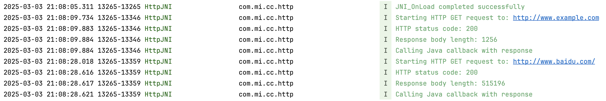
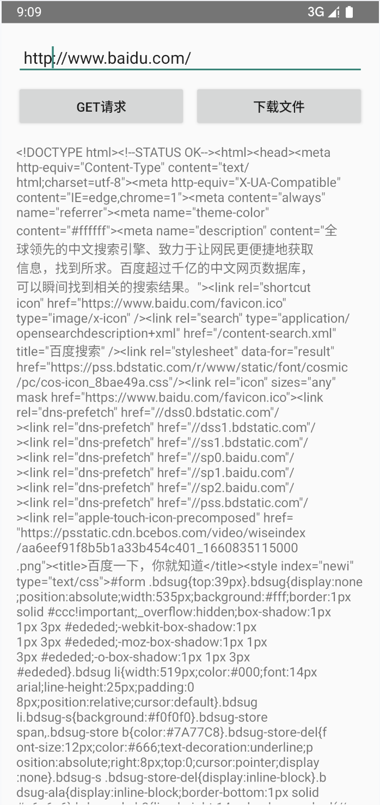
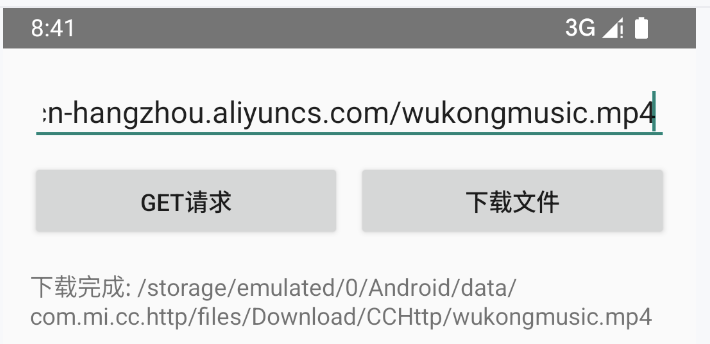
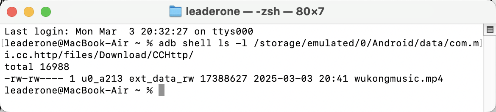

# JNI HTTP 交叉编译

## 题目描述：

- 创建 http jni 接口可以调用 http 请求
- 调用 get 请求，请求网页内容
- 把请求的内容 jni 返回给 android 的 receive 接口，显示出来

## 功能特性

- HTTP GET 请求和文件下载（看错题目要求了，本题没有要求实现文件下载，但发现时已实现）。
- 错误处理、日志记录和简单的用户界面。
- 如果链接是 HTTPS 会提示用户。
- 如果链接重定向，会追踪重定向后的链接（在 http_jni.cpp 实现）。

## 运行结果：

### get 请求百度官网后的日志记录



### get 请求百度官网后的用户界面



### 成功 download 请求给定的歌曲 mp4



### 使用 adb shell 在存储空间中找到下载的 mp4 文件



## 项目结构

```
CCHttp/
├── app/
│   ├── src/
│   │   ├── main/
│   │   │   ├── cpp/                    # C++ 源代码
│   │   │   │   ├── http_jni.cpp        # JNI 实现
│   │   │   │   └── libghttp/           # HTTP 库
│   │   │   ├── java/                   # Java 源代码
│   │   │   │   └── com/mi/cc/http/
│   │   │   │       ├── MainActivity.java
│   │   │   │       └── HttpClient.java
│   │   │   ├── res/                    # 资源文件
│   │   │   └── AndroidManifest.xml
│   │   └── CMakeLists.txt              # CMake 构建配置
│   └── build.gradle                     # Gradle 构建配置
└── README.md
```

## 实现过程

- 使用 CMake 构建系统支持 Android 交叉编译，将 libghttp 编译为静态库，创建 cchttp 共享库(.so)用于 Android 调用，链接必要的 Android 系统库。

```Makefile
cmake_minimum_required(VERSION 3.22.1)
project(cchttp)

# 设置 C++ 标准
set(CMAKE_CXX_STANDARD 14)

# 创建 libghttp 静态库
add_library(ghttp STATIC
    ${LIBGHTTP_SOURCES}
)

# 创建 JNI 动态库
add_library(cchttp SHARED
    http_jni.cpp
)

# 链接需要的库
target_link_libraries(cchttp
    ghttp
    android
    log
)
```

- 创建了 JNI 接口函数，支持从 Java 层传入 URL 参数，使用 libghttp 库处理 HTTP 请求，实现了错误处理和重定向支持。

```c++
extern "C" JNIEXPORT void JNICALL
Java_com_mi_cc_http_HttpClient_httpGet(JNIEnv* env, jobject thiz, jstring url)
```

- 调用 get 请求,请求网页内容

```c++
// 1. 创建请求
ghttp_request* request = ghttp_request_new();

// 2. 设置 URL
ghttp_set_uri(request, (char*)native_url);

// 3. 设置 GET 方法
ghttp_set_type(request, ghttp_type_get);

// 4. 设置请求头
ghttp_set_header(request, http_hdr_Accept, "*/*");
ghttp_set_header(request, http_hdr_Connection, "close");

// 5. 发送请求
status = ghttp_process(request);

// 6. 获取响应
const char* body = ghttp_get_body(request);
int body_len = ghttp_get_body_len(request);
```

- 使用 JNI 回调机制，将 C++ 字符串转换为 Java 字符串，处理错误情况并返回错误信息，正确管理 JNI 本地引用。

```c++
// 1. 定义回调方法 ID
static jmethodID g_onResponse_method = nullptr;

// 2. 在 JNI_OnLoad 中获取方法 ID
g_onResponse_method = env->GetMethodID(g_httpClient_class, "onResponse", "(Ljava/lang/String;)V");

// 3. 将响应内容返回给 Java
jstring response = env->NewStringUTF(response_str.c_str());
env->CallVoidMethod(thiz, g_onResponse_method, response);
```
