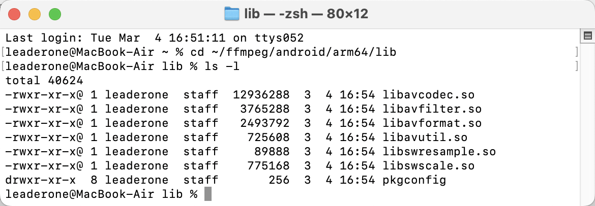

# 课后作业：编译一个 Android 下 ARMv8 的 FFmpeg 库

- 我通过以下步骤，在 macOS M2 上使用 Android NDK 编译适用于 Android ARMv8 (aarch64) 的 FFmpeg 动态库 .so 文件。

## 1. 准备工作

- 我已经安装了 Android NDK 和 FFmpeg 源码。

## 2. 设置交叉编译环境

- 在终端中，设置 NDK 和编译工具链环境变量。打开终端，输入以下命令：

```sh
export NDK=~/Library/Android/sdk/ndk/25.2.9519653 # 设置 NDK 路径
export API=21 # 设置 Android 最低支持版本（API 21 对应 Android 5.0 Lollipop）
export ARCH=arm64 # 设置架构为 ARMv8 (aarch64)
export TARGET=aarch64-linux-android # 设置目标平台
export TOOLCHAIN=$NDK/toolchains/llvm/prebuilt/darwin-x86_64  # NDK 工具链
export SYSROOT=$TOOLCHAIN/sysroot # 设置 sysroot 路径
export CROSS_PREFIX=$TOOLCHAIN/bin/$TARGET- # 设置交叉编译前缀
export CC=$TOOLCHAIN/bin/$TARGET$API-clang          # 设置 C 编译器
export CXX=$TOOLCHAIN/bin/$TARGET$API-clang++ # 设置 C++ 编译器
export STRIP=$TOOLCHAIN/bin/llvm-strip              # 设置 strip 工具
export PATH=$TOOLCHAIN/bin:$PATH # 添加 NDK 工具到 PATH
```

## 3. 配置 FFmpeg 编译

- 在 FFmpeg 源码目录下执行 configure 命令进行配置：

```bash
./configure \
    --prefix=$(pwd)/android/$ARCH \
    --enable-cross-compile \
    --cross-prefix=$CROSS_PREFIX \
    --target-os=android \
    --arch=$ARCH \
    --sysroot=$SYSROOT \
    --cc=$CC \
    --cxx=$CXX \
    --strip=$STRIP \
    --extra-cflags="-Os -fPIC -I$SYSROOT/usr/include" \
    --extra-ldflags="-L$SYSROOT/usr/lib" \
    --enable-shared \
    --disable-static \
    --disable-programs \
    --disable-doc \
    --disable-ffmpeg \
    --disable-ffplay \
    --disable-ffprobe \
    --disable-avdevice
```

- 配置完成后没有报错，继续进行编译。

## 4. 编译 FFmpeg

- 运行以下命令进行编译：

```sh
make -j$(sysctl -n hw.ncpu) # 使用所有 CPU 核心进行编译，提高速度
make install # 安装编译后的文件
```

## 5. 检查编译结果

- 编译完成后，检查 `android/arm64/lib/` 目录，确保 .so 文件生成正确：

```sh
ls -l android/arm64/lib/
file android/arm64/lib/libavcodec.so
```

- `file` 命令的输出为：



- 这表明生成的库是适用于 Android 的 ARMv8 架构。
