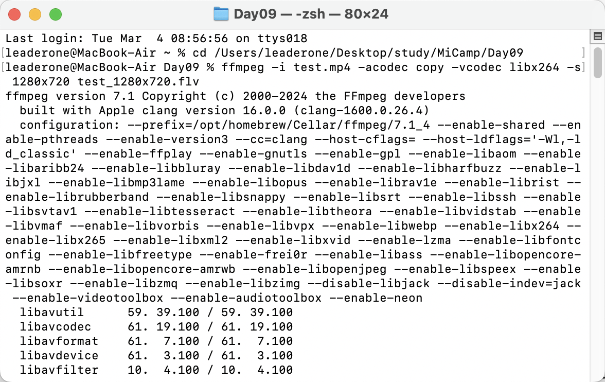
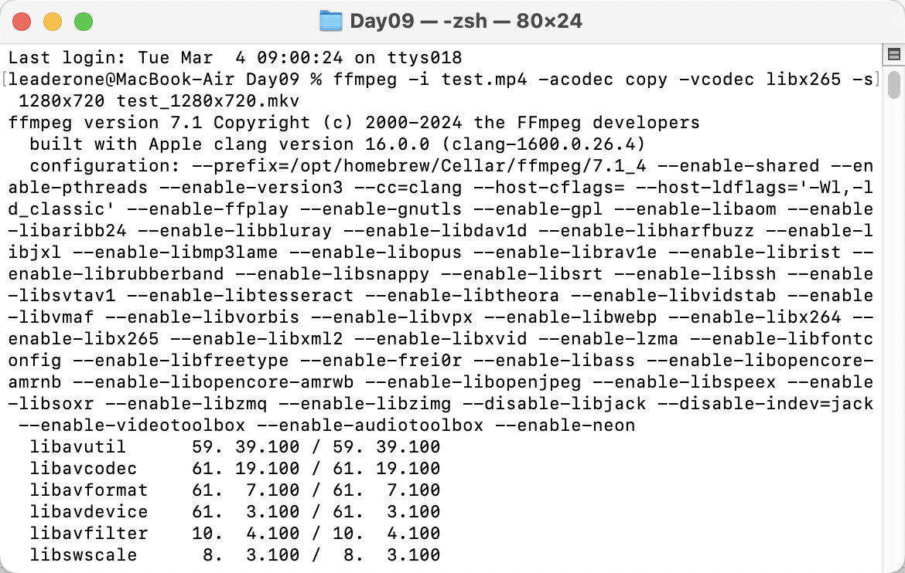
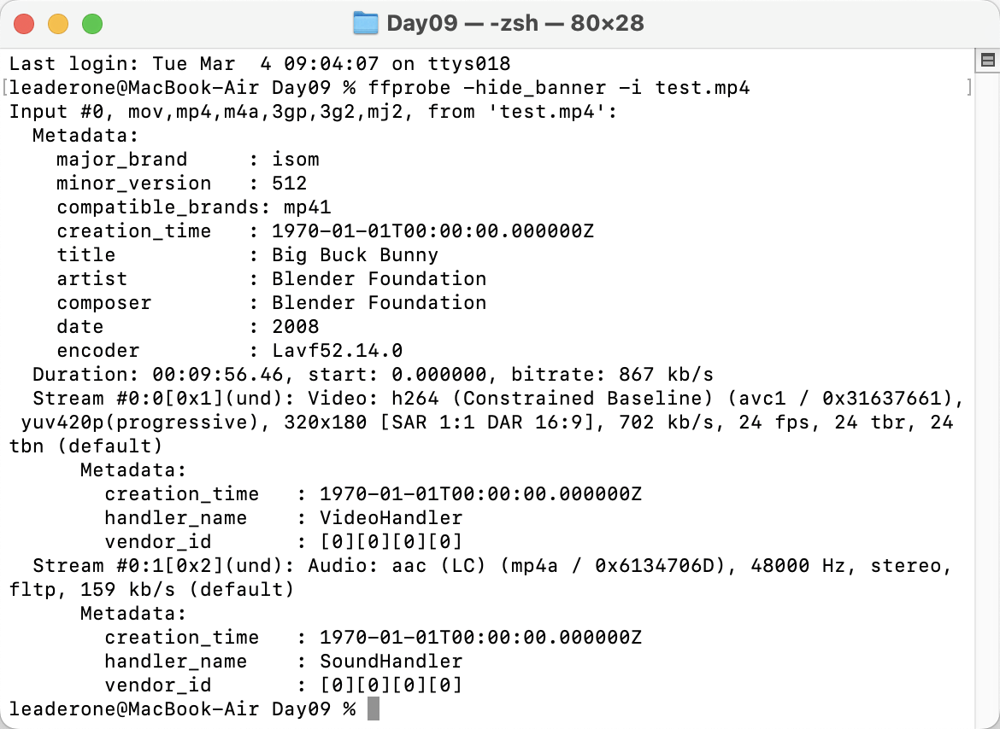
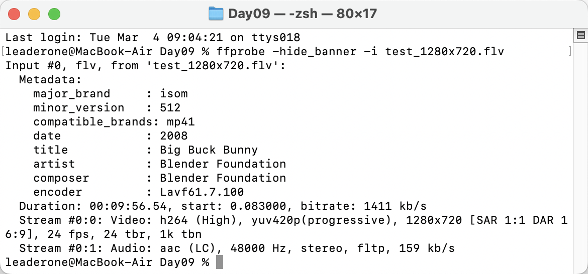
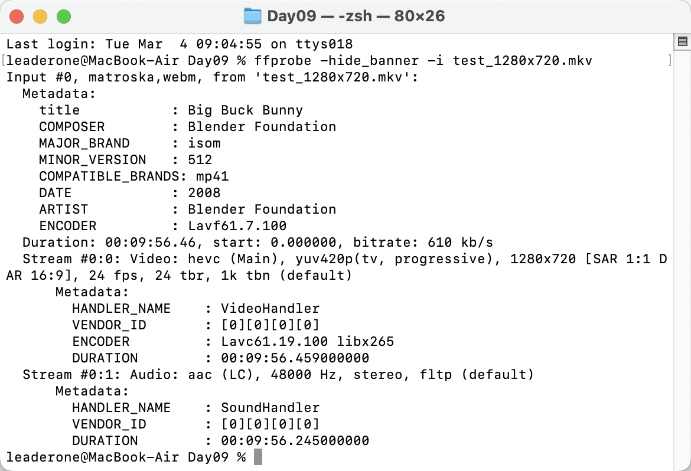
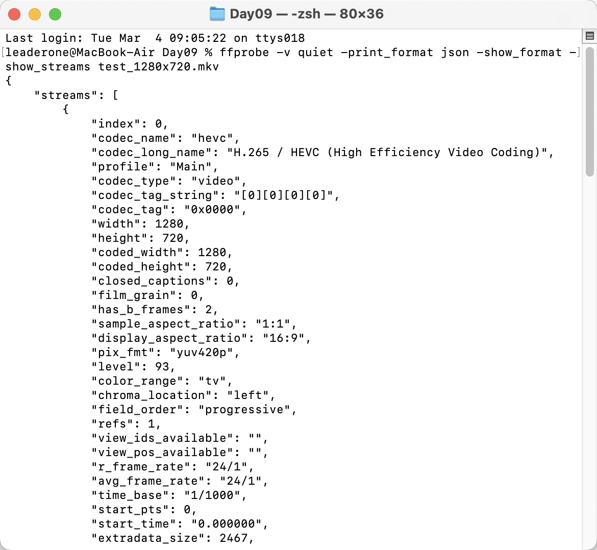

# 课堂作业 1：将 MP4 文件转成 FLV 和 MKV 格式，之后使用 `ffprobe` 查看这三个视频。

## 实现过程和结果：

### 首先执行以下命令：

```bash
ffmpeg -i test.mp4 -acodec copy -vcodec libx264 -s 1280x720 test_1280x720.flv
ffmpeg -i test.mp4 -acodec copy -vcodec libx265 -s 1280x720 test_1280x720.mkv
```




#### 分析命令：

- -i test_1920x1080.mp4：输入原始视频（分辨率 1920x1080）
- -acodec copy：保留原始音频，不重新编码
- -vcodec libx264 / -vcodec libx265：使用 H.264（x264）或 H.265（x265）视频编码
- -s 1280x720：将视频分辨率缩小到 1280x720
- 生成不同格式的视频：
  - test_1280x720.flv（H.264 编码）
  - test_1280x720.mkv（H.265 编码）

### 使用 FFprobe 查看视频信息

```bash
ffprobe -hide_banner -i test.mp4
ffprobe -hide_banner -i test_1280x720.flv
ffprobe -hide_banner -i test_1280x720.mkv
```





#### FFprobe 输出的关键信息：

- Stream #0:0：视频流信息（编码格式、分辨率、帧率）
- Stream #0:1：音频流信息（编码格式、采样率）
- Duration：视频时长
- bitrate：码率（影响画质和文件大小）

### 拓展尝试：查看更详细的 JSON 格式信息

```bash
ffprobe -v quiet -print_format json -show_format -show_streams test_1280x720.mkv
```


