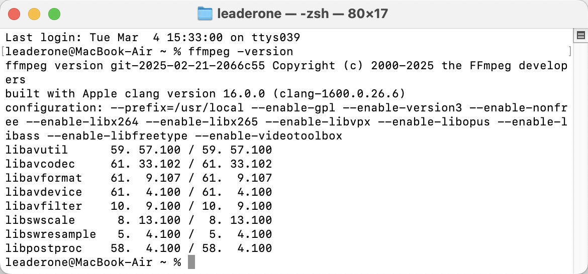

# 课堂作业 2：在 Ubuntu 上编译 FFmpeg 源码，完成开源项目的自主安装

由于架构问题我无法在本机运行 Ubuntu 虚拟机，在咨询老师后，我转而在 macOS 上编译并安装了 FFmpeg 的最新源码版本。我将整个过程记录如下。

在过往我就我使用 Homebrew 安装了 FFmpeg：

```bash
brew install ffmpeg
```

## 获取 FFmpeg 最新源码

按照老师的指导，我从官方 GitHub 仓库克隆了 FFmpeg 源码：

```bash
git clone https://github.com/FFmpeg/FFmpeg.git
cd FFmpeg
```

为了确保我使用的是最新版本，我执行了：

```bash
git log --oneline -n 1
```

输出显示我当前的 commit 版本是 2025-02-21-2066c55，这表明我获取的是 2025 年 2 月 21 日的最新代码。

## 配置编译选项

在源码目录下，我运行了 `./configure` 命令，并添加了所需的编译选项：

```bash
./configure \
 --prefix=/usr/local \
 --enable-gpl \
 --enable-version3 \
 --enable-nonfree \
 --enable-libx264 \
 --enable-libx265 \
 --enable-libvpx \
 --enable-libopus \
 --enable-libass \
 --enable-libfreetype \
 --enable-videotoolbox
```

### 配置参数解析

- `--prefix=/usr/local`：安装路径设为 /usr/local
- `--enable-gpl`：启用 GPL 许可（必需用于 x264/x265）
- `--enable-version3`：启用 LGPL v3 相关功能
- `--enable-nonfree`：启用非自由组件（如 fdk-aac 需要）
- `--enable-libx264`：启用 x264（H.264 编码支持）
- `--enable-libx265`：启用 x265（H.265/HEVC 编码支持）
- `--enable-libvpx`：启用 libvpx（VP8/VP9 编码支持）
- `--enable-libopus`：启用 Opus 音频支持
- `--enable-libass`：启用 ASS 字幕支持
- `--enable-libfreetype`：启用 FreeType（用于字幕渲染）
- `--enable-videotoolbox`：启用 macOS 硬件加速（VideoToolbox）

## 编译 FFmpeg

配置完成后，我使用 `make` 进行编译：

```bash
make -j$(sysctl -n hw.ncpu)
```

其中，`sysctl -n hw.ncpu` 会自动检测我的 Mac 处理器的核心数，并让 `make` 充分利用所有 CPU 资源，以加速编译过程。

## 安装 FFmpeg

编译完成后，我使用以下命令将 FFmpeg 安装到 /usr/local/bin 目录：

```bash
sudo make install
```

安装完成后，我运行了以下命令来检查安装是否成功：

```bash
ffmpeg -version
```

输出显示：

```bash
ffmpeg version git-2025-02-21-2066c55
built with Apple clang version 16.0.0 (clang-1600.0.26.6)
configuration: --prefix=/usr/local --enable-gpl --enable-version3 --enable-nonfree --enable-libx264 --enable-libx265 --enable-libvpx --enable-libopus --enable-libass --enable-libfreetype --enable-videotoolbox
```



这表明 FFmpeg 已成功安装，并且包含了我启用的所有功能。

## 结论

通过以上步骤，我成功地从源码编译并安装了 FFmpeg，并且启用了常见的视频、音频编码支持，如 H.264、H.265、VP9、Opus、ASS 字幕和 macOS VideoToolbox 硬件加速。

✅ FFmpeg 编译安装成功！ 🎉
