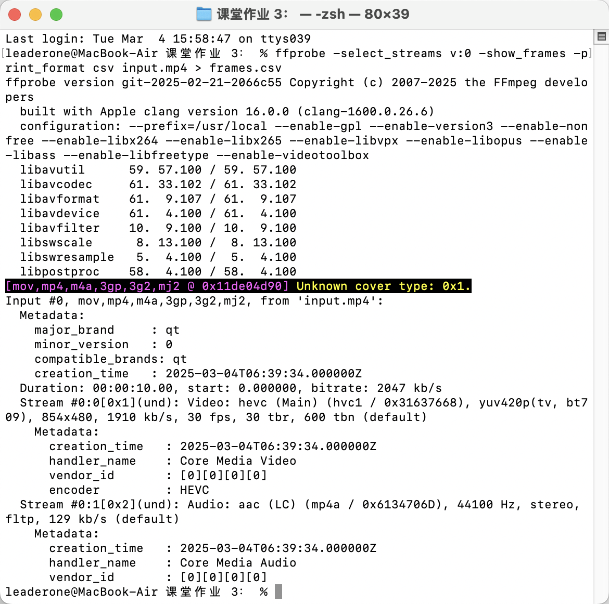
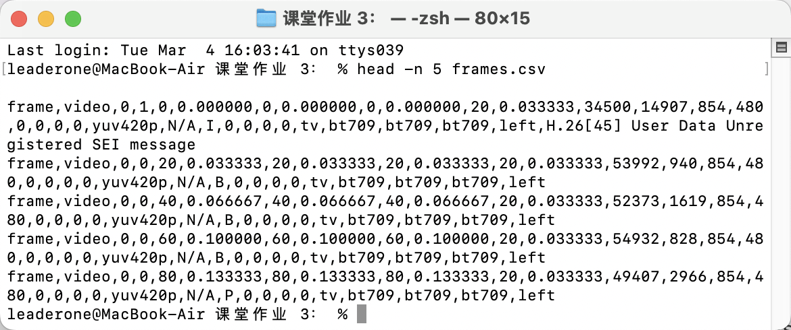

# 课堂作业 3：使用 FFmpeg 的 `ffprobe` 命令，解析一个音视频，逐帧输出音视频文件的数据，并以 CSV 文件格式展示出来。

## 运行结果：



由此可见 ffprobe 命令已成功执行，并将逐帧视频数据导出到 `frames.csv`。以下是 `input.mp4` 文件的基本分析结果：

## 文件格式

- **容器格式**：MOV/MP4（major_brand: qt）
- **创建时间**：2025-03-04T06:39:34Z
- **时长**：10 秒
- **比特率**：2047 kb/s

## 视频流

- **编码格式**：HEVC (H.265)
- **分辨率**：854×480
- **颜色空间**：YUV420p (tv, bt709)
- **比特率**：1910 kb/s
- **帧率**：30 fps（每秒 30 帧）
- **时间基准**：
  - **TBR（时间基准速率）**：30（fps）
  - **TBN（时间基准单位）**：600（与文件格式相关）
- **编码器**：HEVC (H.265)

## 音频流 (Stream #0:1)

- **编码格式**：AAC (LC)
- **采样率**：44100 Hz
- **声道**：立体声（stereo）
- **比特率**：129 kb/s

## ffprobe 命令执行情况

- ffprobe 解析了 `input.mp4` 并识别出 2 条流（1 条视频流，1 条音频流）。
- 它生成了 `frames.csv` 文件，里面存储了每一帧的元数据（时间戳、帧类型、宽高等）。

## 接下来，我使用命令检查 `frames.csv` 前五行的内容：

```bash
head -n 5 frames.csv
```



### 主要字段分析

每一行表示 一帧视频数据，字段主要包括：

| 字段              | 含义                | 示例                                        |
| ----------------- | ------------------- | ------------------------------------------- |
| frame             | 数据类型（固定值）  | frame                                       |
| video             | 该数据属于视频流    | video                                       |
| 0                 | 轨道编号（流索引）  | 0                                           |
| 1 / 0             | 是否为关键帧 (I 帧) | 1（I 帧）/ 0（P/B 帧）                      |
| pkt_pts_time      | 时间戳（秒）        | 0.000000, 0.033333, 0.066667                |
| pkt_duration_time | 每帧持续时间        | 0.033333（符合 30 FPS 视频）                |
| pkt_size          | 帧大小（字节）      | 34500, 53992, 52373                         |
| width / height    | 视频分辨率          | 854x480                                     |
| pict_type         | 帧类型 (I/P/B)      | I, B, P                                     |
| color_space       | 颜色空间            | bt709                                       |
| chroma_location   | 色度位置            | left                                        |
| 其他字段          | 一些 SEI 消息       | H.26[45] User Data Unregistered SEI message |

### 关键观察

#### 逐帧时间间隔

- 每帧的 `pkt_pts_time` 递增 0.033333 秒，符合 30 FPS 视频结构：

  ```
  0.000000 → 0.033333 → 0.066667 → 0.100000 ...
  ```

  - 说明 `ffprobe` 提取的时间戳数据是准确的。

#### 帧类型分布

- 第一帧是 I 帧（关键帧）：

  ```
  frame,video,0,1,0,0.000000, ..., I
  ```

- 之后的帧是 B 帧（双向预测帧）：

  ```
  frame,video,0,0,20,0.033333, ..., B
  frame,video,0,0,40,0.066667, ..., B
  ```

- P 帧（前向预测帧）出现在 `pkt_pts_time=0.133333`：

  ```
  frame,video,0,0,80,0.133333, ..., P
  ```

- 这种 IBBPBBP 的模式表明视频采用了 GOP 结构（Group of Pictures），即：
  - I 帧（关键帧）
  - P 帧（预测帧）
  - B 帧（双向预测帧）

#### 帧大小 (`pkt_size`)

- I 帧最大：34500 字节
- B 帧较小：53992, 52373, 54932 字节
- P 帧大小介于 I 和 B 帧之间：49407 字节

#### 分辨率 & 颜色空间

- 分辨率：854x480
- 颜色空间：yuv420p
- 色度采样格式：bt709
- 色度位置：left

### 结论

- 逐帧时间戳稳定，符合 30 FPS 结构
- 帧类型分布合理 (IBBPBBP 结构)，有关键帧
- 帧大小变化正常，I > P > B
- 颜色空间、分辨率正确 (yuv420p + bt709)
