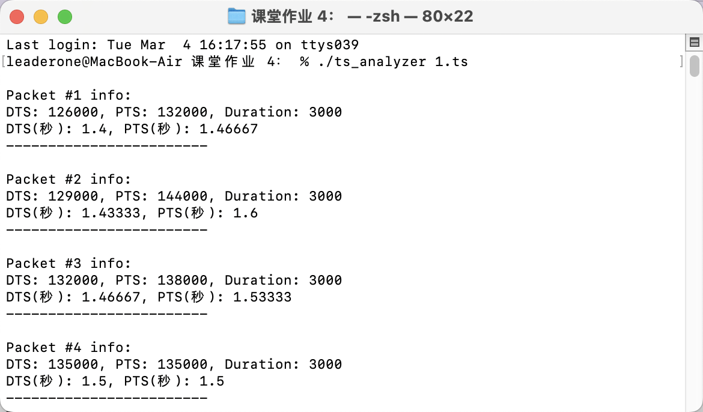
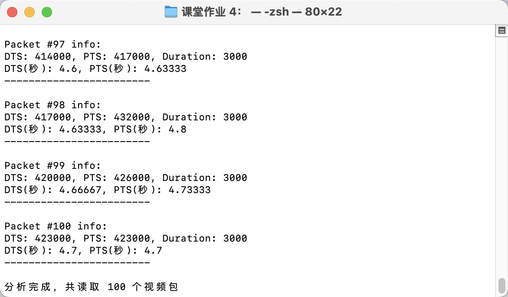

# 课堂作业 4：利用 FFmpeg API 编写程序，将 `1.ts` 视频文件解析到 `AVPacket`，并打印其中数据包的 DTS 和 PTS 信息。

## 解题思路

我的目标是使用 FFmpeg API 解析 `1.ts` 视频文件，提取 `AVPacket`，并打印数据包的 DTS（解码时间戳）和 PTS（显示时间戳）信息。

主要步骤如下：

1. 打开输入视频文件并解析其格式。
2. 查找视频流，确保程序只处理视频数据。
3. 读取视频流的数据包 (`AVPacket`)，提取 DTS 和 PTS 信息并转换为秒。
4. 输出解析后的数据包信息。

## 编译命令

```bash
g++ -o ts_analyzer main.cpp \
-I/opt/homebrew/include \
-L/opt/homebrew/lib \
-lavformat -lavcodec -lavutil -lswscale \
-framework CoreFoundation \
-framework CoreVideo \
-framework CoreMedia \
-framework VideoToolbox \
-framework Security
```

## 运行结果




## 核心代码

### 1. 打开输入文件并获取流信息

```cpp
AVFormatContext* fmt_ctx = nullptr;
if (avformat_open_input(&fmt_ctx, in_file, nullptr, nullptr) < 0) {
    cout << "无法打开输入文件" << endl;
    return -1;
}

if (avformat_find_stream_info(fmt_ctx, nullptr) < 0) {
    cout << "无法找到流信息" << endl;
    avformat_close_input(&fmt_ctx);
    return -1;
}
```

这部分代码使用 `avformat_open_input` 打开输入视频文件，并使用 `avformat_find_stream_info` 解析流信息。

### 2. 查找视频流索引

```cpp
int vid_idx = -1;
for (unsigned int i = 0; i < fmt_ctx->nb_streams; i++) {
    if (fmt_ctx->streams[i]->codecpar->codec_type == AVMEDIA_TYPE_VIDEO) {
        vid_idx = i;
        break;
    }
}
if (vid_idx == -1) {
    cout << "没有找到视频流" << endl;
    avformat_close_input(&fmt_ctx);
    return -1;
}
```

我遍历 `fmt_ctx->streams`，找到第一个 `AVMEDIA_TYPE_VIDEO` 类型的流，并记录其索引。

### 3. 读取视频数据包并提取 DTS、PTS

```cpp
AVPacket* pkt = av_packet_alloc();
if (!pkt) {
    cout << "无法分配AVPacket" << endl;
    avformat_close_input(&fmt_ctx);
    return -1;
}

int pkt_cnt = 0;
while (av_read_frame(fmt_ctx, pkt) >= 0 && pkt_cnt < 100) {
    if (pkt->stream_index == vid_idx) {
        pkt_cnt++;
        cout << "\n包 #" << pkt_cnt << " 信息:" << endl;
        cout << "DTS: " << pkt->dts
             << ", PTS: " << pkt->pts
             << ", 持续时间: " << pkt->duration << endl;

        AVRational time_base = fmt_ctx->streams[vid_idx]->time_base;
        double dts_sec = (pkt->dts != AV_NOPTS_VALUE) ?
                         pkt->dts * av_q2d(time_base) : -1;
        double pts_sec = (pkt->pts != AV_NOPTS_VALUE) ?
                         pkt->pts * av_q2d(time_base) : -1;

        cout << "DTS(秒): " << dts_sec
             << ", PTS(秒): " << pts_sec << endl;
        cout << "------------------------" << endl;
    }
    av_packet_unref(pkt);
}
```

这部分代码循环读取 `AVPacket` 数据包，只处理属于视频流的数据包。

- `av_read_frame` 读取数据包。
- `av_packet_unref(pkt)` 释放数据包，以便读取下一个。
- `av_q2d(time_base)` 将 DTS、PTS 转换为秒单位，方便理解。

### 4. 释放资源

```cpp
av_packet_free(&pkt);
avformat_close_input(&fmt_ctx);
```

我释放 `AVPacket` 和 `AVFormatContext` 以避免内存泄漏。
