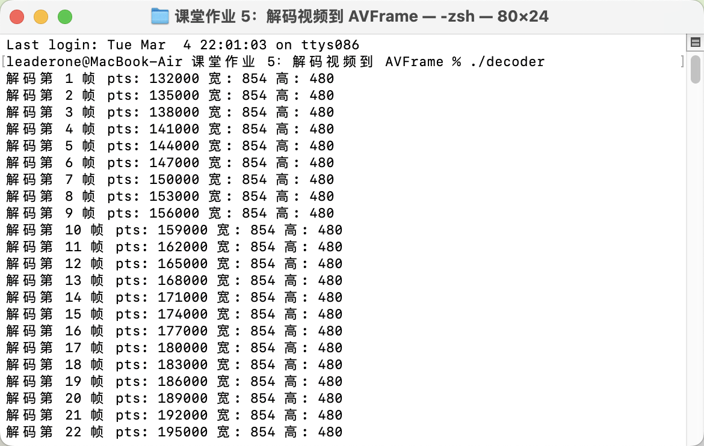

# 课堂作业 5：利用 FFmpeg API 编写程序，将 `1.ts` 视频文件解码到 `AVFrame`（运用编解码信息进行编解码）。

## 解题思路

- 使用 FFmpeg API 解析 `1.ts` 视频文件，并对其视频流进行解码，输出解码的帧信息。

主要流程如下：

1. **打开视频文件**：使用 `avformat_open_input` 解析 TS 文件。
2. **获取视频流信息**：使用 `avformat_find_stream_info` 查找视频流。
3. **查找解码器**：获取视频流的解码器参数，并查找合适的解码器。
4. **初始化解码器**：创建 `AVCodecContext`，并与解码器进行关联。
5. **读取并解码帧**：
   - 通过 `av_read_frame` 读取 `AVPacket`。
   - 使用 `avcodec_send_packet` 发送数据包到解码器。
   - 使用 `avcodec_receive_frame` 获取解码后的 `AVFrame`。
   - 打印帧的 PTS、宽度和高度信息。
6. **释放资源**：关闭文件、释放解码器和内存。

## 编译命令

```bash
g++ main.cpp -o decoder \
-I/opt/homebrew/include \
-L/opt/homebrew/lib \
-lavcodec -lavformat -lavutil \
-framework CoreFoundation \
-framework CoreVideo \
-framework CoreMedia \
-framework VideoToolbox \
-framework Security \
-liconv \
-lz \
-lbz2 \
-framework AudioToolbox
```

## 运行结果

由于 AVFrame 只是解码后的数据存储结构，并没有进行后续的处理，所以我选择打印了一些视频的帧信息。


## 核心代码

### 1. 打开视频文件并获取流信息

```cpp
AVFormatContext *fmt_ctx = nullptr;
if (avformat_open_input(&fmt_ctx, input, nullptr, nullptr) < 0)
{
    cout << "无法打开文件: " << input << endl;
    perror("错误原因");
    return -1;
}

if (avformat_find_stream_info(fmt_ctx, nullptr) < 0)
{
    cout << "无法获取流信息" << endl;
    avformat_close_input(&fmt_ctx);
    return -1;
}
```

使用 `avformat_open_input` 打开 `1.ts` 文件，并解析流信息。

### 2. 查找视频流

```cpp
int v_idx = -1;
for (unsigned int i = 0; i < fmt_ctx->nb_streams; i++)
{
    if (fmt_ctx->streams[i]->codecpar->codec_type == AVMEDIA_TYPE_VIDEO)
    {
        v_idx = i;
        break;
    }
}
```

遍历 `fmt_ctx->streams`，找到第一个视频流的索引。

### 3. 获取解码器并创建 `AVCodecContext`

```cpp
AVCodecParameters *codecParams = fmt_ctx->streams[v_idx]->codecpar;
const AVCodec *codec = avcodec_find_decoder(codecParams->codec_id);
if (!codec)
{
    cout << "找不到解码器" << endl;
    avformat_close_input(&fmt_ctx);
    return -1;
}

AVCodecContext *codec_ctx = avcodec_alloc_context3(codec);
if (!codec_ctx)
{
    cout << "无法分配解码器上下文" << endl;
    avformat_close_input(&fmt_ctx);
    return -1;
}
```

### 4. 关联解码器并打开

```cpp
if (avcodec_parameters_to_context(codec_ctx, codecParams) < 0)
{
    cout << "无法复制解码器参数" << endl;
    avcodec_free_context(&codec_ctx);
    avformat_close_input(&fmt_ctx);
    return -1;
}

if (avcodec_open2(codec_ctx, codec, nullptr) < 0)
{
    cout << "无法打开解码器" << endl;
    avcodec_free_context(&codec_ctx);
    avformat_close_input(&fmt_ctx);
    return -1;
}
```

### 5. 读取数据包并解码视频帧

```cpp
AVPacket *pkt = av_packet_alloc();
AVFrame *frame = av_frame_alloc();

int frame_count = 0;
while (av_read_frame(fmt_ctx, pkt) >= 0)
{
    if (pkt->stream_index == v_idx)
    {
        int ret = avcodec_send_packet(codec_ctx, pkt);
        if (ret < 0)
        {
            cout << "发送数据包失败" << endl;
            break;
        }

        while (ret >= 0)
        {
            ret = avcodec_receive_frame(codec_ctx, frame);
            if (ret == AVERROR(EAGAIN) || ret == AVERROR_EOF)
            {
                break;
            }
            else if (ret < 0)
            {
                cout << "接收帧失败" << endl;
                goto end;
            }

            frame_count++;
            cout << "解码第 " << frame_count << " 帧"
                 << " pts: " << frame->pts
                 << " 宽: " << frame->width
                 << " 高: " << frame->height << endl;
        }
    }
    av_packet_unref(pkt);
}
```

该部分实现了视频帧的解码：

1. 使用 `av_read_frame` 读取 `AVPacket`。
2. 使用 `avcodec_send_packet` 发送数据包到解码器。
3. 使用 `avcodec_receive_frame` 接收 `AVFrame` 并解析帧信息。
4. 打印 `PTS`、宽度和高度信息。

### 6. 释放资源

```cpp
end:
av_frame_free(&frame);
av_packet_free(&pkt);
avcodec_free_context(&codec_ctx);
avformat_close_input(&fmt_ctx);

cout << "总共解码 " << frame_count << " 帧" << endl;
```

释放 `AVFrame`、`AVPacket`、`AVCodecContext` 和 `AVFormatContext` 以避免内存泄漏。
