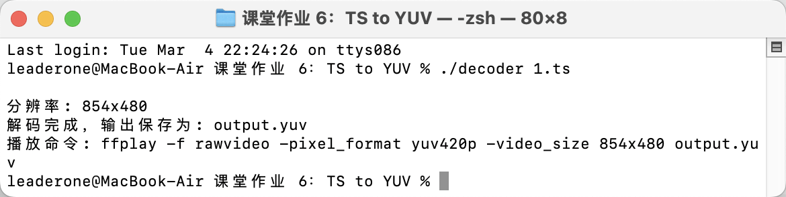
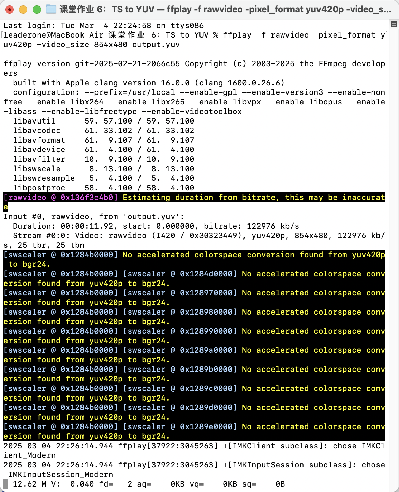

# 课堂作业 6：利用 FFmpeg API 编写程序，将 `1.ts` 视频文件保存成 YUV 格式视频。

我使用这个程序将 MP4 或 TS 格式的视频文件解码为原始 YUV 格式。今日的附加题，我基本复用了这道题的代码。

## 编译程序

使用以下命令编译程序：

```bash
g++ test.cpp -o decoder $(pkg-config --cflags --libs libavcodec libavformat libavutil libswscale) \
-framework CoreFoundation \
-framework CoreVideo \
-framework CoreMedia \
-framework VideoToolbox \
-framework Security
```

## 运行结果

1. 运行程序，指定输入视频文件：

```bash
./decoder 1.ts
```


程序会显示视频分辨率并生成 output.yuv 文件。

2. 使用 ffplay 播放生成的 YUV 文件：

```bash
ffplay -f rawvideo -pixel_format yuv420p -video_size <width>x<height> output.yuv
```


注意：需要将<width>x<height>替换为实际视频的分辨率，程序运行时会显示这个信息。

视频成功打开。

- 程序会自动检测视频分辨率，解码视频帧，分离并保存 YUV 分量，显示正确的播放命令。

- YUV 文件没有压缩，体积会比较大

## 常见问题解决

- 遇到 "Failed to set value 'yuv420p' for option 'pix_fmt'" 错误，于是我使用更新的 ffplay 参数格式：

```bash
ffplay -f rawvideo -pixel_format yuv420p -video_size <width>x<height> output.yuv
```

## 核心代码

### 解析输入参数

```cpp
if (argc != 2) {
    cout << "用法: " << argv[0] << " <输入文件>" << endl;
    return -1;
}
```

### 打开 TS 文件

```cpp
const char* in_file = argv[1];
AVFormatContext* fmt_ctx = nullptr;
if (avformat_open_input(&fmt_ctx, in_file, nullptr, nullptr) < 0) {
    cout << "无法打开输入文件" << endl;
    return -1;
}
```

使用 `avformat_open_input` 打开 TS 文件，并将其格式信息存入 `fmt_ctx`。

### 解析流信息

```cpp
if (avformat_find_stream_info(fmt_ctx, nullptr) < 0) {
    cout << "无法找到流信息" << endl;
    avformat_close_input(&fmt_ctx);
    return -1;
}
```

调用 `avformat_find_stream_info` 获取 TS 文件的流信息，确保解析成功。

### 查找视频流

```cpp
int vid_idx = -1;
for (unsigned int i = 0; i < fmt_ctx->nb_streams; i++) {
    if (fmt_ctx->streams[i]->codecpar->codec_type == AVMEDIA_TYPE_VIDEO) {
        vid_idx = i;
        break;
    }
}
```

遍历所有流，找到第一个视频流并记录索引 `vid_idx`。

### 初始化解码器

```cpp
AVCodecParameters* codec_par = fmt_ctx->streams[vid_idx]->codecpar;
const AVCodec* codec = avcodec_find_decoder(codec_par->codec_id);
AVCodecContext* codec_ctx = avcodec_alloc_context3(codec);
```

获取视频流的解码器参数，找到合适的解码器，并创建 `AVCodecContext`。

### 关联解码器参数并打开解码器

```cpp
if (avcodec_parameters_to_context(codec_ctx, codec_par) < 0 || avcodec_open2(codec_ctx, codec, nullptr) < 0) {
    cout << "解码器初始化失败" << endl;
    avcodec_free_context(&codec_ctx);
    avformat_close_input(&fmt_ctx);
    return -1;
}
```

使用 `avcodec_parameters_to_context` 复制参数到 `AVCodecContext`，然后 `avcodec_open2` 打开解码器。

### 创建输出文件

```cpp
FILE* out_f = fopen(out_file, "wb");
if (!out_f) {
    cout << "无法打开输出文件" << endl;
    avcodec_free_context(&codec_ctx);
    avformat_close_input(&fmt_ctx);
    return -1;
}
```

打开 `output.yuv` 作为 YUV 数据存储文件。

### 读取 TS 数据包并解码

```cpp
AVFrame* frame = av_frame_alloc();
AVPacket* pkt = av_packet_alloc();
while (av_read_frame(fmt_ctx, pkt) >= 0) {
    if (pkt->stream_index == vid_idx) {
        int ret = avcodec_send_packet(codec_ctx, pkt);
        if (ret < 0) break;
```

使用 `av_read_frame` 逐个读取 `AVPacket`，并将其送入解码器。

### 获取解码帧

```cpp
while (ret >= 0) {
    ret = avcodec_receive_frame(codec_ctx, frame);
    if (ret == AVERROR(EAGAIN) || ret == AVERROR_EOF) break;
```

调用 `avcodec_receive_frame` 接收 `AVFrame`，如果失败则退出循环。

### 将解码帧写入 YUV 文件

```cpp
for (int i = 0; i < frame->height; i++) {
    fwrite(frame->data[0] + i * frame->linesize[0], 1, frame->width, out_f);
}
for (int i = 0; i < frame->height / 2; i++) {
    fwrite(frame->data[1] + i * frame->linesize[1], 1, frame->width / 2, out_f);
    fwrite(frame->data[2] + i * frame->linesize[2], 1, frame->width / 2, out_f);
}
```

按 YUV420P 格式逐行写入 Y、U、V 分量到 `output.yuv`。

### 释放资源

```cpp
fclose(out_f);
av_frame_free(&frame);
av_packet_free(&pkt);
avcodec_free_context(&codec_ctx);
avformat_close_input(&fmt_ctx);
```

关闭文件，释放 `AVFrame`、`AVPacket` 和解码器资源，防止内存泄漏。
