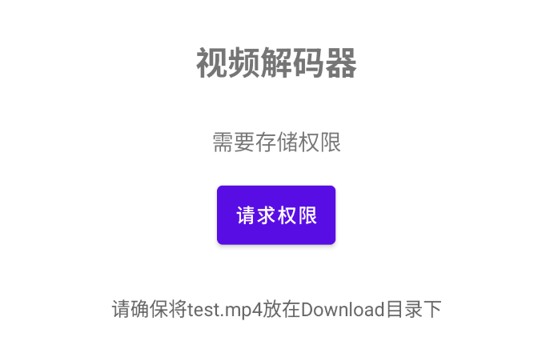
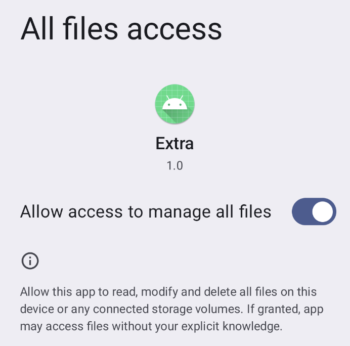
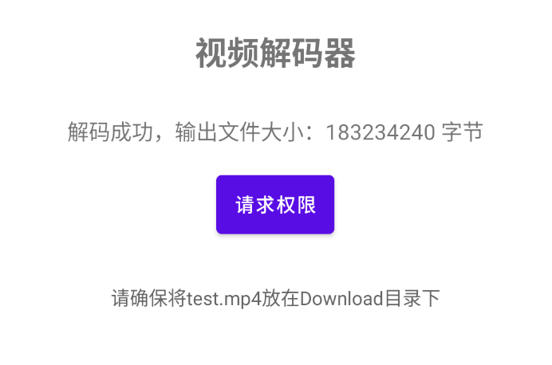
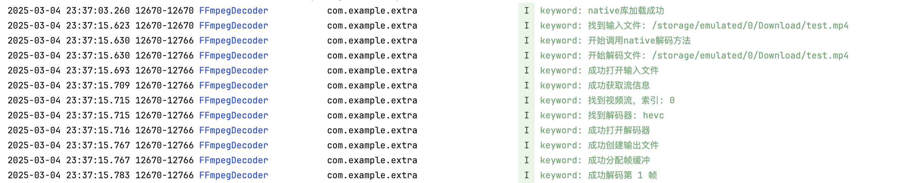
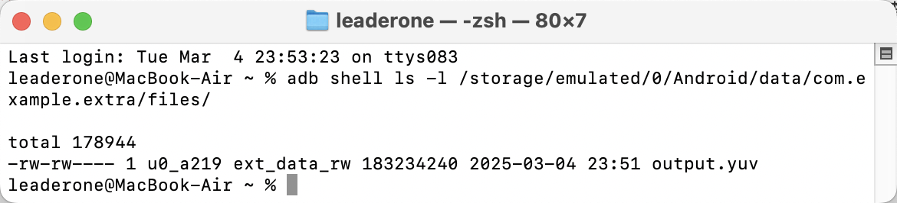
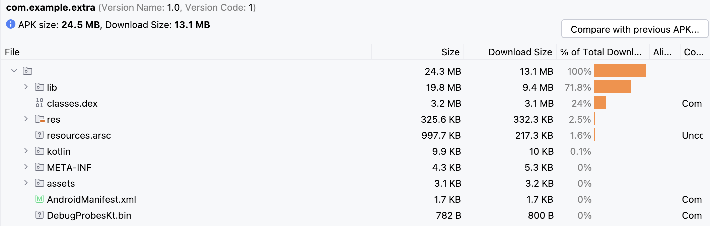

# 附加加分题：Android 视频解码器

- 这是一个使用 FFmpeg 解码视频的 Android 应用。主要功能是将 MP4 视频文件解码为 YUV 格式。

## 实现过程

1. 搭建基本的 Android 项目结构
2. 集成 FFmpeg 库并编写 JNI 接口
3. 实现 Java 层 UI 和文件操作
4. 处理 Android 存储权限问题

## 运行结果

- 我预先使用如下命令将 test.mp4 导入虚拟机。

```bash
leaderone@MacBook-Air raw % adb push test.mp4 /storage/emulated/0/Download/
test.mp4: 1 file pushed, 0 skipped. 19.4 MB/s (2558928 bytes in 0.126s)
```

- 初次运行时要请求读取虚拟机 download 目录的权限。



- 开启权限。



- 编解码成功。



- 日志提示。



- 使用 adb 命令查看应用的外部存储目录,找到了生成的 yuv 文件。

```bash
adb shell ls -l /storage/emulated/0/Android/data/com.example.extra/files/
```



- 最终打包成 apk，分析如图：



## 核心代码

### JNI 接口

```cpp
extern "C" JNIEXPORT jint JNICALL
Java_com_example_extra_MainActivity_decodeToYUV(
    JNIEnv env, jobject thiz, jstring input_path, jstring output_path) {
    // 使用 FFmpeg 解码视频
}
```

### 文件操作

```java
// 从 Download 目录读取输入文件
File downloadDir = Environment.getExternalStoragePublicDirectory(Environment.DIRECTORY_DOWNLOADS);
File inputFile = new File(downloadDir, "test.mp4");
// 输出到应用私有目录
File outputFile = new File(getExternalFilesDir(null), "output.yuv");
```

## 权限处理

由于需要访问外部存储，需要处理不同 Android 版本的权限：

- Android 13+: `READ_MEDIA_VIDEO`
- Android 11-12: `MANAGE_EXTERNAL_STORAGE`
- Android 10 及以下: `READ_EXTERNAL_STORAGE` + `WRITE_EXTERNAL_STORAGE`

权限声明：

```xml
<uses-permission android:name="android.permission.READ_MEDIA_VIDEO" />
<uses-permission android:name="android.permission.MANAGE_EXTERNAL_STORAGE" />
<uses-permission android:name="android.permission.READ_EXTERNAL_STORAGE" />
```

## 使用方法

1. 将 `test.mp4` 文件放入设备的 Download 目录
2. 运行应用并授予存储权限
3. 应用会自动开始解码
4. 解码后的 YUV 文件保存在应用私有目录

## 注意事项

- 需要 Android 7.0 (API 24) 及以上系统
- 首次运行需要手动授予存储权限
- 确保 `test.mp4` 文件已正确放置在 Download 目录
