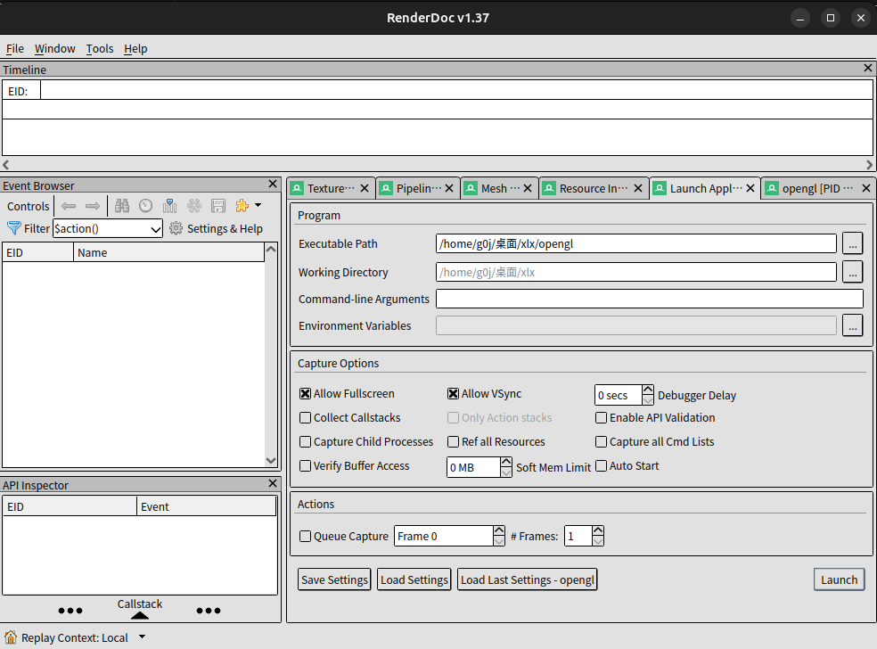
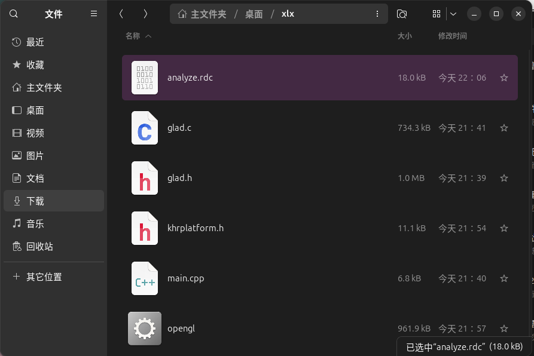
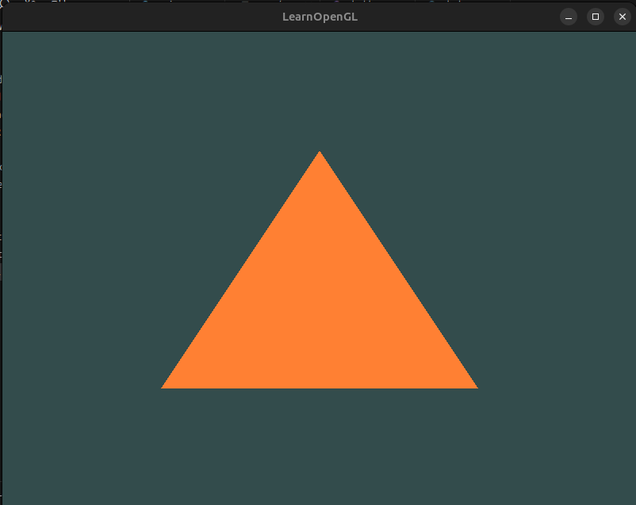
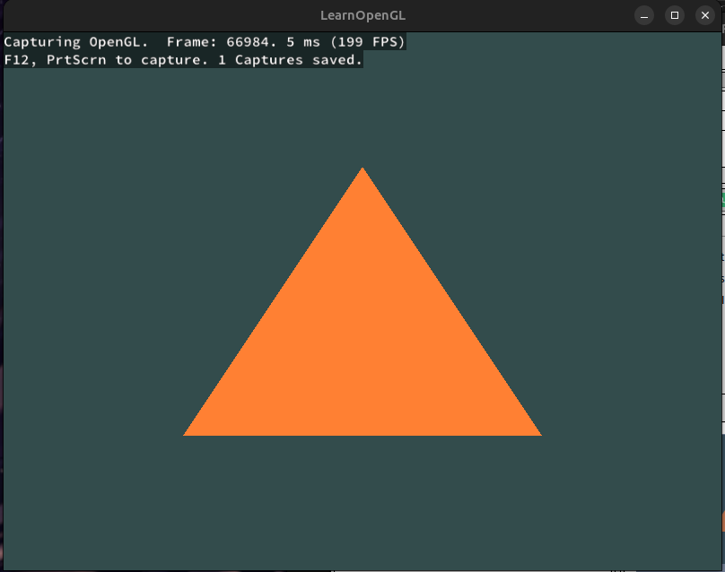
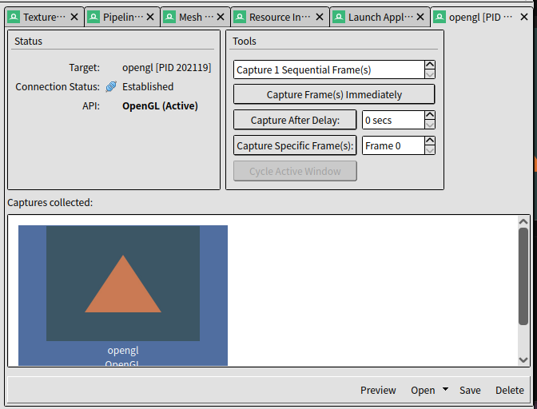
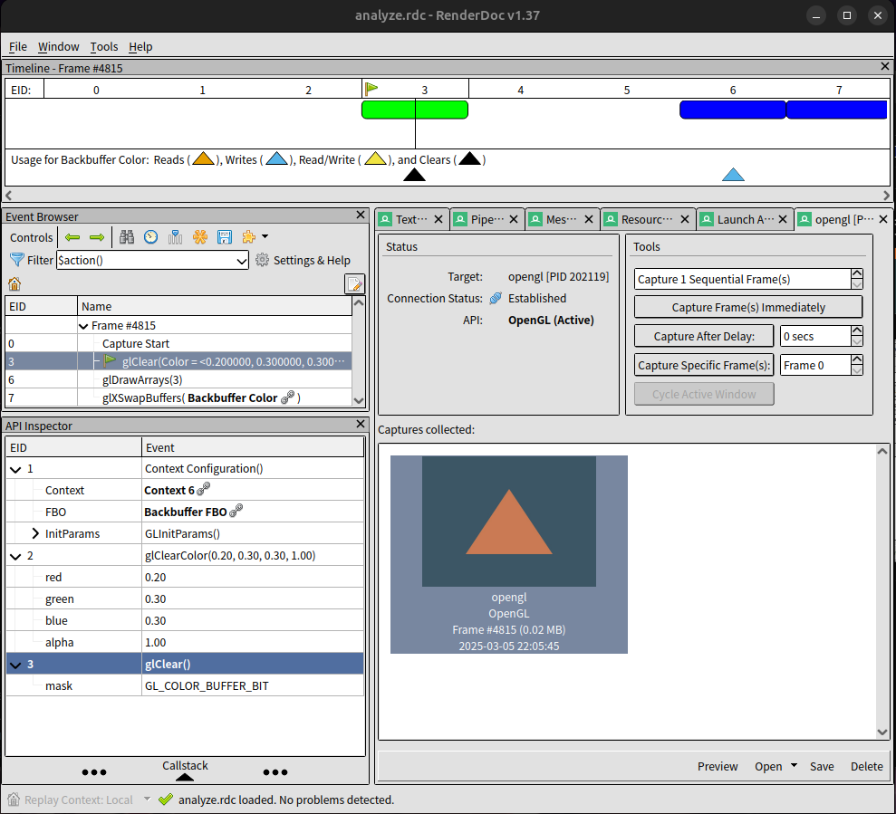

# 使用 RenderDoc 抓取和分析帧

## 步骤 1：确保 RenderDoc 已安装并准备好

我从 RenderDoc 官方网站下载并安装了最新版本。安装完成后：

- 打开 RenderDoc 应用程序，看到它的主用户界面，确保 RenderDoc 运行正常，没有错误提示。



## 步骤 2：编译我的 C++ 程序

根据老师提供的 C++ 文件，编译成 RenderDoc 需要的可执行文件。

### 使用编译器

#### 我使用的是命令行（g++）：

- 打开终端输入以下命令：

```bash
g++ -o opengl_app main.cpp glad.c -lglfw3 -lGL -ldl
```

编译时的项目结构：


- 编译成功后，我得到一个可执行文件 opengl。

### 验证程序运行

- 双击生成的可执行文件，确保它能正常运行并显示图形窗口。



- 然后记录可执行文件路径，后续会用到。

## 步骤 3：通过 RenderDoc 启动我的程序

有了可执行文件后，我需要通过 RenderDoc 启动它，以便 RenderDoc 能够注入并捕获帧。操作如下：

- 1.在 RenderDoc 的主界面，点击菜单栏中的 "File" -> "Launch Application"。
- 2.在弹出的对话框中：
  - **Executable Path**：点击浏览按钮，选择我的 C++ 程序的可执行文件。
- 3.点击 "Launch" 按钮，RenderDoc 将启动我的程序。
- 4.RenderDoc 显示一个捕获对话框。

## 步骤 4：捕获帧

现在我的程序正在运行，我可以捕获一个帧进行分析：

- 1.切换到我的 C++ 程序窗口，确保它正在渲染图形。



- 2.按下 F12，RenderDoc 将捕获当前帧。
- 3.捕获成功后，点击 save，生成一个.rdc 文件，我已经将该文件移进本题的目录中。



## 步骤 5：打开并查看捕获的帧

捕获帧后，我可以打开它进行分析：

- 1.在捕获对话框中，选择我想分析的帧并双击该帧。

- 2.RenderDoc 将加载捕获的帧，并显示一个分析窗口。



## 步骤 6：分析捕获的帧

- 分析 Event Browser：

  - 捕获了 Frame #4815，其中包含 OpenGL API 调用：
  - glClearColor()：设置清屏颜色（0.2, 0.3, 0.3, 1.0）
  - glClear(GL_COLOR_BUFFER_BIT)：执行清屏
  - glDrawArrays()：绘制调用
  - glSwapBuffers()：交换缓冲区

- 分析 API Inspector：
  - 详细展示了 glClearColor 和 glClear 调用的参数：
  - glClearColor(0.2, 0.3, 0.3, 1.0)：背景色为深蓝绿色
  - glClear(GL_COLOR_BUFFER_BIT)：清除颜色缓冲
