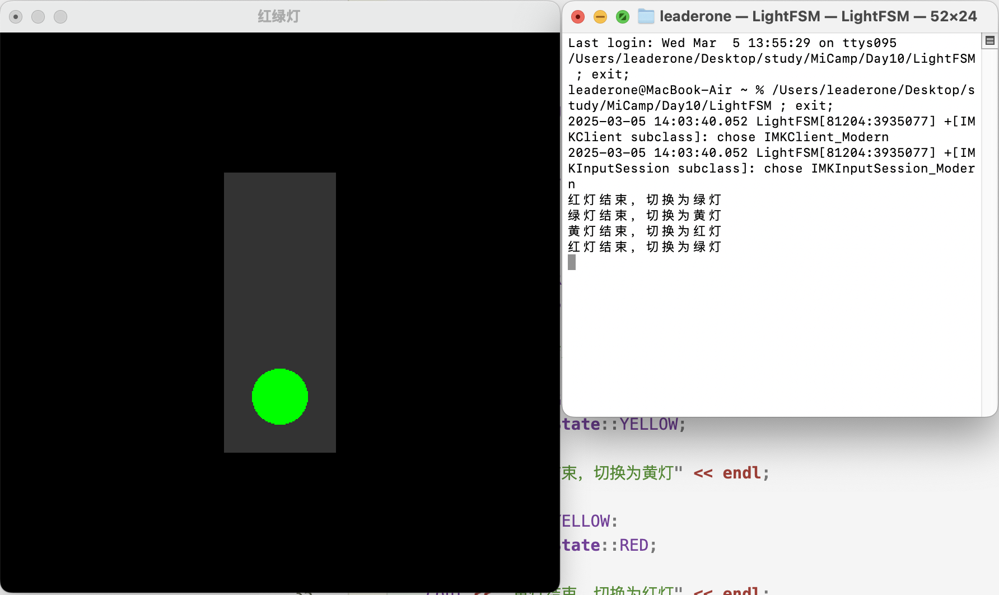

# 作业 2：交通信号灯

## 题目要求

实现一个简单的交通信号灯的有限状态机。交通信号灯有三种状态：红灯（Red）、绿灯（Green）、黄灯（Yellow）。状态转换规则如下：

- 红灯持续 10 个时间单位后转换为绿灯。
- 绿灯持续 8 个时间单位后转换为黄灯。
- 黄灯持续 2 个时间单位后转换为红灯。

## 简单实现效果

运行后，屏幕上会出现一个交通灯，灯光会按规定时间依次切换。


## 核心代码

- 该代码使用 OpenGL 和 GLUT 实现了交通信号灯的可视化。
- 代码通过 `glutTimerFunc` 定时切换灯光状态，并使用 `glutPostRedisplay` 进行界面更新。
- 终端会打印每次灯光切换时的中文提示信息。

```cpp
void changeLight(int value) {
    switch (state) {
        case LightState::RED:
            state = LightState::GREEN;
            timeCnt = 8;
            cout << "红灯结束，切换为绿灯" << endl;
            break;
        case LightState::GREEN:
            state = LightState::YELLOW;
            timeCnt = 2;
            cout << "绿灯结束，切换为黄灯" << endl;
            break;
        case LightState::YELLOW:
            state = LightState::RED;
            timeCnt = 10;
            cout << "黄灯结束，切换为红灯" << endl;
            break;
    }
    glutTimerFunc(timeCnt * 1000, changeLight, 0);
    glutPostRedisplay();
}
```

## 编译和运行

在 macOS 上，可以使用以下命令编译：

```bash
g++ LightFSM.cpp -o LightFSM -I/opt/homebrew/include -L/opt/homebrew/lib -framework OpenGL -framework GLUT
```

运行程序：

```bash
./LightFSM
```
