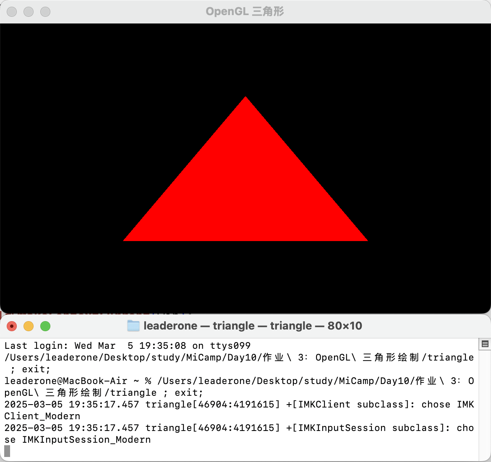

# 作业 3：C++ 使用 OpenGL 让画面绘制一个红色三角形。

## 编译和运行

```bash
g++ main.cpp -o triangle -std=c++17 -I/opt/homebrew/include -L/opt/homebrew/lib -lglfw -lGLEW -framework OpenGL -DGL_SILENCE_DEPRECATION
```

```bash
./triangle
```

- 运行结果：



## 做题过程

### 安装依赖

```bash
brew install glfw glew
```

### 编写 OpenGL 代码

#### 使用 GLFW 创建窗口

```cpp
glfwInit();
glfwWindowHint(GLFW_CONTEXT_VERSION_MAJOR, 3);
glfwWindowHint(GLFW_CONTEXT_VERSION_MINOR, 3);
glfwWindowHint(GLFW_OPENGL_PROFILE, GLFW_OPENGL_CORE_PROFILE);

GLFWwindow *win = glfwCreateWindow(800, 600, "OpenGL 三角形", nullptr, nullptr);
glfwMakeContextCurrent(win);
```

#### 由于 macOS 的 OpenGL 版本较旧，需要使用 GLEW 解决 OpenGL API 解析问题

```cpp
glewExperimental = GL_TRUE;
glewInit();
```

#### 创建 VAO 和 VBO

- VBO（顶点缓冲对象）存储三角形顶点数据。
- VAO（顶点数组对象）管理 VBO 配置，保证顶点数据正确传递到着色器。

```cpp
float verts[] = {
    -0.5f, -0.5f, 0.0f,
    0.5f, -0.5f, 0.0f,
    0.0f, 0.5f, 0.0f
};

GLuint VBO, VAO;
glGenVertexArrays(1, &VAO);
glGenBuffers(1, &VBO);

glBindVertexArray(VAO);
glBindBuffer(GL_ARRAY_BUFFER, VBO);
glBufferData(GL_ARRAY_BUFFER, sizeof(verts), verts, GL_STATIC_DRAW);

glVertexAttribPointer(0, 3, GL_FLOAT, GL_FALSE, 3 * sizeof(float), (void *)0);
glEnableVertexAttribArray(0);
```

#### 编写 GLSL 着色器

- 顶点着色器：接收三角形的顶点数据，计算位置。
- 片段着色器：给三角形上色（纯红色）。
- 创建 OpenGL 程序并绑定两个着色器。

```cpp
const char *vShaderSrc = R"(
#version 330 core
layout (location = 0) in vec3 pos;
void main() {
    gl_Position = vec4(pos, 1.0);
})";

const char *fShaderSrc = R"(
#version 330 core
out vec4 color;
void main() {
    color = vec4(1.0, 0.0, 0.0, 1.0);
})";

GLuint vShader = glCreateShader(GL_VERTEX_SHADER);
glShaderSource(vShader, 1, &vShaderSrc, nullptr);
glCompileShader(vShader);

GLuint fShader = glCreateShader(GL_FRAGMENT_SHADER);
glShaderSource(fShader, 1, &fShaderSrc, nullptr);
glCompileShader(fShader);

GLuint shaderProg = glCreateProgram();
glAttachShader(shaderProg, vShader);
glAttachShader(shaderProg, fShader);
glLinkProgram(shaderProg);

glDeleteShader(vShader);
glDeleteShader(fShader);
```

#### 在循环中渲染三角形

- `glClear(GL_COLOR_BUFFER_BIT)` 清空屏幕。
- `glUseProgram(shaderProg)` 启用着色器程序。
- `glDrawArrays(GL_TRIANGLES, 0, 3)` 绘制三角形。

```cpp
while (!glfwWindowShouldClose(win))
{
    glClear(GL_COLOR_BUFFER_BIT);
    glUseProgram(shaderProg);
    glBindVertexArray(VAO);
    glDrawArrays(GL_TRIANGLES, 0, 3);

    glfwSwapBuffers(win);
    glfwPollEvents();
}
```

#### 释放 OpenGL 资源，关闭窗口。

```cpp
glDeleteVertexArrays(1, &VAO);
glDeleteBuffers(1, &VBO);
glDeleteProgram(shaderProg);

glfwDestroyWindow(win);
glfwTerminate();
```

## 遇到的问题与解决

- OpenGL 3.3 Core Profile 被 macOS 10.14+ 标记为废弃，但仍然可以使用。
- 必须使用 GLEW 或 GLAD 解决 OpenGL 函数未声明问题，否则 `glGenVertexArrays()` 之类的 API 不能正常使用。
