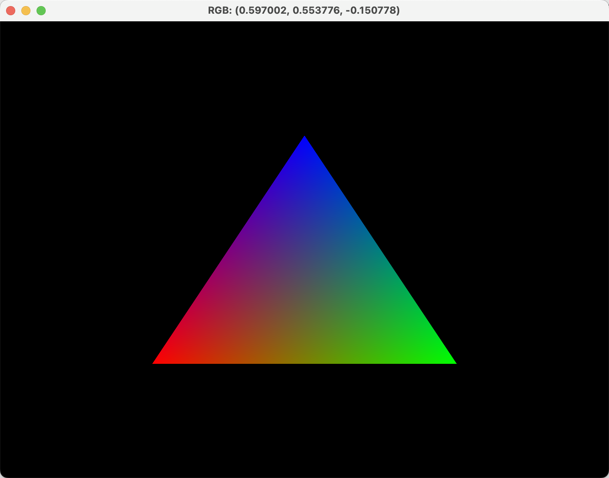

# 作业 4：C++ 使用 OpenGL 让画面绘制一个彩色三角形

## 解题思路

### 1. 红色三角形的实现

在上一题中，我首先创建了一个红色三角形。通过设置顶点位置数据并传递到着色器，使用片段着色器将颜色固定为红色。整个过程是通过固定颜色来展示三角形。

### 2. 彩色三角形的扩展

这一次，我在上一题的基础上做了一些关键的修改：

- 为每个顶点指定不同的颜色：在三角形的每个顶点，我都添加了颜色信息。具体来说，第一个顶点是红色，第二个顶点是绿色，第三个顶点是蓝色。
- 在顶点着色器中传递颜色信息：我修改了顶点着色器，将每个顶点的颜色作为输入，并通过 `fragColor` 传递给片段着色器进行插值。

```cpp
const char *vShaderSrc = R"(
#version 330 core
layout (location = 0) in vec3 pos;
layout (location = 1) in vec3 color;
out vec3 fragColor;
void main() {
    gl_Position = vec4(pos, 1.0);
    fragColor = color;
})";
```

- 片段着色器根据插值渲染颜色：在片段着色器中，通过传入的颜色数据来渲染最终的颜色。这样，每个像素的颜色会在三角形内根据顶点的颜色进行渐变。

```cpp
const char *fShaderSrc = R"(
#version 330 core
in vec3 fragColor;
out vec4 color;
void main() {
    color = vec4(fragColor, 1.0);
})";
```

### 3. 鼠标显示 RGB 信息（创新点）

在此基础上，我加入了一个鼠标回调函数，当鼠标悬停在三角形区域时，计算鼠标位置的 RGB 值，并动态更新窗口的标题显示 RGB 信息。

- 鼠标回调函数：我通过获取鼠标坐标并将其映射到 OpenGL 的归一化坐标系，来判断鼠标是否在三角形内。若在三角形内，则根据鼠标的相对位置计算 RGB 值。

```cpp
void mouseCB(GLFWwindow *win, double xpos, double ypos) {
    int w, h;
    glfwGetWindowSize(win, &w, &h);
    float x = (2.0f * xpos) / w - 1.0f;
    float y = 1.0f - (2.0f * ypos) / h;

    if (x >= -0.5f && x <= 0.5f && y >= -0.5f && y <= 0.5f) {
        float r = (x + 0.5f);
        float g = (y + 0.5f);
        float b = 1.0f - r - g;
        stringstream colorInfo;
        colorInfo << "RGB: (" << r << ", " << g << ", " << b << ")";
        glfwSetWindowTitle(win, colorInfo.str().c_str());
    }
}
```

这个功能并不是题目要求，而是我在实现过程中灵光一现的小功能。通过这个功能，我可以在鼠标指向不同位置时动态获取 RGB 值，增强了交互性。

### 4. 运行结果：


