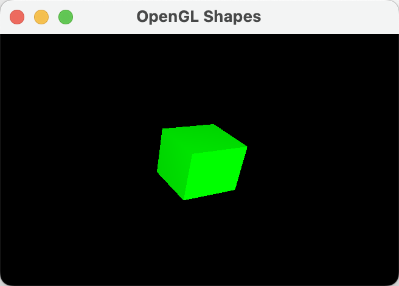

# C++ 使用 OpenGL 让画面绘制一张图片到界面上

## 项目介绍

这道题的自由度很高，我选择实现了一个带光照的 3D 立方体渲染。立方体具有基本的光照效果，并进行了旋转，使其看起来更有立体感。该程序使用 GLFW 进行窗口管理，并使用 GLEW 来处理 OpenGL 扩展。

## 功能特点

- 创建 OpenGL 窗口（使用 GLFW）。
- 使用 OpenGL 光照模型让立方体具有明暗层次。
- 法线计算让光照正确作用于立方体的各个面。
- 支持 3D 旋转，以 45° 角度旋转立方体。
- 深度测试确保 3D 立方体正确渲染。

## 运行效果

运行程序后能够看到：

- 一个旋转的绿色立方体
- 光照作用后，立方体的不同面会有明暗变化
- 立方体具有深度感，不再是单纯的平面形状



## 代码结构

### 1. 窗口初始化

```cpp
if (!glfwInit())
{
    std::cerr << "初始化 GLFW 失败" << std::endl;
    return -1;
}

GLFWwindow *window = glfwCreateWindow(800, 600, "OpenGL Shapes", NULL, NULL);
if (!window)
{
    std::cerr << "创建 GLFW 窗口失败" << std::endl;
    glfwTerminate();
    return -1;
}

glfwMakeContextCurrent(window);
glewExperimental = GL_TRUE;
if (glewInit() != GLEW_OK)
{
    std::cerr << "初始化 GLEW 失败" << std::endl;
    return -1;
}
```

- 使用 GLFW 创建窗口，并启用 OpenGL 上下文。
- 通过 GLEW 进行 OpenGL 扩展初始化。

### 2. OpenGL 光照

```cpp
void setupLighting()
{
    glEnable(GL_LIGHTING);
    glEnable(GL_LIGHT0);

    GLfloat lightPos[] = {0.0f, 0.0f, 3.0f, 1.0f};     // 光源位置
    GLfloat lightColor[] = {1.0f, 1.0f, 1.0f, 1.0f};   // 白色光
    GLfloat ambientLight[] = {0.2f, 0.2f, 0.2f, 1.0f}; // 环境光

    glLightfv(GL_LIGHT0, GL_POSITION, lightPos);
    glLightfv(GL_LIGHT0, GL_DIFFUSE, lightColor);
    glLightfv(GL_LIGHT0, GL_SPECULAR, lightColor);
    glLightfv(GL_LIGHT0, GL_AMBIENT, ambientLight);

    glEnable(GL_COLOR_MATERIAL);
    glColorMaterial(GL_FRONT_AND_BACK, GL_AMBIENT_AND_DIFFUSE);
}
```

- 启用 OpenGL 的光照 (`glEnable(GL_LIGHTING)`)。
- 设定光源位置，让立方体的各个面都有光照层次。
- 设置漫反射、镜面反射、环境光以模拟更真实的光照效果。

### 3. 绘制立方体

```cpp
void drawCube(float s)
{
    float hs = s / 2.0f;
    glBegin(GL_QUADS);

    // 计算法线，确保光照正确作用于立方体表面
    glNormal3f(0.0f, 0.0f, 1.0f);
    glVertex3f(-hs, -hs, hs);
    glVertex3f(hs, -hs, hs);
    glVertex3f(hs, hs, hs);
    glVertex3f(-hs, hs, hs);

    glNormal3f(0.0f, 0.0f, -1.0f);
    glVertex3f(-hs, -hs, -hs);
    glVertex3f(-hs, hs, -hs);
    glVertex3f(hs, hs, -hs);
    glVertex3f(hs, -hs, -hs);

    glNormal3f(0.0f, 1.0f, 0.0f);
    glVertex3f(-hs, hs, -hs);
    glVertex3f(-hs, hs, hs);
    glVertex3f(hs, hs, hs);
    glVertex3f(hs, hs, -hs);

    glNormal3f(0.0f, -1.0f, 0.0f);
    glVertex3f(-hs, -hs, -hs);
    glVertex3f(hs, -hs, -hs);
    glVertex3f(hs, -hs, hs);
    glVertex3f(-hs, -hs, hs);

    glNormal3f(1.0f, 0.0f, 0.0f);
    glVertex3f(hs, -hs, -hs);
    glVertex3f(hs, hs, -hs);
    glVertex3f(hs, hs, hs);
    glVertex3f(hs, -hs, hs);

    glNormal3f(-1.0f, 0.0f, 0.0f);
    glVertex3f(-hs, -hs, -hs);
    glVertex3f(-hs, -hs, hs);
    glVertex3f(-hs, hs, hs);
    glVertex3f(-hs, hs, -hs);

    glEnd();
}
```

- 通过 `glBegin(GL_QUADS)` 依次绘制立方体的六个面。
- 法线计算 (`glNormal3f()`) 确保每个面的光照方向正确。

### 4. 立方体旋转与显示

```cpp
void display()
{
    glClear(GL_COLOR_BUFFER_BIT | GL_DEPTH_BUFFER_BIT);

    glPushMatrix();
    glTranslatef(0.0, 0.0, -6.0);
    glRotatef(45.0f, 1.0f, 1.0f, 0.0f);
    glColor3f(0.0, 1.0, 0.0); // 绿色立方体
    drawCube(1.0);
    glPopMatrix();
}
```

- 使用 `glTranslatef()` 将立方体放置在屏幕中央。
- 使用 `glRotatef(45.0f, 1.0f, 1.0f, 0.0f)` 让立方体沿 (1,1,0) 轴旋转 45°，增强 3D 视觉效果。

## 编译命令

在 macOS 上使用以下命令编译：

```sh
g++ main.cpp -o main -I/opt/homebrew/include -L/opt/homebrew/lib \
-lglfw -lGLEW -framework OpenGL -DGL_SILENCE_DEPRECATION
```
