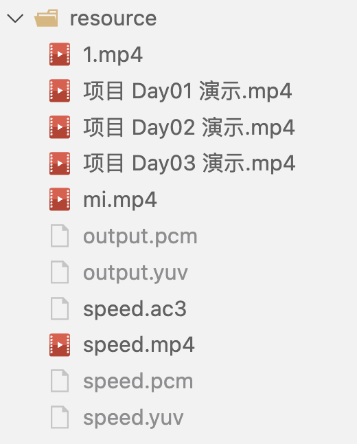
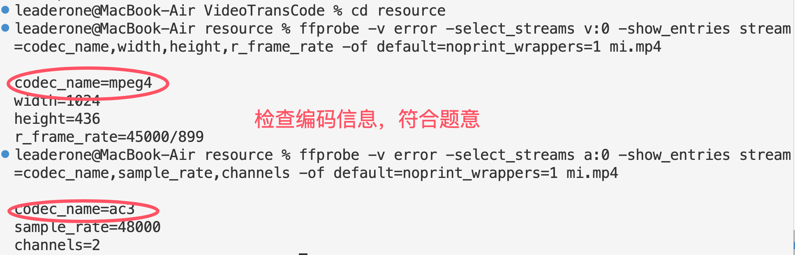

# 基于 ffmpeg 开发的视频转换器

## 使用 run.sh 脚本运行

- 显式指定编译器

```bash
cmake -DCMAKE_C_COMPILER=/usr/bin/clang -DCMAKE_CXX_COMPILER=/usr/bin/clang++ ..
```

- 使用 -j4 让 make 并行编译，最多使用 4 个 CPU 线程加快编译速度。

```bash
make -j4
```

- 运行脚本支持以下几种方式：

```bash
# 默认运行（2倍速）
./run.sh

# 指定速度参数（支持0.5、1.0、2.0、3.0倍速）
./run.sh 0.5
./run.sh 1.0
./run.sh 2.0
./run.sh 3.0

# 运行 transcode 程序（仅解码为YUV和PCM，不做速度处理）
./run.sh transcode
```

- 运行结果会在 resource 目录中生成以下文件：
  - `speed_X.X.mp4`: 调整速度后的视频文件
  - `speed_X.X.ac3`: 调整速度后的音频文件
  - `miX.X.mp4`: 最终合并的音视频文件（X.X 表示速度倍率）

### 播放和检查生成的文件

```bash
# 播放最终合并的MP4文件
ffplay resource/mi.mp4          # 默认2倍速

# 检查视频编码信息
ffprobe -v error -select_streams v:0 -show_entries stream=codec_name,width,height,r_frame_rate -of default=noprint_wrappers=1 mi.mp4

# 检查音频编码信息
ffprobe -v error -select_streams a:0 -show_entries stream=codec_name,sample_rate,channels -of default=noprint_wrappers=1 mi.mp4

# 播放 mpeg4 格式的视频文件和 ac3 格式的音频文件
ffplay speed.mp4
ffplay speed.ac3
```

### 运行结果

- 执行脚本运行后，在 resource 目录生成的文件如图所示（我将介绍这些文件）：

  - 首先 output.yuv 和 output.pcm 都是 1.mp4 解码生成的文件；
  - speed.pcm 和 speed.yuv 都是解码后文件使用倍速 filter 过滤后的文件；
  - speed.ac3 和 speed.mp4 则是过滤后文件进行编码产生的文件；
  - mi.mp4 是编码后文件进行合并封装产生的最终文件。

- 

- 对视频和音频的编码信息检查如图所示：



## Day03

在今天的作业中，我在昨天的基础上使用 video filter 实现了视频倍速播放，并实现了完整的音频处理流程。通过整合视频处理和音频处理，构建了一个完整的音视频转码系统，能够对视频进行 0.5 倍、1.0 倍、2.0 倍和 3.0 倍速的调整，并保持音视频同步。

### 项目运行流程

现在整个项目的处理流程分为三个主要部分：

- **视频处理**：

  - 将视频解码为 YUV 格式
  - 根据指定的速度因子调整视频帧的 PTS（显示时间戳）
  - 将处理后的视频帧编码为 MPEG4 格式
  - 输出为独立的视频文件

- **音频处理**：

  - 将音频解码为 PCM 格式
  - 使用音频滤镜调整音频的播放速度，同时保持音调不变
  - 将处理后的音频编码为 AC3 格式
  - 输出为独立的音频文件

- **音视频合并**：

  - 读取处理后的视频文件和音频文件
  - 创建新的 MP4 容器
  - 将视频流和音频流复制到新容器中
  - 输出最终的 MP4 文件，包含同步的音视频

整个流程通过 run.sh 脚本串联起来，用户只需指定一个速度参数，即可完成全部处理过程。

### 技术实现细节

- **音视频倍速处理**：

  - 视频使用 FFmpeg 的视频滤镜系统，通过`setpts`滤镜调整视频帧的显示时间戳。
  - 音频使用 FFmpeg 的音频滤镜系统，通过`atempo`滤镜调整音频速度。

- **音频编码**：

  - 实现了 PCM 到 AC3 的编码转换
  - 使用缓冲区管理系统，确保音频帧的正确处理
  - 处理不同采样率和通道布局的音频输入

- **音视频合并**：

  - 实现了独立的音视频流合并程序
  - 正确处理时间戳，确保音视频同步
  - 支持不同格式的音视频输入

### 环形缓冲区优化

环形缓冲区的实现代码详见：`ring_buffer.h`，在项目中的优化实现步骤如下：

- **在音频滤镜处理中应用环形缓冲区**：

  - 在`AudioFilter`类中添加`RingBuffer`成员变量
  - 将输入的音频帧数据写入环形缓冲区
  - 使用较小的块大小（4096 字节）从环形缓冲区读取数据进行处理

- **优化数据处理流程**：

  - 将大块的音频数据分成小块处理，减少 CPU 峰值使用
  - 确保读取的数据块大小是音频帧大小的整数倍，避免处理不完整的音频帧
  - 在处理完成后释放资源，避免内存泄漏

### 遇到的问题与解决方案

#### 音画不同步问题

在测试中，我发现处理后的视频存在音画不同步问题，大约有半秒的差异。经过分析，我发现问题出在音频滤镜处理中的 PTS（显示时间戳）计算上。

解决步骤如下：

- **添加 PTS 跟踪变量**：

  - 在`AudioFilter`类中添加成员变量，用于跟踪音频采样位置和 PTS
  - `currentSamplePos_`：当前处理的采样位置
  - `lastInputPts_`：上一个输入帧的 PTS
  - `samplesPerFrame_`：每帧的采样数
  - `ptsPerSample_`：每个样本的 PTS 增量

- **正确计算 PTS**：

  - 在`processFrame`方法中，根据输入帧的 PTS 和当前采样位置计算每个处理块的 PTS
  - 动态更新每个样本的 PTS 增量，确保时间戳的准确性
  - 跟踪当前采样位置，确保连续的音频块有连续的 PTS

- **重置 PTS 跟踪变量**：

  - 在`reset`方法中重置所有 PTS 跟踪变量，确保在重新初始化时不会有残留值

通过这些修改，我解决了音画不同步问题。关键在于不再简单地将输入帧的 PTS 赋值给所有处理块，而是根据当前采样位置和每个样本的 PTS 增量来计算每个处理块的 PTS，确保音频数据的时间戳与其实际内容相匹配。

## Day02

在本次作业中，我通过 Demux 线程、视频解码线程、视频编码线程和 Mux 线程构建了一整套视频转码流程。首先，从输入的 MP4 文件中解析并提取视频流，解码为 YUV 格式；随后，通过视频过滤模块对帧进行 90° 旋转 处理；最后，重新编码为 MPEG-4 格式，并封装输出，完成整个转码过程。

### 项目运行流程

`video_transcode.cpp` 实现了完整的视频处理流程，主要包括以下步骤：

- **输入处理**：

  - 接收输入视频文件路径和输出文件路径
  - 设置旋转前和旋转后的 YUV 文件路径

- **视频解码**：

  - 打开输入视频文件
  - 查找视频流
  - 初始化解码器
  - 解码视频帧为原始 YUV 格式
  - 保存解码后的原始帧到旋转前 YUV 文件

- **视频滤镜处理**：

  - 初始化视频滤镜，设置旋转参数（90 度旋转）
  - 将解码后的帧传递给滤镜进行处理
  - 保存滤镜处理后的帧到旋转后 YUV 文件

- **视频编码**：

  - 初始化 MPEG4 编码器
  - 将滤镜处理后的帧编码为 MPEG4 格式

- **封装输出**：

  - 初始化封装器
  - 添加视频流
  - 将编码后的数据包写入输出 MP4 文件

- **资源释放**：

  - 关闭所有打开的文件
  - 释放分配的内存和上下文

整个过程通过回调函数实现数据在各个处理阶段之间的传递，确保高效的内存使用和处理流程。

### 遇到的问题与解决方案

- **"too many B-frames in a row" 警告**：

  - 问题：在使用 MPEG4 编码器时，控制台输出大量"too many B-frames in a row"警告，影响日志可读性。
  - 解决方案：实现了自定义日志过滤系统，通过创建管道和线程，过滤掉包含特定字符串的日志输出，保持控制台输出的清晰。

- **视频旋转后尺寸问题**：

  - 问题：旋转视频后，宽高需要交换，否则会导致画面变形。
  - 解决方案：在初始化编码器时，交换了宽高参数：`videoEncoder.init(height, width, ...)`，确保旋转后的视频保持正确的宽高比。

- **内存管理**：
  - 问题：视频处理过程中可能出现内存泄漏。
  - 解决方案：确保每个`av_frame_alloc()`和`av_packet_alloc()`都有对应的`av_frame_free()`和`av_packet_unref()`，并在适当的位置释放资源。

## Day01

在今天的作业中，我实现了将视频流解码成视频帧和音频帧，并保存到文件的功能。为了使项目能够在不同平台上运行，我采用了两种方式：一种是使用系统安装的 FFmpeg 库（在 macOS 上我通过 brew 安装 FFmpeg），另一种是使用自己编译的 FFmpeg 动态链接库（libffmpeg_merge.so）。

### 项目运行流程

- **解复用（Demuxer）**：

  - 读取输入的 MP4 文件
  - 将视频和音频数据分离成不同的数据包
  - 将数据包放入相应的队列中

- **音视频解码（VideoDecoder && AudioDecoder）**：

  - 从队列中获取视频/音频数据包
  - 解码成原始视频帧（YUV 格式）和原始音频帧（PCM 格式）
  - 通过回调函数将音/视频帧传递给转码器

- **转码处理（Transcode）**：

  - 接收解码后的视频帧和音频帧
  - 将视频帧保存为 YUV 文件
  - 将音频帧保存为 PCM 文件

- **日志记录**：
  - 将详细的帧信息记录到日志文件中
  - 在控制台只显示主要的进度信息

### 编译 FFmpeg 动态链接库（libffmpeg_merge.so）的详细步骤

编译 FFmpeg 成一个单独的动态链接库是今天的作业中折磨我最久的任务，以下是我编译的步骤：

- **重点配置编译选项**：

```bash
- `--enable-pic`：生成位置无关代码，这对于创建共享库是必要的
- `--disable-asm`：禁用汇编优化，提高兼容性
- `--extra-cflags="-fPIC"`：添加位置无关代码标志
- `--disable-everything`：禁用所有组件，然后只启用我们需要的部分
- `--enable-decoder=h264,aac`：只启用 H.264 视频和 AAC 音频解码器
- `--enable-demuxer=mov,mp4`：只启用 MP4/MOV 解复用器
```

- **编译 FFmpeg 库**：

```bash
make -j$(nproc)
make install
```

- **合并为单个动态链接库**：

```bash
cd /tmp/ffmpeg_build/lib
gcc -shared -o libffmpeg_merge.so \
    -Wl,--whole-archive \
    -Wl,--allow-multiple-definition \
    libavcodec.a \
    libavformat.a \
    libavutil.a \
    libswscale.a \
    libswresample.a \
    -Wl,--no-whole-archive \
    -lm -lz -lpthread
```

- 这个命令的关键部分：
  - `-shared`：创建共享库
  - `-Wl,--whole-archive`：包含整个静态库的内容
  - `-Wl,--allow-multiple-definition`：允许符号重复定义
  - 最后链接了数学库、压缩库和线程库

### 在项目中使用 FFmpeg 库

#### 在 macOS 上，使用 brew 安装的 FFmpeg：

```shell
brew install ffmpeg
```

- 然后在 CMakeLists.txt 中配置：

```Makefile
if(APPLE)
    # Mac OS X 特定配置
    execute_process(
        COMMAND brew --prefix ffmpeg
        OUTPUT_VARIABLE FFMPEG_PREFIX
        OUTPUT_STRIP_TRAILING_WHITESPACE
    )

    # 设置FFmpeg包含目录和库目录
    include_directories(${FFMPEG_PREFIX}/include)
    link_directories(${FFMPEG_PREFIX}/lib)

    # 直接链接到库文件
    set(FFMPEG_LIBRARIES
        avcodec
        avformat
        avutil
        swscale
        swresample
    )
endif()
```

#### 在 Ubuntu 上，使用我编译的 libffmpeg_merge.so：

- 然后在 CMakeLists.txt 中配置：

```Makefile
if(UNIX AND NOT APPLE AND LINUX_DISTRO STREQUAL "Ubuntu")
    # Ubuntu系统使用自定义的FFmpeg库
    set(CUSTOM_FFMPEG_LIB "${CMAKE_CURRENT_SOURCE_DIR}/lib/libffmpeg_merge.so")

    # 创建lib目录并复制libffmpeg_merge.so
    file(MAKE_DIRECTORY ${CMAKE_BINARY_DIR}/lib)
    file(COPY ${CUSTOM_FFMPEG_LIB} DESTINATION ${CMAKE_BINARY_DIR}/lib)

    # 设置运行时库路径
    set(CMAKE_INSTALL_RPATH "${CMAKE_BINARY_DIR}/lib")
    set(CMAKE_BUILD_WITH_INSTALL_RPATH TRUE)

    # Ubuntu系统需要的额外依赖库
    target_link_libraries(transcode
        ${CUSTOM_FFMPEG_LIB}
        ${CMAKE_THREAD_LIBS_INIT}
        asound
        xcb
        X11
        SDL2
        Xv
        Xext
        sndio
    )
endif()
```

### 遇到的问题与解决方案

**音频爆裂声问题**： 最初，生成的 PCM 文件播放时会有爆米花般的爆裂声。查阅资料后我发现这是音频数据对齐和缓冲区管理问题导致的。我修改了 AudioDecoder 类中的代码，确保正确处理音频帧数据：

```cpp
int out_buffer_size = av_samples_get_buffer_size(
    nullptr, outputChannels_, frame->nb_samples, outputFormat_, 1);
uint8_t* out_buffer = new uint8_t[out_buffer_size];
int out_samples = swr_convert(
    swrContext_, &out_buffer, frame->nb_samples,
    (const uint8_t**)frame->data, frame->nb_samples);
int actual_out_size = out_samples * outputChannels_ *
    av_get_bytes_per_sample(outputFormat_);
```

**Ubuntu 系统上视频转换不完整问题**： 在 macOS 上将视频转为 YUV 格式时文件大小约为 700MB，但在 Ubuntu 上运行时只有 200MB（大小比较随机），且播放到一半就中断。经过分析，我发现了以下几个关键问题：

- **线程同步问题**： 在原始代码中，当队列为空时解码线程会立即退出，导致部分数据包未被处理。修改了 `video_decoder.cpp` 和 `audio_decoder.cpp` 中的解码线程函数：

  ```cpp
  // 修改前
  if (!packetQueue_->pop(pkt)) {
      break;
  }
  // 修改后（一开始改成 10毫秒，仍有小概率存在这个 bug，直接改成 100 毫秒，解决了 bug）
  if (!packetQueue_->pop(pkt)) {
      this_thread::sleep_for(chrono::milliseconds(100));
      continue;
  }
  ```

- **缓冲区处理不完整**： 原始代码没有处理解码器缓冲区中的剩余帧。在解码线程结束前添加了刷新缓冲区的代码：

  ```cpp
  // 处理缓冲区中剩余的帧
  avcodec_send_packet(codecContext_, nullptr);
  while (true) {
      int ret = avcodec_receive_frame(codecContext_, frame);
      if (ret == AVERROR(EAGAIN) || ret == AVERROR_EOF) {
          break;
      }
      // 处理帧...
  }
  ```

- **文件写入保护**： 添加了互斥锁保护文件写入操作，防止多线程写入冲突：

  ```cpp
  // 确保文件写入操作是原子的
  std::lock_guard<std::mutex> lock(videoFileMutex_);

  // 写入 Y 平面
  for (int i = 0; i < avFrame->height; i++) {
      videoOutFile_.write(reinterpret_cast<char*>(avFrame->data[0] + i * avFrame->linesize[0]), avFrame->width);
      if (!videoOutFile_.good()) {
          std::cerr << "写入 Y 平面失败，行: " << i << std::endl;
          return false;
      }
  }
  ```

- **等待时间优化**： 增加了等待时间和队列清空检查，确保所有数据都被处理：

  ```cpp
  // 等待视频包队列和音频包队列清空
  cout << "等待队列清空..." << endl;
  while (videoPacketQueue_->size() > 0 || audioPacketQueue_->size() > 0) {
      this_thread::sleep_for(chrono::milliseconds(100));
  }

  // 增加等待时间，确保所有视频帧都被处理
  this_thread::sleep_for(chrono::seconds(5));
  ```

这些修改解决了在 Ubuntu 系统上视频转换不完整的问题，现在在两个平台上都能生成完整的 YUV 文件。

